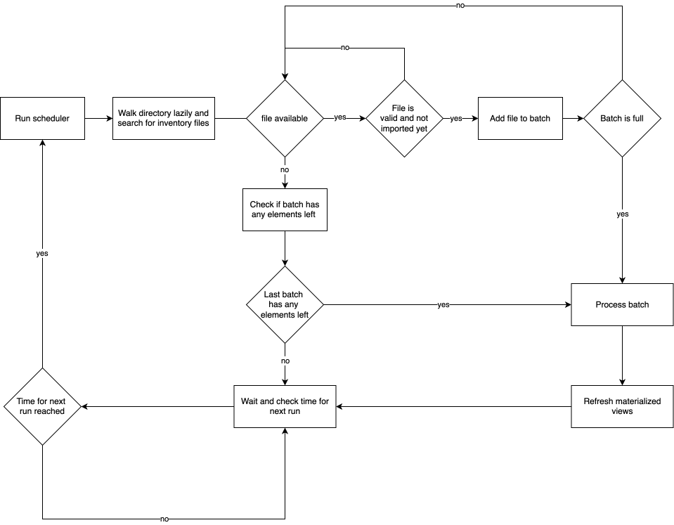
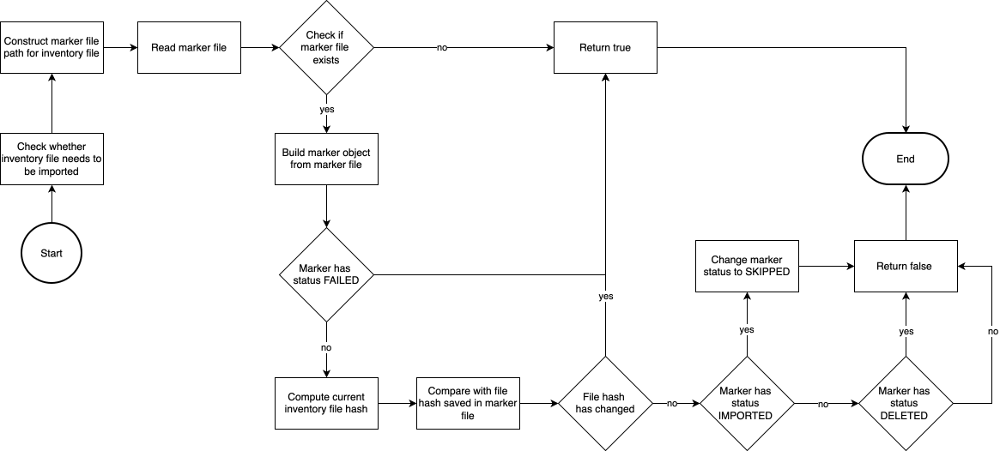

# Inventory Importer Service

## Introduction

The Inventory Importer Service module implements two schedulers that are responsible for importing (**import task**) and deleting (**delete task**)
inventories with a specified cron.

The **import task** is responsible for searching inventory files in the "input-inventories" directory and to import and persist them.
The inventories are collected in batches with a predefined size and imported in batches.
If an inventory is already imported or was deleted before by the **delete task** and its file hashes did not change, it will be skipped and not
persisted in the database again.
The folders under the "input-inventories" directory may also have child folders f.e. to group the inventories by a specific category (f.e. keycloak,
openssl, ...).

The **delete task** on the other hand is responsible for deleting inventories. This can be done by three rules:

1. A maximum age: inventories older than a specified period (2 months, 34 days, 4 years, ...) will be deleted
2. A list of project ids: inventories that are associated with a list of projects will be deleted
3. A list of paths: inventories with a specific path will be deleted.

## Interfaces

Both scheduled tasks use properties during the process that can be configured in the env.rc file. Those are described for both task in the following
sections.

### Import task

The **import task** uses properties that are necessary for importing and persisting the inventories.

#### Database URL

The database URL describes which database is used. This URL can be configured via the `II_DATABASE_URL` property in the env.rc file.

#### User name

The name of the database user can be configured via the `II_DATABASE_USER_NAME` property in the env.rc file. This user will be created during
the setup process and has limited permissions.

#### User password

The password for the database user can be configured via the `II_DATABASE_USER_PASSWORD` property in the env.rc file.

#### Batch size

The batch size defines how many inventories will be imported simultaneously and then persisted. By default, the batch size is set to 10.
It can be configured by setting the `II_IMPORT_BATCH_SIZE` property in the env.rc file.
After each inventory batch is persisted, the materialized views are refreshed to ensure data consistency.

#### Tenant ID

The tenant ID property describes who the tenant of the inventories is.
It can be configured by setting the `II_IMPORT_DEFAULT_TENANT_ID` property in the env.rc file.
With this, the same inventory can be persisted multiple times with different tenants.

#### Path

The Path property defines the directory where the inventories that have to be persisted are located.
It can be configured by setting the `II_IMPORT_INPUT_DIR` property in the env.rc file.
The inventories can be located directly under the input directory or also under child folders of the input directory.

#### Cron

The scheduler runs with a cron expression that defines the repeated execution time and can be configured in the env.rc file by setting the
`II_IMPORT_SCHEDULE` property.
For further information on how to create a cron expression visit https://crontab.cronhub.io/.
For Example if the scheduler runs every minute, each minute it triggers the **import task** to run. If a scheduler that has started the **import task
** from the minute before is still running, the new scheduler is skipped.

#### assetKeyMappings

The **import task** allows configuring a mapping for three asset keys to map to the metaeffekt asset keys.
The following table shows the mappable keys and the corresponding environment variables:

| Metaeffekt asset key | Environment variable                          | Description                                            |
|:---------------------|:----------------------------------------------|:-------------------------------------------------------|
| **externalAssetId**  | II_IMPORT_ASSET_KEY_MAPPING_EXTERNAL_ASSET_ID | Maps the defined key to the metaeffekt externalAssetId | 
| **externalViewId**   | II_IMPORT_ASSET_KEY_MAPPING_EXTERNAL_VIEW_ID  | Maps the defined key to the metaeffekt externalViewId  | 
| **pathInGroup**      | II_IMPORT_ASSET_KEY_MAPPING_PATH_IN_GROUP     | Maps the defined key to the metaeffekt pathInGroup     |

Each value of those variables can be a list of possible keys separated by comma, f.e. `"Key1, Key 2, Key 3"`. Each comma separated elements will be
seen
as a string element in the list (including whitespaces).
In this example there are three Keys: `"Key1"`, `"Key 2"` and `"Key 3"`.
The importer will map the first key in the list for that a value is found to the corresponding asset attribute. Here the order is relevant and defines
the priority of the keys to be mapped.
For the example list `"Key1, Key 2, Key 3"` for externalAssetId mapping the importer first would try to map `"Key1"` to the externalAssetId.
If the inventory has a corresponding `"Key1"` attribute in the asset sheet, the value of that attribute would be returned and all other keys in the
list would be ignored (even if those were valid too).
If the inventory has no `"Key1"` asset attribute, the importer would try to find a `"Key 2"` attribute and so on. If the importer does not find any
mappable element in the list, the value will be null.
By default, each list of the three mentioned variables has the metaeffekt asset key as the first element. Any other key(s) can be defined by adding
element(s) to the lists.

### Delete task

The **delete task** uses properties that are necessary for deleting the inventories.

#### Cron

Like the **import task** the **delete task** also is started by a scheduler that runs with a predefined cron. Its execution time can be configured in
the env.rc file by setting the `II_DELETE_SCHEDULE` property.

#### Rules

As mentioned before, inventories can be deleted depending on three different rules. Those are described in the following table:

| Rule            | Environment variable             | Description                                                                             |
|:----------------|:---------------------------------|:----------------------------------------------------------------------------------------|
| **max age**     | II_DELETE_RULE_INVENTORY_AGE_MAX | Inventories older than the specified max age will be deleted (f.e. older than 2 months) | 
| **project ids** | II_DELETE_RULE_PROJECT_IDS       | Inventories with the specified (list of) project ids will be deleted                    | 
| **paths**       | II_DELETE_RULE_FILE_SYSTEM_PATHS | Inventories with the specified (list of) paths will be deleted                          |

### Refresh of Materialized views

The refresh of the materialized views happens at two moments during the **import task**:

1. Once after a batch of inventories is persisted
2. Once after all inventory batches are persisted

For the **delete task** the materialized views are refreshed at the end of a complete deletion run.

## Processing approach

The diagram below presents a compact and simplified view on the **import task**:

### Marker files

During both tasks (**import task** and **delete task**) marker files are generated for each inventory file and used to store the status of the file
and
some additional information.

`Note`: A marker file is stored in the JSON format and located next to where the inventory file is located and has the same name as the inventory file
with the additional file ending **.json**

#### Marker data

This information is stored in the marker files:

| Data                       | Value type | Description                                                                                                                                                                                                                                                                                                                      |
|:---------------------------|:-----------|:---------------------------------------------------------------------------------------------------------------------------------------------------------------------------------------------------------------------------------------------------------------------------------------------------------------------------------|
| **fileHash**               | String     | The file hash of the inventory file to check if the file has changed                                                                                                                                                                                                                                                             |
| **lastCheckTimestamp**     | Instant    | The timestamp of the last time the file was accessed or modified for the import or delete task                                                                                                                                                                                                                                   |
| **importSuccessTimestamp** | Instant    | The timestamp of the first time the file was successfully imported and persisted                                                                                                                                                                                                                                                 |
| **currentStatus**          | Status     | The current status of the import. This can be either:  `IMPORTED` (if the file was successfully imported),  `FAILED` (if the import/persistence faild),  `SKIPPED` (if the inventory with the same file hash already exists in the database) or  `DELETED` (if the inventory was deleted by the **delete task**) |
| **errorMessage**           | String     | The error message if the import of the file failed, otherwise if it was successful this will be null                                                                                                                                                                                                                             |

#### Checking if inventory needs to be imported

When the **import task** finds an inventory file, it first checks if the file is valid and needs to be imported. This is done by checking if a marker
file for this inventory file exists and what status it has. The following diagram shows the process of checking if an inventory has to be imported or
not:

`Note`: If an inventory is deleted from the database manually, the corresponding marker file also has to be deleted by hand. If not so, the importer
will not import the same (unchanged file hash) file because a marker file with the status `IMPORTED` and the same file hash already exists for this
file.

#### Updating markers after import

Depending on the import status of the inventories, for each of them the marker file is updated with the new file hash, the import status and
timestamp. In case the import fails, an error message is additionally saved to the marker file.

#### Updating markers after delete

After the **delete task** also every marker file for the deleted inventory file is updated by setting the `currentStatus` property to `DELETED`.