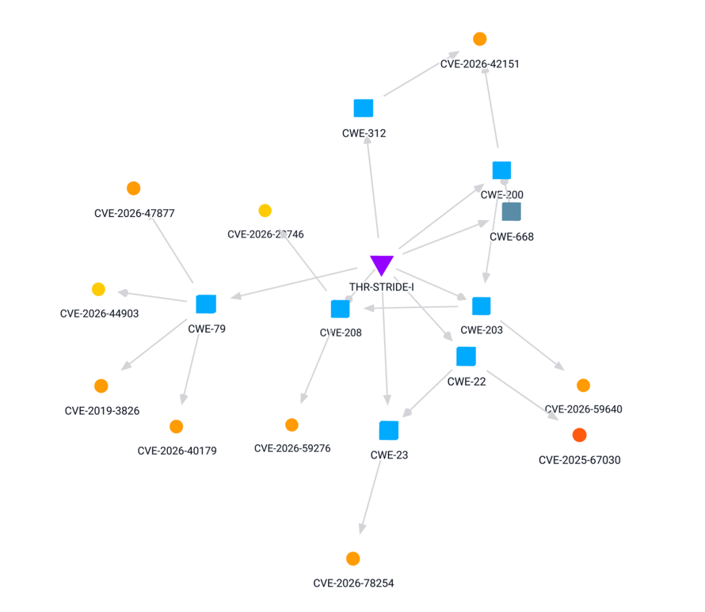

# {metæffekt} Threats & Controls

## Introduction

### {metæffekt} Four Domain Model

{metæffekt} has derived a long term strategy to establish an infrastructure for a formal assessment of threats and
vulnerabilities. In general, the approach outlines four central domains:

The four domains are:

* **Vulnerability Assessment Model** – captures assessment details on vulnerabilities detected in the assets under
  analysis. The model allows the assets to be contextualized within the design or deployment.
* **Threat Assessment Model** – captures assessment data on threats as defined by a selected Threat Catalog. The Threat
  Assessment Model applies system- or product-specific assessments and may already call for high-level controls to
  protect the assets.
* **System Model** – models the system in terms of its assets, their capabilities, and the relationships between them.
  The System Model defines which assets act as protective controls for other assets and derives claims that can, in
  turn, be used by vulnerability assessments.
* **Verification/Validation Model** – covers verification and validation activities. In the current scope,
  verification addresses the effectiveness of controls: control-specific verification tests are defined and applied to
  collect evidence of the protection they provide. Validation is covered by further testing and qualification measures,
  such as fuzzing, penetration testing, or audits that identify deviations.

The fifth element, the risk assessment, is applied on top of the Four Domain Model and its results: the evaluation of
the design as captured by the System Model, and the evaluation of vulnerabilities. It adds context-specific parameters
to the overall equation and enables evaluating the resulting impact of:

* design weaknesses (missing controls), and
* vulnerabilities (weaknesses not anticipated in the design, or weaknesses exposed by ineffective controls).

The approach is designed for progressive refinement: you can start with a very coarse model and refine it where needed
or where more precision is required.

### Scope of this Document

This document focuses on the Threat Assessment Model, the association of threats with vulnerabilities, and the parts of
the System Model required to express the relationships between assets, capabilities, and controls.

## Objectives

* Provide a progressively refinable model of threats, threat assessments on assets and capabilities, and logical,
  high-level controls.
* Enable associating identified vulnerabilities with threats.
* Prioritize vulnerabilities in the context of the threats they contribute to.

## Additional Concepts

### Threat Catalogs

A Threat Catalog defines and describes threats. Threat Catalogs can be based on industry best practices or standards.

To enable a reproducible evaluation, threats are described using existing concepts that can be linked to
vulnerabilities. The key mechanism is that vulnerabilities are already linked to weaknesses (for example, CVEs to
CWEs). Describing a threat in terms of the weaknesses that enable or contribute to it therefore implicitly associates
the threat with the corresponding vulnerabilities. The Threat Catalog is where these relationships are defined.

In addition, a Threat Catalog may define generic impact assessments. These apply whenever no more specific assessment
has been made at asset or capability level, which supports the progressive refinement approach.

More details on the Threat Catalog can be found in REF. <!-- TODO: insert reference -->

### Threat-Vulnerability Graphs

Because threats are described using concepts that link to identified vulnerabilities, a graph can be constructed from a
threat to its vulnerabilities. The graph is directed from the threat towards the vulnerabilities. The intermediate
nodes are the concepts used to describe the threat, further concepts reached by navigating taxonomies (e.g., the CWE
hierarchy), and finally the vulnerabilities themselves.

### Threat-Vulnerability Paths

Focusing on a single threat-vulnerability pair reduces the graph to the part connecting the two. There may still be
several ways to navigate from the threat to the vulnerability; each of these is represented as a path.

### Threat-Vulnerability Path Score

A score can be computed for each threat-vulnerability path, quantifying the assessment along that path. The score may
also express that, at the level of the impact assessment, the vulnerability does not contribute to the threat.
