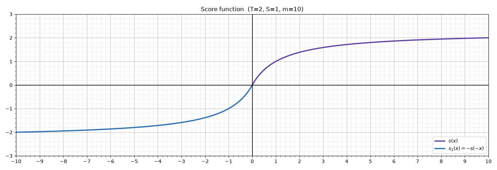
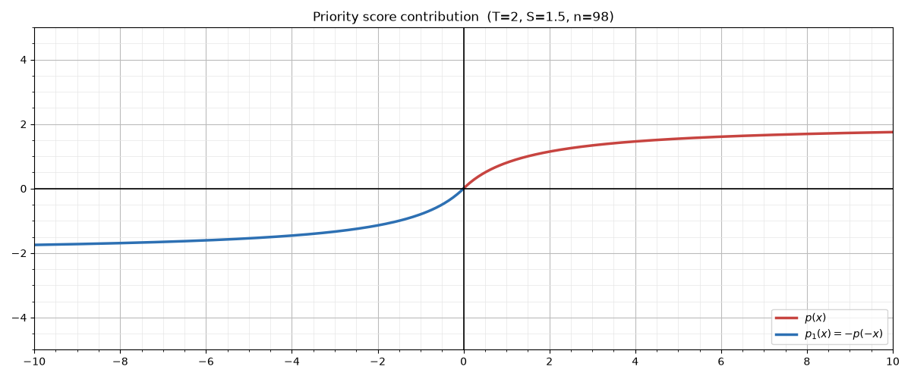

# Threat-based Prioritization of Vulnerabilities

## Context
Based on the established threat catalogs a prioritization of vulnerabilities is possible. To enable this a scoring of
the vulnerability-to-threat (V to T) association is required.

## Outline

1. Isolate the paths from `V` to `T`.
2. For each path, evaluate a resulting Universal Assessment Vector (UAV):
   1. Start at `T` with its impact assessment, asset-specific where one exists, generic
      otherwise.
   2. Convert that assessment into one or more distinct UAVs, ideally one.
   3. For each further entity along the path (CAPEC, CWE, CVE):
      - convert its scope/impact statement into a UAV;
      - combine the accumulated UAV with the entity UAV, using the propagation matrix.

## Evaluation Pipeline

The [Outline](#outline) above in full. Each step consumes the previous step's output, so the order is
forced rather than conventional:

| # | Step                                                                                                  | Operates on                | Produces                    |
|---|-------------------------------------------------------------------------------------------------------|----------------------------|-----------------------------|
| 1 | Convert each impact assessment ([absence rule](#the-absence-rule))                                    | source vocabularies        | one UAV per assessment      |
| 2 | [Aggregate assessments](#aggregation-operator-multiple-assessments-to-one-uav), worst case per metric | UAVs of one threat         | one UAV per threat          |
| 3 | [Propagate](#propagation-operator-uav-to-uav-evaluation-matrix) along each path, `min` per metric     | UAVs of the path entities  | one UAV per path            |
| 4 | Score each path with [`s(x)`](#score-function-s)                                                      | UAV                        | one scalar per path         |
| 5 | Apply the `relatedTo` weight `w`, by coverage grade (**R1**)                                          | path scalar                | weighted scalar per path    |
| 6 | Select the strongest path (**R2**)                                                                    | path scalars of one threat | one contribution per threat |
| 7 | Suppress negatives if any contribution is positive (**R3**)                                           | threat contributions       | filtered set                |
| 8 | Sum to `x`, then [`p(x)`](#priority-score-contribution-p)                                             | filtered contributions     | priority score contribution |

R1–R3 are defined under [From Paths to `x`](#from-paths-to-x).

Two orderings are load-bearing. **`w` is applied before path selection** (5 before 6), so
paths compete on their weighted value; otherwise a `relatedTo` path could win on
unweighted merit and be discounted afterwards. **Path selection precedes suppression**
(6 before 7): within a threat, `max` already discards negative paths whenever a positive
one exists, so R3 only ever operates across threats.

### The Five Combination Operators

Five operations combine two things, and they are not interchangeable. Four of them are
steps of the pipeline above: aggregation (2), propagation (3), path selection (6) and
summation (8); the fifth, comparison, belongs to the UAV specification and is listed for
contrast. The distinctions are deliberate:

| Step                                                                        | Operates on | Combines                       | Rule                          |
|-----------------------------------------------------------------------------|-------------|--------------------------------|-------------------------------|
| Comparison ([UAV doc](universal-assessment-vector.md#comparison-operators)) | UAVs        | vectors of *different* aspects | per metric, polarity-aware    |
| Propagation                                                                 | UAVs        | steps along one path           | per metric, `min`             |
| Aggregation                                                                 | UAVs        | assessments of one threat      | per metric, `max`             |
| Path selection                                                              | scalar `s`  | paths of one threat            | `max`, selects one path whole |
| Summation                                                                   | scalar `s`  | threats of one vulnerability   | `+`                           |

Aggregation and path selection both take a maximum but are **not** the same operation.
Aggregation merges per metric, because several assessments describe the same threat from
different viewpoints. Path selection picks one path entire, because paths are *alternative*
causal routes; merging their metrics would assert a combined impact that no single route
produces.

## Conversion to UAV

Every entity on a path carries its impact statement in its own vocabulary. Before the
propagation operator can be applied, each has to be converted to a UAV.

### The Absence Rule

Conversion is not simply a renaming of metrics. The decisive question is what to emit for
a UAV metric the source does **not** mention, and the answer depends on whether the source
*could* have mentioned it:

| Case                                                                                        | Emit | Reason                                                                                                                                                                                                  |
|---------------------------------------------------------------------------------------------|------|---------------------------------------------------------------------------------------------------------------------------------------------------------------------------------------------------------|
| Source states the metric                                                                    | `U`  | The source confirms it carries this kind of impact but gives no severity. `U` is the identity of the propagation operator: it **keeps the metric open and propagates** the accumulated value unchanged. |
| Source **can** express the metric but does not list it                                      | `N`  | A genuine assertion of non-impact. `N` absorbs, so the metric is closed for the whole path.                                                                                                             |
| Source can express the metric, does not list it, **and declares an unclassified remainder** | `R`  | Neither an assertion of non-impact nor silence. `R` caps what the threat asserted and opens nothing; see [`Scope: Other` beside real scopes](#scope-other-beside-real-scopes-is-residue-the-value-r).   |
| Source **cannot** express the metric at all                                                 | `U`  | Silence is not an assertion. Emitting `N` here would put words in the source's mouth and, because `N` absorbs, permanently erase that metric from the path.                                             |

The last row is the one that matters most. MITRE's Scope enumeration has no concept of
Possession, Utility, Authenticity or Safety, so a CWE or CAPEC entry can never speak to
them.
Converting that silence to `N` would mean that any path passing through a single CWE or
CAPEC destroys those four metrics, no matter what the threat asserted.

### CWE and CAPEC

Both use the same 9-value Scope enumeration (verified against `cwec_v4.19.1.xml` and
`capec-2000.xml`):

| Scope           | UAV metric                                                                                                                                                |
|-----------------|-----------------------------------------------------------------------------------------------------------------------------------------------------------|
| Confidentiality | `C`                                                                                                                                                       |
| Integrity       | `I`                                                                                                                                                       |
| Availability    | `A`                                                                                                                                                       |
| Authentication  | `An`                                                                                                                                                      |
| Authorization   | `Az`                                                                                                                                                      |
| Non-Repudiation | `Nr`                                                                                                                                                      |
| Accountability  | `Ac`                                                                                                                                                      |
| Access Control  | `An` **and** `Az`; the Universal Vector treats Access Control as the combination of the two, see [Metrics](universal-assessment-vector.md#authentication) |
| Other           | no Scope-level mapping, but see the Impact-level rule for `As` below                                                                                      |

`P`, `U`, `Au` and `Sf` are not expressible in this enumeration and therefore always
convert to `U`, never `N`.

**The Impact enumeration opens metrics too, not only Scope.** MITRE's Scope list is not a
complete statement of what a weakness harms, so an Impact that names a consequence opens
that metric wherever it appears. `CWE-1304` is the plain case: it records three `DoS:`
impacts plus `Reduce Performance` and `Reduce Reliability`, under Scopes `Confidentiality`
and `Integrity` with **no Availability scope at all**. Reading Scope alone closed `A` with
`N`, and because `N` absorbs, that annihilated the `A:M` its owning threat asserted, the
catalog ended up asserting no availability impact for a weakness recording three
denial-of-service consequences.

The metric a given Impact opens:

| Impact                                                                                                                                                          | opens         |
|-----------------------------------------------------------------------------------------------------------------------------------------------------------------|---------------|
| `Read Memory`, `Read Application Data`, `Read Files or Directories`                                                                                             | `C`           |
| `Modify Memory`, `Modify Application Data`, `Modify Files or Directories`, `Alter Execution Logic`, `Unexpected State`, `Execute Unauthorized Code or Commands` | `I`           |
| the `DoS: …` family, `Reduce Performance`, `Reduce Reliability`                                                                                                 | `A`           |
| `Gain Privileges or Assume Identity`, `Bypass Protection Mechanism`                                                                                             | `An` and `Az` |
| `Hide Activities`                                                                                                                                               | `Nr` and `Ac` |

**Assurance is recovered from the Impact enumeration, not from Scope.** MITRE has no
Assurance scope at all, so it files quality consequences under `Other`, which is the third
most common scope in CWE (334 occurrences). These Impact values emit `As` wherever they
appear:

| CWE / CAPEC Impact                         | UAV metric                             |
|--------------------------------------------|----------------------------------------|
| `Reduce Maintainability`                   | `As`                                   |
| `Quality Degradation`                      | `As`                                   |
| `Increase Analytical Complexity`           | `As`                                   |
| `Reduce Reliability`, `Reduce Performance` | `A` (runtime behaviour, not assurance) |
| `Varies by Context`, `Other`               | no mapping, emit `U`                   |

This recovers 145 consequences across 110 of the 944 active CWEs that would otherwise
contribute nothing.

#### `Scope: Other` alone is silence, not absence

`Other` records that MITRE could not classify the consequence. It is therefore **ignorance,
not an assertion**, and falls under the third row of [The Absence Rule](#the-absence-rule):

> Where every consequence of an entry carries `Scope: Other` and no other scope, the entry
> is treated as silent: **all metrics convert to `U`**, exactly as for an entry that
> declares no consequences at all. Undeclared metrics are *not* closed with `N`.

181 of the 944 active CWEs carry `Other` as their only scope. They are not all mute: 132 of
them name a harm through a mapped Impact (89 `As`, 34 `A`, 14 `I`), which is how Assurance is
recovered at all. For conversion this makes no difference, nothing is closed either way and
the vector is all `U`, but it matters wherever the tooling asks what a CWE *declares*: such a
CWE declares what its Impacts name. Only the remaining 49 are silent outright.

#### `Scope: Other` beside real scopes is residue, the value `R`

Where `Other` appears **alongside** real scopes, the entry is neither silent nor complete.
The real scopes and Impacts open their metrics as usual. The metrics it does **not** mention
are a third case, distinct from both neighbours:

| Entry                          | Unmentioned expressible metrics | Reading                                                                      |
|--------------------------------|---------------------------------|------------------------------------------------------------------------------|
| real scopes only               | `N`                             | MITRE enumerated and stopped: an assertion of non-impact.                    |
| `Other` alone                  | `U`                             | MITRE enumerated nothing: silence.                                           |
| `Other` **beside** real scopes | **`R`** (Residual)              | MITRE enumerated, and recorded that something remains it could not classify. |

> **`R` is an attenuating filter.** It **caps** a metric the threat asserted at the residual
> level - **`L`** for the time being, and it **never opens** a metric the threat left silent.
> It is a conversion-only value: it is emitted by this rule and nowhere else, it never appears
> in an authored vector string, and it never survives into a propagated vector.

Both alternatives were tried first, and each failed in a measurable way:

* **Closing with `N`** made the rule **discontinuous in the wrong direction**. An entry whose
  only scope is `Other` asserts nothing; adding a single real scope flipped six metrics to `N`.
  `CWE-185` (`Access Control`, `Other`) is the example: learning one more fact about a
  weakness made the model more confident about everything the weakness never mentioned. 121 of
  the 944 active CWEs carry `Other` alongside real scopes; the change removed 658 manufactured
  `N`s.
* **Leaving them `U`** removed the cliff but made such a CWE *indifferent to its owner*: with
  nothing closed and nothing capped, the threat's vector passes through unchanged, so a
  mis-owned weakness scores as well as a correctly owned one. `CWE-244` (`Confidentiality`,
  `Other`) scored `+1.175` under the disclosure threat and `+1.033` under the *availability*
  threat, and the score had stopped detecting mis-ownership for all 121.

`R` sits between them. The threat that speaks to what the CWE declares is untouched; the
threat that asserts a magnitude on a metric the CWE left in its residue keeps that metric,
but only at `L`. Under `R`, `CWE-244` scores `+1.175` under the disclosure threat, unchanged,
and `+0.208` under the availability threat. No path can turn negative through `R`, because
`R` never produces `N`.

**Why a cap and not a level.** Emitting a plain `L` would let the propagation operator's
identity rule (`U × L = L`) *create* a magnitude wherever the threat was silent. Measured
over the five catalogs, that produced a magnitude the threat never asserted on 2,597
(claim, metric) pairs, raised the score of correct mappings through sheer breadth, and
would have satisfied the "no magnitude established" diagnostic permanently, since the CWE
would always bring its own. A derived entity must not supply severity, see
[Values](#values-cwe-and-capec-carry-no-severity). The distinct marker is what lets the
operator tell a residue from an assessed `L`.

**Why `L`, and why that is provisional.** The cap states how much weight an unclassified
remainder may carry. `L` gives the strongest separation between a right and a wrong owner
(a gap of `0.97` on `CWE-244`, against `0.72` at `M`). The level is a policy constant
(`RESIDUAL_CAP`) kept apart from the marker, so it can be revisited without touching the
conversion rule or any catalog.

The `Other`-alone rule is load-bearing rather than pedantic. Treating `Other`-only entries as
"none of the other eight" closes all eight expressible metrics, so the propagation operator
annihilates whatever the threat asserted. Measured against the STRIDE-LM catalog, that put
a block of code-quality CWEs at the very bottom of the scale: `CWE-1043` and `CWE-1045`
both scored `-1.913`, reading as "established to have essentially no impact", when each was
reached from a code-quality threat that matched them precisely. Their only declared scope
was `Other`. Applying the rule above lifted the catalog's median from `1.000` to `1.094`.

`Reduce Performance` and `Reduce Reliability` open `A` rather than `As`, on the boundary
that keeps runtime behaviour out of Assurance; they are listed in the Impact table above and
apply wherever they occur, not only under an `Other` scope.

#### Values: CWE and CAPEC carry no severity

This is the hard case. A CWE `<Consequence>` contains `Scope`, `Impact` and a free-text
`Note`, **no severity of any kind**. The same holds for CAPEC. There is consequently no
source value to map onto `L`, `M` or `H`, and the converted vector is determined entirely
by presence and absence:

| Situation                                                                                     | UAV value                                                              |
|-----------------------------------------------------------------------------------------------|------------------------------------------------------------------------|
| Scope is listed, or an Impact names the consequence                                           | `U`, the entity carries this kind of impact but states no magnitude    |
| Scope is not listed, but expressible                                                          | `N`                                                                    |
| Scope is not listed, but expressible, and the entry carries `Scope: Other` beside real scopes | `R`, [residue](#scope-other-beside-real-scopes-is-residue-the-value-r) |
| Every scope is `Other`, or no consequence is declared                                         | `U` throughout, [silence](#scope-other-alone-is-silence-not-absence)   |
| Scope is not expressible (`P`, `U`, `Au`, `Sf`)                                               | `U`                                                                    |

Two fields look like severity and are not:

* CWE `Likelihood` (inside a consequence) is present on only 78 consequences catalog-wide
  (`High` 51, `Medium` 17, `Low` 5, `Unknown` 5) and expresses *likelihood*, not magnitude.
* CWE `Likelihood_Of_Exploit` is weakness-level exploitability, not impact.

The `Impact` sub-values (25 distinct in CWE, 10 in CAPEC) refine *which* scope applies but
carry no severity either. They are useful for sanity-checking a mapping: `Hide Activities`
should coincide with an `Accountability` or `Non-Repudiation` scope, `Gain Privileges or
Assume Identity` with `Authorization`.

**CAPEC's `Typical_Severity` is deliberately not used.** The field exists at the
attack-pattern level on 490 of 615 patterns, with values `Very Low` … `Very High`, and
could in principle supply `L`/`M`/`H`. It is not converted, because it is **per pattern,
not per scope**: applying it would assert the same magnitude for every scope the pattern
lists, that a `High` CAPEC damages confidentiality and availability equally. Under the
min-semantics of the propagation operator that magnitude would then cap the entire path
on the strength of a statement never made about any individual metric.

CAPEC therefore converts exactly like CWE: presence and absence only, yielding `U`, `N` and, beside `Scope: Other`, `R`.

### CIA impact assessments

The `impactAssessments` entries of `type: "CIA"` already present in the catalogs:

| CIA | UAV metric                                           |
|-----|------------------------------------------------------|
| `C` | `C`                                                  |
| `I` | `I`                                                  |
| `A` | `A`                                                  |
| —   | all other UAV metrics: `U` (CIA cannot express them) |

Unlike CWE and CAPEC, CIA assessments do carry values:

| CIA value | UAV value | In use across the catalogs                    |
|-----------|-----------|-----------------------------------------------|
| `H`       | `H`       | yes                                           |
| `M`       | `M`       | yes                                           |
| `L`       | `L`       | yes                                           |
| `X`       | **`U`**   | yes, the most frequent value by a wide margin |
| `N`       | `N`       | not currently present in any catalog          |

`X` converts to `U`, never to `N`: it records the absence of an assessment, not an assessed
absence of impact. This distinction is the single most consequential rule in the migration,
because `X` dominates the existing data; for Availability it outnumbers all three assessed
values combined. Converting it to `N` would make the propagation operator annihilate the
metric on most paths.

### CVSS

| CVSS v3.1 | CVSS v4.0                 | UAV metric                       |
|-----------|---------------------------|----------------------------------|
| `C`       | `VC` / `SC`               | `C`                              |
| `I`       | `VI` / `SI`               | `I`                              |
| `A`       | `VA` / `SA`               | `A`                              |
| —         | `S` (Supplemental Safety) | `Sf`                             |
| —         | `MSI:S` / `MSA:S`         | `Sf`, and `I` / `A` respectively |

Base metrics for the Vulnerable System (`VC`/`VI`/`VA`) and the Subsequent System
(`SC`/`SI`/`SA`) both convert to the same UAV metric; where a vector carries both, worst
case applies, as for any two assessments of one subject.

Exploitability metrics (`AV`, `AC`, `AT`, `PR`, `UI`) describe how a weakness is reached,
not what it damages, and are not converted. Neither are the remaining supplemental metrics
(`AU` Automatable, `R` Recovery, `V` Value Density, `RE` Response Effort, `U` Provider
Urgency), which qualify response rather than impact. Assurance has no CVSS counterpart and
converts to `U`.

| CVSS value                                          | UAV value                             |
|-----------------------------------------------------|---------------------------------------|
| `H` (High)                                          | `H`                                   |
| `L` (Low)                                           | `L`                                   |
| `N` (None)                                          | `N`, a genuine assertion of no impact |
| `X` (Not Defined, environmental / modified metrics) | `U`                                   |
| `S:P` (Supplemental Safety, Present)                | `Sf:M`                                |
| `S:N` (Supplemental Safety, Negligible)             | `Sf:N`                                |
| `MSI:S` / `MSA:S` (Safety)                          | `Sf:H`, plus `I:H` / `A:H`            |

**On the Safety mappings.** CVSS v4.0 is the only source in this pipeline besides ATT&CK
for ICS that can express Safety, and it defines the supplemental metric against **IEC
61508 consequence categories**, the same standards family behind the UAV's Safety metric,
so the two are semantically aligned rather than merely similar. `Present` spans IEC's
*marginal*, *critical* and *catastrophic* categories without distinguishing them, so it
converts to a single `Sf:M`; grading beyond that would invent precision the source does not
carry. `Negligible` is a genuine assertion and converts to `Sf:N`.

`MSI:S` and `MSA:S` rank **above** `H` in CVSS's own ordering, so they convert to `Sf:H`
and additionally carry the underlying `I:H` or `A:H`. `MSC` has no Safety value: CVSS
treats safety consequences as arising from integrity and availability failures, not from
disclosure.

CVSS defines no Medium for `C`/`I`/`A`, so a converted CVSS vector never produces `M`.
Its scale is coarser than the UAV's, which means a CVSS-derived `H` and a threat-derived
`H` are not calibrated against each other: CVSS `H` spans what the UAV would split
between `M` and `H`.

This is also the level at which an assessor may deliberately set `I` for a metric; see
the invariant under [Propagation Operator](#propagation-operator-uav-to-uav-evaluation-matrix).

### STRIDE

| STRIDE category        | UAV metric                                                             |
|------------------------|------------------------------------------------------------------------|
| Spoofing               | `Au` (and `An` where the spoofing defeats an authentication mechanism) |
| Tampering              | `I`                                                                    |
| Repudiation            | `Nr` and `Ac`                                                          |
| Information Disclosure | `C`                                                                    |
| Denial of Service      | `A`                                                                    |
| Elevation of Privilege | `Az`                                                                   |

STRIDE has no counterpart to `P`, `U`, `As` or `Sf`; all convert to `U`.

STRIDE is a classification, not a measurement; a threat either falls in a category or it
does not, so it supplies no values at all:

| Situation                                                  | UAV value |
|------------------------------------------------------------|-----------|
| Category applies                                           | `U`       |
| Category does not apply, but STRIDE can express the metric | `N`       |
| STRIDE cannot express the metric (`P`, `U`, `As`, `Sf`)    | `U`       |

In practice the STRIDE-LM catalog entries carry `impactAssessments` alongside their STRIDE
classification, so STRIDE determines *which* metrics are touched and the accompanying CIA
assessment supplies the values.

### BSI IT-Grundschutz

| BSI objective     | UAV metric                                              |
|-------------------|---------------------------------------------------------|
| Confidentiality   | `C`                                                     |
| Integrity         | `I`                                                     |
| Availability      | `A`                                                     |
| Authenticity      | `Au`                                                    |
| Binding Character | `Au` **and** `Nr`; BSI defines it as the combination    |
| Reliability       | not a metric: the composite outcome of `C`, `I` and `A` |

BSI's three-level scale (*normal* / *hoch* / *sehr hoch*) is a **Schutzbedarf**, a
protection requirement, belonging to the *demands* aspect, not to *impacts*. It is
therefore not a value source for this pipeline; see the demands column of the
[Metric Values table](universal-assessment-vector.md#metric-values-x). For the impacts
aspect BSI objectives are categorical and follow the same presence/absence rule as STRIDE.

### MITRE ATT&CK

ATT&CK's Impact tactic states what a technique achieves. The ICS matrix is, besides
CVSS v4.0, the only source in this pipeline that can express Safety:

| ATT&CK Impact technique                                                                | UAV metric                                         |
|----------------------------------------------------------------------------------------|----------------------------------------------------|
| Loss of Availability, Loss of Control, Denial of Control, Loss of View, Denial of View | `A`                                                |
| Manipulation of Control, Manipulation of View                                          | `I`, and `Au` where a displayed state is falsified |
| Theft of Operational Information                                                       | `C`                                                |
| **Loss of Safety**, **Damage to Property**                                             | `Sf`                                               |
| **Loss of Protection**                                                                 | `Sf` (the protective function itself is defeated)  |
| Loss of Productivity and Revenue                                                       | no mapping (business consequence, out of scope)    |

Techniques outside the Impact tactic describe how an adversary proceeds rather than what
is damaged, and are not converted. ATT&CK carries no severity, so the presence/absence
rule applies as for CWE and CAPEC.

### Source Coverage Summary

Which UAV metrics each source is capable of expressing at all. A gap means the source
converts that metric to `U`:

|             | C | I | A | P | U | Au | An | Az | Nr | Ac | As | Sf |
|-------------|---|---|---|---|---|----|----|----|----|----|----|----|
| CWE / CAPEC | ✔ | ✔ | ✔ | — | — | —  | ✔  | ✔  | ✔  | ✔  | ✔  | —  |
| CIA         | ✔ | ✔ | ✔ | — | — | —  | —  | —  | —  | —  | —  | —  |
| CVSS        | ✔ | ✔ | ✔ | — | — | —  | —  | —  | —  | —  | —  | ✔  |
| STRIDE      | ✔ | ✔ | ✔ | — | — | ✔  | ✔  | ✔  | ✔  | ✔  | —  | —  |
| BSI         | ✔ | ✔ | ✔ | — | — | ✔  | —  | —  | ✔  | —  | —  | —  |
| ATT&CK ICS  | ✔ | ✔ | ✔ | — | — | ✔  | —  | —  | —  | —  | —  | ✔  |

No source expresses Possession or Utility; both can only originate from a threat's own
impact assessment authored against the Universal Vector directly. Assurance is reachable
only through CWE/CAPEC, and only via the Impact-level rule; Safety through ATT&CK for ICS
and CVSS v4.0.

### Value Coverage Summary

Which UAV *values* each source can produce. This is the sharper constraint:

| Source          | Produces `N` | `L` | `M` | `H` | `U` | `I` | `R` |
|-----------------|--------------|-----|-----|-----|-----|-----|-----|
| CWE             | ✔            | —   | —   | —   | ✔   | —   | ✔   |
| CAPEC           | ✔            | —   | —   | —   | ✔   | —   | ✔   |
| CIA assessments | (✔)          | ✔   | ✔   | ✔   | ✔   | —   | —   |
| CVSS            | ✔            | ✔   | —   | ✔   | ✔   | ✔   | —   |
| STRIDE          | ✔            | —   | —   | —   | ✔   | —   | —   |
| BSI (impacts)   | ✔            | —   | —   | —   | ✔   | —   | —   |
| ATT&CK ICS      | ✔            | —   | —   | —   | ✔   | —   | —   |

`(✔)` = the value is defined but does not occur in the current catalogs.

**Only threat-level assessments and CVSS produce graded values.** Every intermediate
entity on a path contributes nothing but `U` (kept open), `N` (closed) and `R` (capped).
Since `U` is the identity of the propagation operator, the CWE and CAPEC steps can only ever
*reduce* a metric, to `N`, or through `R` to the residual cap, or leave it as it was. They
can never raise a level, and never establish one where the threat was silent.

The severity of a path is therefore fixed at its two ends: the threat's impact assessment
sets it, and the CVE's CVSS vector may cap it. The CWE and CAPEC hops act purely as
filters. With one exception they decide *whether* a metric survives the path, never *how
much*; the exception is `R`, which attenuates to a fixed policy level rather than grading,
it carries no information about the weakness beyond "unclassified remainder".

## Aggregation Operator (Multiple Assessments to One UAV)

A threat may carry several impact assessments: a CIA assessment and a UAV assessment, or
an asset-specific one alongside a generic one. The path evaluation needs a single UAV, so
these are reduced by the **aggregation operator**.

Each assessment is first converted to a UAV independently, using the rules above. Only then
are the resulting UAVs aggregated. Converting after aggregating would mean combining values
from different vocabularies, which the absence rule is specifically designed to prevent.

The policy is **worst case, applied per metric**:

|       | N | U | I  | L  | M  | H  |
|-------|---|---|----|----|----|----|
| **N** | N | U | N  | L  | M  | H  |
| **U** | U | U | U  | L  | M  | H  |
| **I** | N | U | I  | L⚠ | M⚠ | H⚠ |
| **L** | L | L | L⚠ | L  | M  | H  |
| **M** | M | M | M⚠ | M  | M  | H  |
| **H** | H | H | H⚠ | H  | H  | H  |

The operator is commutative and reduces to `max` under the ordering `N < U < L < M < H`,
with `I` dropped unless every assessment states it. ⚠ marks a combination that also raises
a warning (see below).

This is a **third** operator, distinct from the two others, and the three treat the
non-scoring values differently on purpose:

| Operator                       | Direction         | `U`                                   |
|--------------------------------|-------------------|---------------------------------------|
| Comparison (cross-aspect)      | —                 | propagates as `U`                     |
| Propagation (along a path)     | `min`, narrowing  | identity; yields to the other operand |
| Aggregation (over assessments) | `max`, worst case | outranks `N`, yields to `L`/`M`/`H`   |

### Why `U` outranks `N` here

Under a worst-case policy, one assessor stating "no impact" must not silently overrule
another stating "unknown". `max(N, U) = U` keeps the open question open; resolving it to
`N` would convert an unexamined metric into an assurance that nothing is at stake, and
because `N` absorbs during propagation, that assurance would then close the metric for
every path through this threat.

`U` does not outrank a graded value: an assessor who examined the metric and found `M`
carries more information than one who did not look, so `max(U, M) = M`.

### Why `I` is dropped unless unanimous

`I` records that *an assessor* put a metric out of scope. It is authoritative for that
assessment, but it is not a statement about the threat. Where one assessment scopes a
metric out and another assesses it, the assessed value wins; a scoping decision should
not suppress a positive finding made elsewhere. `I` survives aggregation only when every
assessment states it, which is the case where the metric genuinely is out of scope for the
threat as a whole.

### Warnings

Aggregation is where contradictory assessments surface. Two conditions are logged rather
than silently resolved:

* A **scope conflict** is an `I` combined with `L`, `M` or `H`. One assessor considered the
  metric irrelevant while another recorded impact on it.
* A **material disagreement** is an `N` combined with `M` or `H`, that is, an assessed
  absence of impact against an assessed significant impact. A gap of a single level
  (`N` with `L`, or `L` with `M`) is ordinary assessor variance and is not reported.

Both warnings identify the threat, the metric and the conflicting assessments. The
aggregation still produces a result, the worst case, so the pipeline does not stall on
a data quality problem.

## Propagation Operator (UAV to UAV Evaluation Matrix)

This matrix defines the **propagation operator**: it carries a single aspect, here
**impacts**, along a path, combining the current UAV with the UAV of the next entity in
that path. It is not a comparison operator. The comparison operators in
[`universal-assessment-vector.md`](universal-assessment-vector.md#comparison-operators)
relate vectors of *different* aspects and deliberately treat `U` the opposite way: there
`U` propagates as `U`, whereas here `U` yields to the affector, so that an entity stating
nothing about a metric cannot erase what the threat already established.

|       | N | U | I | L | M | H | R | Comment                                  |
|-------|---|---|---|---|---|---|---|------------------------------------------|
| **N** | N | N | I | N | N | N | N | All none, except against I               |
| **U** | N | U | I | L | M | H | U | Take over affector, but `R` never opens  |
| **I** | I | I | I | I | I | I | I | Ignore absorbs everything, incl. N       |
| **L** | N | L | I | L | L | L | L | Cannot be higher than L                  |
| **M** | N | M | I | L | M | M | L | Cannot be higher than M; `R` caps at `L` |
| **H** | N | H | I | L | M | H | L | Cannot be higher than H; `R` caps at `L` |

Rows carry the impact level accumulated along the path so far, columns the UAV of the next
entity in that path. That next entity is called the affector below, because its vector is
what acts on the accumulated value.

The matrix is commutative: `U` acts as the identity (the affector is taken over), `N`
absorbs everything except `I`, and every remaining pair resolves to the lower of the two
levels under `N < L < M < H`. The `I` column mirrors the `I` row accordingly; an entity
declaring a metric out of scope removes it from the path regardless of what has
accumulated so far. `I` and `N` are therefore two competing absorbing elements, and `I`
wins: `I×N` evaluates to `I`, because we do not want `N` to contribute to the score.

**The `R` column.** `R` is the residual value emitted for a CWE or CAPEC that declares
`Scope: Other` beside real scopes, see
[Conversion](#scope-other-beside-real-scopes-is-residue-the-value-r). Against a graded value
it behaves as `min(level, cap)` with the cap at `L`; against `U` it yields `U`, which is the
one place it departs from an assessed `L` (`U × L = L`, but `U × R = U`). That departure is
the whole point of the distinct marker: a residue may weaken a claim, it may not make one.
`N` and `I` absorb it as they absorb everything else.

**Invariant: where `R` may originate.** Only from conversion of a derived entity. `R` is
never authored, so it is not a value of the vector string grammar and never occurs as a
*row* of the matrix: the accumulated vector starts at a threat's assessment, and no cell of
the `R` column yields `R`. It therefore never reaches `x` or `s`. (For completeness the
operator is defined commutatively, `R × R = R`.)

**Invariant: where `I` may originate.** `I` is never stated on a derived entity vector:
CAPEC and CWE entries do not carry it. It is set only where an assessor deliberately
excludes a metric, on a threat's impact assessment, or at CVE/CVSS level where an
assessor may choose to ignore a metric of the UAV. Because `I` is therefore always a
deliberate scoping decision by the party performing the assessment, letting it absorb
every other value, including an `H` established earlier in the path, is the intended
behaviour. The invariant is what makes that safe: were `I` ever emitted by derived data,
a third party could silently erase an assessed impact.

### Example: Evaluating a Path

A threat `T` reaches a CVE over a path through one CAPEC entry and two CWE entries. Each
pair of columns below shows the next entity's own UAV and the value accumulated after
combining the two with the propagation matrix, metric by metric.

| Metrics | UAV1 (T) | UAV2 (CAPEC) | UAV1×UAV2 | UAV3 (CWE) | UAV1×..×UAV3 | UAV4 (CWE) | UAV1×..×UAV4 | UAV5 (CVE) | UAV1×..×UAV5 |
|---------|----------|--------------|-----------|------------|--------------|------------|--------------|------------|--------------|
| C       | H        | U            | H         | U          | H            | N          | N            | H          | N            |
| I       | H        | U            | H         | U          | H            | U          | H            | H          | H            |
| A       | N        | U            | N         | U          | N            | N          | N            | N          | N            |
| P       | U        | U            | U         | U          | U            | U          | U            | U          | U            |
| U       | U        | U            | U         | U          | U            | U          | U            | U          | U            |
| Au      | H        | U            | H         | U          | H            | U          | H            | U          | H            |
| An      | M        | U            | M         | U          | M            | U          | M            | U          | M            |
| Az      | U        | U            | U         | U          | U            | U          | U            | U          | U            |
| Nr      | M        | N            | N         | U          | N            | U          | N            | U          | N            |
| Ac      | U        | U            | U         | U          | U            | U          | U            | U          | U            |
| As      | U        | U            | U         | U          | U            | U          | U            | U          | U            |
| Sf      | U        | U            | U         | U          | U            | U          | U            | U          | U            |

Five behaviours of the operator are visible in this table.

The threat can close a metric at the very start. `A` is `N` on `T`, so the threat states
that it does not damage availability, and no later entity can reopen it.

An intermediate entity can close a metric just as effectively. The CAPEC lists no
Non-Repudiation scope although its enumeration is able to express one, so it emits `N`, and
the `M` the threat asserted for `Nr` does not survive the first hop.

A closure late in the path still wins. The second CWE emits `N` for `C`, absorbing the `H`
carried that far, and the `H` in the CVE's own vector cannot restore it. This is what makes
`N` an absorbing element rather than a minimum.

Silence propagates instead of erasing. CVSS cannot express Authenticity, so the CVE emits
`U` for `Au` and the threat's `H` passes through unchanged. Had the absence rule emitted `N`
here, the metric would have been destroyed by a source that never spoke to it.

Intermediate entities never raise a value. `An` stays at the `M` set by the threat all the
way along, because every entity on the path emits `U` for it.

The propagated vector is therefore:

```
UAV:1.0/C:N/I:H/A:N/Au:H/An:M/Nr:N
```

which yields `x = 2.25` and scores `s = 1.43` under the [score function](#score-function-s).

## Score Formula

The formula below is provisional and still subject to revision. It scores across all `m`
metrics, so that a vector carrying `H` on every metric scores twice what a vector carrying a
single `H` scores.

Boundary cases (`m` is the number of metrics in a UAV, currently 12):

* `s(1*H)=1`
* `s(m*H)=2`
* `s(m*U)=s(m*I)=0`
* `s(8*L)=s(2*M)`

| Level         | Level Score | Comment                                              |
|---------------|-------------|------------------------------------------------------|
| N (None)      | −1.0        | m*(-1.0)=-m for symmetry reasons in s                |
| I (Ignore)    | 0           | Ignore does contribute nothing to s                  |
| U (Undefined) | 0           | Undefined (threat in limbo) does contribute nothing. |
| L (Low)       | 0.0625      | Rationale: 4L = 1M → 4*0.0625=0.25                   |
| M (Medium)    | 0.25        | Rationale: 4M = 1H → 4*0.25=1.0                      |
| H (High)      | 1.0         |                                                      |

### Aggregation of `x`

`x` is the sum of the level scores over the `m` metrics of a UAV:

$$
x = \sum_{i=1}^{m} \text{score}(v_i)
$$

with one exception, the **N suppression rule**:

> `N` contributes `−1.0` **only if no metric of the vector is `L`, `M` or `H`**.
> As soon as at least one metric carries `L`, `M` or `H`, every `N` contributes `0`.

and, along a path, one further condition, the **contradiction rule**:

> An `N` contributes `−1.0` only where the **threat itself asserted that metric** at `L`,
> `M` or `H`. Where the threat never spoke to it, the `N` still closes the metric for
> propagation but does not charge the path for it.

Both conditions exist to stop a path being charged for a disagreement that never happened.
The suppression rule handles it within one vector; the contradiction rule handles it between
two. A `−1.0` should mean *the threat claimed this is harmed and the weakness says it is
not*, not *these two vocabularies happen not to overlap here*. Of the seven `N`s `CWE-244`
carried under `THR-STRIDE-D`, only `A` and `Ac` were contradictions; the other five were
metrics that threat never mentioned, and they were charging the path `−5.0` between them.

The rule keeps the two things `N` expresses from interfering with each other. A vector
that asserts non-impact across the board stays at the negative end of the scale
(`m*N` → `x=-m` → `s=-2`, the mirror of `m*H` → `s=2`). But once a vector carries any
real impact, its `N` entries no longer cancel that impact; an assessor who records
honest non-impacts is not penalised against one who leaves the same metrics `U`.

Examples (values computed at `m = 12`):

| Vector                    | x     | s     |                               |
|---------------------------|-------|-------|-------------------------------|
| `m*H`                     | 12.0  | 2.0   | upper bound                   |
| `M H N H H N N H N M U U` | 4.5   | 1.74  | N suppressed, four H present  |
| `H` + 11×`U`              | 1.0   | 1.0   |                               |
| `5*N + 7*U`               | −5.0  | −1.77 | N evaluated, no L/M/H present |
| `m*N`                     | −12.0 | −2.0  | lower bound                   |

Note that `s` is discontinuous where the rule switches: `m*N` scores `-2.0`, whereas
changing a single metric to `L` yields `x=0.0625` and `s=0.11`.

### Score Function `s`

For the computations of `s` we concluded:

$$
s(x) = T \cdot \frac{x}{x + S\left(\frac{m-x}{m-S}\right)} \quad \{0 \le x \le m\}
$$

$$
s_1(x) = -s(-x) \quad \{x \ge -m\}
$$



Current settings:

* `T=2` (fixed here)
* `S=1` (fixed here)
* `m`: number of metrics in a UAV; currently 12

Characteristics:

* `s(0)=0`
* `s(1)=1`
* `s(m)=2`
* `s_1(-1)=-1`
* `s_1(-m)=-2`

### From Paths to `x`

A vulnerability `V` may be associated with `i` of the `n` threats in the catalog, and a
threat `T` may reach `V` over several distinct paths. Each path has been scored by `s` at
this point.
Three rules reduce those path scores to the single `x` that `p` consumes.

#### R1: the `relatedTo` weight

A path whose originating link from `T` is a `relatedTo` association rather than `basedOn`
has its score reduced. How far depends on the **coverage** the reference states, how much
of the referenced weakness falls under the threat:

```
s_relatedTo = w(coverage) * s        with 0 < w < 1
```

| `coverage`    | Test                                                                                                                                                                                       | Default `w` |
|---------------|--------------------------------------------------------------------------------------------------------------------------------------------------------------------------------------------|-------------|
| `adjacent`    | **No** manifestation of the weakness is itself an instance of the threat. It stands beside the threat on the causal chain, an enabling precondition or a consequence one step on.          | 0.25        |
| `partial`     | **Some** manifestations of the weakness are instances of the threat, others are not, and neither side dominates, or it cannot be said which does. **The default when no grade is stated.** | 0.5         |
| `substantial` | **Most** manifestations of the weakness are instances of the threat. What remains outside is the only thing keeping the reference out of `basedOn`.                                        | 0.75        |

The grades answer one question, *if this weakness is present, how much of what it does falls
under this threat?*, and are decided in a fixed order: could the threat's description be read
as a description of this weakness? Then the reference is `basedOn` and carries no grade. Is any
manifestation of the weakness an instance of the threat? If none, `adjacent`. Are most? Then
`substantial`, otherwise `partial`. There is no grade below `adjacent`: a reference weaker than
that does not belong in the catalog.

**What counts as an instance depends on how the threat is defined.** A threat defined by a
*mechanism* ("the software fails to coordinate concurrent access to a shared resource") has as
instances the occurrences of that mechanism; a weakness that merely makes it reachable stands
beside it. A threat defined by an *outcome* ("a device or information item is tampered",
"resources are unavailable") has as instances the occurrences of that outcome, by whatever
mechanism: a manifestation of the weakness whose consequence is the outcome the threat names
**is** an instance of it. An off-by-one error that ends in overwritten memory is an instance of
Tampering, though it would be only a precondition of a threat about missing integrity checks.
Under an outcome-defined threat `adjacent` is therefore for the weakness whose manifestations
reach the outcome only through a *further* weakness or not at all, and the grade between
`partial` and `substantial` is settled, as everywhere, by how much of what the weakness does
ends there.

**Why the weight is graded.** A single factor applied to every `relatedTo` path discounts
alike a reference naming a precondition and one covering four fifths of the threat. Below
`0.5` the choice barely matters, because a path at half weight already loses wherever a
`basedOn` path exists; it is between `0.5` and `1.0` that rankings reorder, and they reorder
most in the catalogs where a large share of weaknesses are decided by a `relatedTo` path at
all. A single `w` has no room to speak there. The second reason weighs more for Principle 5:
while `basedOn` was worth exactly twice `relatedTo`, choosing a section was also choosing a
score, which left a standing reason to settle a semantic question numerically. Grading the
weight separately removes that reason, so the section can say what the reference *is* and the
grade how far it reaches.

**The catalog states the grade; the policy states the weight.** The three values of `w` are set
by the user in the policy, and those above are proposed defaults. No number appears in a
catalog, so none can be tuned there: an editor can only make a claim that has a written test
behind it, and the weights can be revisited without touching a catalog. `w = 1` is not available
to any grade: a reference worth full weight is a `basedOn` reference, and the way to say so is
to place it there on semantic grounds. A single `w` for all three grades reproduces the earlier
ungraded rule.

Where several `relatedTo` references of one threat reach the same weakness, the strongest grade
applies: they are alternative routes, as under R2. A grade on a reference with `subtree` scope
is inherited by everything the reference expands to.

**A grade is never a means to a score.** For a weakness whose only claims are `relatedTo`,
3% to 8% of each catalog, the grade *is* the result, with no competing path to discipline it.
A grade is therefore set only as the outcome of an individual review, carries a `rationale`
naming the test it passed, and is never assigned by a generator; the catalog repository's
principles check gates the mechanical part of this. The measurements behind the grading are
recorded in the reference-coverage proposal.
<!-- TODO: link proposal-reference-coverage.md once it is available in this repository -->

The weight applies **once per path**, as soon as the link from `T` into the path is
`relatedTo`. The remaining links along the path are treated as equivalent; there is
no further attenuation per step, and the factor does not compound.

`w` multiplies the *score*, not the input `x` of `s`. The two are not equivalent, because
`s` is concave: for a path at `x = 2` and `w = 0.5`, `w·s(x) = 0.69` whereas `s(w·x) = 1.00`. Weighting
the score is the intended reading: a `relatedTo` association does not claim that *less*
damage occurred, it claims the same damage with weaker attribution, so it is the
conclusion that is discounted, not the impact.

The same reasoning applies to negative scores. `w` moves a score toward zero in both
directions: it weakens a claim of impact and equally weakens a claim of harmlessness.

#### R2: path selection

Each threat contributes the **maximum** of its weighted path scores:

```
contribution(T) = max over paths of ( w_path * s_path )
```

Paths are alternative routes for the same harm, so they are not summed; two routes to the
same damage do not double it. This also keeps likelihood out of an impact score: a threat
reachable by five paths is more likely to be exploited, but does not do more damage.

Where several paths tie at the maximum, all of them are retained as justification, but the
contribution is counted **once**. Summing tied paths would multiply a threat's weight by an
accident of graph shape.

#### R3: negative suppression

Negative contributions accumulate while every contribution is negative, moving `x` further
into the negative. As soon as one contribution is greater than zero, all negative
contributions are ignored.

This mirrors the [N suppression rule](#aggregation-of-x) one level up: an established
absence of impact belongs at the negative end of the scale, but must not cancel an
established presence of impact elsewhere. Without it, a vulnerability linked to three
serious and three harmless threats would score the same as one linked to nothing at all.

#### The resulting `x`

$$
x = \sum_{t=1}^{i} \; \max_{q \in \text{paths}(T_t)} \; w_{t,q} \cdot s\big(UV_{t,q}\big)
$$

subject to R3, where `UV_{t,q}` is the propagated UAV of path `q` of threat `T_t` and
`w_{t,q}` the weight R1 assigns to that path. Since each contribution lies in `[-2, 2]` and
`i <= n`, `x` stays within the `[-2n, 2n]` domain of `p`.

The bound is `2n` rather than `2i` by design. In the worst case every threat in the catalog
associates with the vulnerability, so `2n` is the true extreme. Fixing the scale to the
catalog rather than to the individual vulnerability is also what keeps scores comparable:
normalising by `2i` would rescale every vulnerability to its own maximum and flatten the
ranking. A vulnerability that reaches few threats therefore scores below one that reaches
many, which is the intended ordering.

### Priority Score Contribution `p`

`p` converts `x` into the contribution this analysis makes to a vulnerability's
prioritization score. It is a contribution, not a standalone score: `x = 0` yields `p = 0`,
meaning a vulnerability that reaches no threat receives no increase in priority.

For the priority score contribution `p` we concluded:

$$
p(x) = T \cdot \frac{x}{x + S\left(\frac{2n-x}{2n-S}\right)} \quad \{x \ge 0\}
$$

$$
p_1(x) = -p(-x)
$$



Current settings:

* `T=2` (can be altered in the policy)
* `S=1.5` (can be altered in the policy)
* `n`: Number of Threats in Catalog
* Area of definition for `p` is `[0, 2n]`. For negative `x` we flip the function (see `p1`)

Characteristics:

* `p(S)=1`
* `lim_{x → 2n} p = 2`
* `lim_{x → -2n} p = -2`

#### Why `S = 1.5`

`S` is the anchor at which the function reaches half its maximum, since `f(S) = T/2 = 1`
holds regardless of the normaliser. Choosing `S` therefore answers one question: **how
strong must a single threat be for this vulnerability to receive half the maximum priority
contribution?**

A threat contributes at most `s = 2`. Setting `S = 1.5` places the half-maximum at 75% of
a maximal threat: a single strong but not catastrophic threat is enough to reach `p = 1`,
while a single moderate one is not. For orientation, `s = 1.5` corresponds to a propagated
UAV worth roughly 2.6 H-equivalents, for instance two metrics at `H` plus two at `M`.

The alternatives bracket the choice: `S = 1.0` would grant half the maximum to any threat
scoring `s = 1`, a single `H` metric surviving the path, which sets the bar too low for
a catalog-wide scale. `S = 2.0` would require a maximal threat, leaving everything short of
that below the midpoint. `S` is adjustable in the policy; `1.5` is the proposed default.

Note that `s` anchors differently on purpose: there `S = 1` because `s(1*H) = 1` ties the
half-maximum to a single catastrophic metric, which is the natural unit at metric level.
`p` operates one level up, where the natural unit is a whole threat.

### Domains

`s` and `p` are the same function under different normalisers:

$$
f(x) = T \cdot \frac{x}{x + S\left(\frac{X-x}{X-S}\right)}
\qquad X = m \text{ for } s, \quad X = 2n \text{ for } p
$$

Each produces its stated characteristics (`f(0) = 0`, `f(S) = T/2`, `f(X) = T`) for any
admissible choice of `T` and `S`, provided the input lies within its domain. Both domains
hold by construction rather than by enforcement: `x` for `s` cannot exceed `m` because it
sums `m` level scores of at most `1.0`, and `x` for `p` cannot exceed `2n` because it sums
at most `n` threat contributions of at most `2`. Negative inputs are covered by `s_1` and
`p_1` over the mirrored range.

## References

* [Universal Assessment Vector](universal-assessment-vector.md)
* https://github.com/org-metaeffekt/spdx-3-model/blob/812b53c133df4aa54b65f4a2e766704a34e12aa7/images/model-Threat.png
