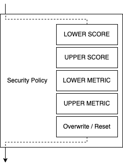

# Application of Vulnerability Assessments

The Vulnerability Assessment Dashboard supports to various levels and forms of
assessments. These are primarily applied to compute an effective context CVSS
vector and a resulting score.

The following sections describe the process how assessments are applied, merged, and
overwritten.

# Definitions

## Baseline Assessments

Baseline assessments are assessments that do not apply on individual vulnerability, but for all
vulnerabilities in a given assessment context. Baseline assessment are often base on additional information
from deployment scenarios.

## Vulnerability Assessments

Vulnerability assessments apply to vulnerabilities and their given characteristics and details.

Vulnerability assessments may apply based on different criteria:
- condition: a generic condition that can be used to express certain prerequisites for the vulnerability to apply.
- CPE: the vulnerability matches a specific CPE
- CWE: the vulnerability matches a specific CWE
- CVE: a vulnerability with the given CVE

# Assessment Application (current implementation)

The current implementation has several levels of evaluation.

# Assessment-Type-Level Application

Assessment-Type-Level Application Order:
1) apply baseline assessments
2) apply vulnerability assessments

This means that all baseline assessments are evaluated first. The result of this evaluation is then used as
input for applying Vulnerability Assessment.

In particular, baseline and vulnerability assessments do not interfere with each other independent on when 
the assessments were created.

# Assessment-Level Application

In both Assessment-Levels assessments a processed according to the following scheme:

Within an assessment different evaluation steps are applied based on different MergeMethods as specified in the 
security policy (contextCvssSelector section). 

The default security policy applies the following order:
* LOWER SCORE modifications - Modification, which are applied only if the resulting score is lower than the score of the input vector.
* UPPER SCORE modifications - Modification, which are applied only if the resulting score is higher than the score of the input vector.
* LOWER METRIC modifications - Modifications applied only in case the metric is lower that the original metric.
* UPPER METRIC modifications - Modifications applied only in case the metric is higher that the original metric.
* ALL other modifications - Other modifications including overwrite and reset.

Within a MergeMethod the assessments are applied ordered by creation time.

Currently, the approach is not mapping all expectations correctly, since time order is significant on assessment-level 
application of changes. This will be fixed short-term.

