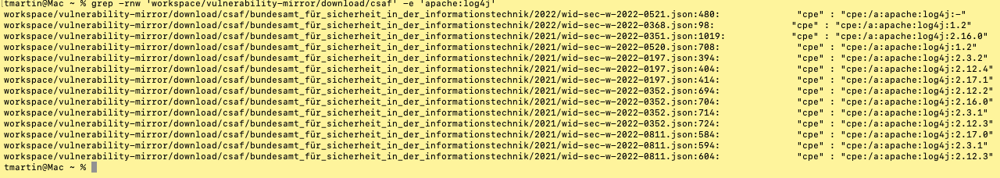
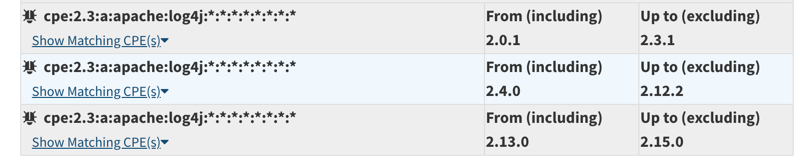

# Why no Log4J in CSAF?

When running the Inventory Enrichment process, when only the CSAF Vulnerability matching is configured (only CSAF is used for Vulnerability Matching) on an Inventory,
containing a log4j artifact in one of the infamous versions (i.e 'log4j-api-2.14.0.jar' -> CPE derivation -> cpe:/a:apache:log4j), the resulting inventory will not contain any vulnerabilities!

*for reference, only using nvd vuln matching, you gain four. (especially THE [log4j vuln](https://nvd.nist.gov/vuln/detail/CVE-2021-44228))*

## What does the index say?
When querying the lucene CSAF index for 'log4j' you will mainly find redhat specific bundled packages (i.e. 'pkg:rpm/redhat/ant-apache-log4j@1.9.2-9.el7?arch=noarch'). This is relatively surprising since the BSI usually creates relatively general Security Advisories, spanning all kind of ecosystems, so the critical log4j bug (CVE-2021-44228) was bound to show up.

## What does the actual data say?
When searching directly for log4j cpe string occurrences, we actually do indeed find some instances:


When checking these advisors, they do indeed define these log4j versions:
```json
{
  "branches": [
    {
      "category": "product_name",
      "name": "Apache log4j < 2.3.2",
      "product": {
        "name": "Apache log4j < 2.3.2",
        "product_id": "T021443",
        "product_identification_helper": {
          "cpe": "cpe:/a:apache:log4j:2.3.2"
        }
      }
    },
    {
      "category": "product_name",
      "name": "Apache log4j < 2.12.4",
      "product": {
        "name": "Apache log4j < 2.12.4",
        "product_id": "T021444",
        "product_identification_helper": {
          "cpe": "cpe:/a:apache:log4j:2.12.4"
        }
      }
    },
    {
      "category": "product_name",
      "name": "Apache log4j < 2.17.1",
      "product": {
        "name": "Apache log4j < 2.17.1",
        "product_id": "T021445",
        "product_identification_helper": {
          "cpe": "cpe:/a:apache:log4j:2.17.1"
        }
      }
    }
  ],
  "category": "product_name",
  "name": "log4j"
}
```

(one might also notice that the version ranges are way too imprecise, as they do not have a lower bound. NVD displays the correct ranges:


The underlying reason as to why these log4j versions are not matched using CSAF, is that these documents fail to list the defined products in the 'affected_products' mapping:

```json
{
  "notes": [
    {
      "category": "description",
      "text": "Es existiert eine Schwachstelle in Apache log4j. Bestimmte Nutzer-Eingaben werden nur ungenügend validiert. Ein entfernter authentisierter Angreifer mit der Berechtigung zum Ändern der Protokollierungskonfigurationsdatei kann eine bösartige Konfiguration mit einem JDBC-Appender mit einer Datenquelle erstellen, die auf einen JNDI-URI verweist. In der Folge kann Code zur Ausführung gebracht werden."
    }
  ],
  "product_status": {
    "known_affected": [
      "T001160",
      "67646",
      "T017032",
      "... missing 'T021445', 'T021443' and 'T021444'"
    ]
  }
}
```

This is a reoccurring problem with BSI Csaf documents, where they define products in the product tree, yet fail to map them to any vulnerability in the document.
All in all this is not critical as the log4j vulnerabilities should probably already be matched using the NVD Vuln Matching and any CSAF matching would be redundant.    
Nevertheless, this occurrence is documented, since it demonstrates a very big lack of data quality in CSAF

(State as of 07.02.2024)