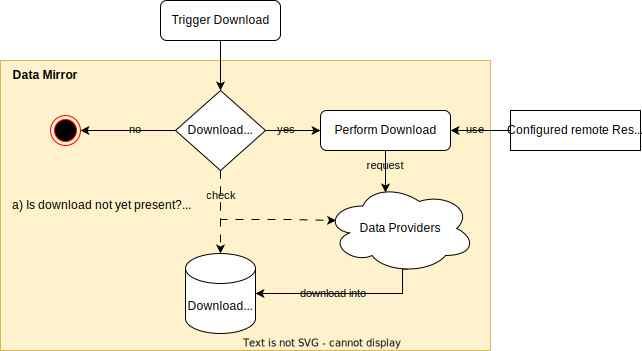

> [Documentation](../../README.md) >
> [Vulnerability Management](../vulnerability-management.md) >
> [Vulnerability Data Mirror](vulnerability-data-mirror.md) >
> Downloaders

# Downloaders

Downloaders are responsible for retrieving data from a remote source and storing it in a local directory.
The implementation of each downloader varies depending on the format of the data provided by the source
(e.g., JSON, XML).
Below is a list of all available downloaders, including deprecated ones.
Detailed information about each downloader can be found in the [Downloader Details](#downloader-details) section.

- [NVD CVE API](#nvd-cve-api)
- [NVD CPE API](#nvd-cpe-api)
- [MSRC](#msrc)
- [MSRC Security Guide](#msrc-security-guide)
- [CERT-SEI](#cert-sei)
- [CERT-FR](#cert-fr)
- [CERT-EU](#cert-eu)
- [CISA KEV](#cisa-kev)
- [EPSS](#epss)
- [EOL](#eol)
- [GHSA](#ghsa)
- [_NVD (deprecated)_](#nvd-deprecated)
- [_CPE Dictionary (deprecated)_](#cpe-dictionary-deprecated)
- [_MSRC Manual CSV (deprecated)_](#msrc-manual-csv-deprecated)

## General Downloading Workflow

Each downloader operates independently and can be executed using the `data-mirror` goal from the
`com.metaeffekt.artifact.analysis:ae-mirror-plugin`.
An example configuration is provided on the [Vulnerability Data Mirror](vulnerability-data-mirror.md) page.

While the downloaders have distinct implementations, they all follow a similar overall process.
Before actually running a download when triggered, they check if an update is needed.
The download step is skipped if no update is required.

A download is considered necessary if:

- The downloader has never been run before.
- The previous download attempt failed.
- The data is older than a configured threshold.
- The remote source has been updated since the last download. (not available for all downloaders)

Each downloader stores then its data in a single designated directory, with a format that depends on the downloader.

The remote resource locations can be configured by using the ResourceLocations configuration.
Every downloader makes its remote URLs available via this configuration, allowing hosting the data on different servers,
like a local mirror or a caching proxy.
All available resource locations are listed in the detailed downloader descriptions.

# Downloader Details

## NVD CVE API

`nvd` / `nvdCveDownload`

| Resource Location | Description |
| --- | --- |
| `CVE_API_LIST_ALL` | https://services.nvd.nist.gov/rest/json/cves/2.0?startIndex=%d
<ol>     <li><code>startIndex</code> 0-based index of the first CVE to be returned in the response data</li> </ol> |
| `CVE_API_START_END_DATE` | https://services.nvd.nist.gov/rest/json/cves/2.0/?startIndex=%d&lastModStartDate=%s&lastModEndDate=%s
The maximum allowable range when using any date range parameters is 120 consecutive days.  Values must be entered in the extended ISO-8061 date/time format:  <code>[YYYY][“-”][MM][“-”][DD][“T”][HH][“:”][MM][“:”][SS][Z]</code> <ol>     <li><code>startIndex</code> 0-based index of the first CVE to be returned in the response data</li>     <li><code>lastModStartDate</code> the start date</li>     <li><code>lastModEndDate</code> the end date</li> </ol> |

## NVD CPE API

`cpe-dict` / `nvdCpeDownload`

| Resource Location | Description |
| --- | --- |
| `CPE_API_LIST_ALL` | https://services.nvd.nist.gov/rest/json/cpes/2.0?startIndex=%d
<ol>     <li><code>startIndex</code> 0-based index of the first CPE to be returned in the response data</li> </ol> |
| `CPE_API_START_END_DATE` | https://services.nvd.nist.gov/rest/json/cpes/2.0?startIndex=%d&lastModStartDate=%s&lastModEndDate=%s
The maximum allowable range when using any date range parameters is 120 consecutive days.  Values must be entered in the extended ISO-8061 date/time format:  <code>[YYYY][“-”][MM][“-”][DD][“T”][HH][“:”][MM][“:”][SS][Z]</code> <ol>     <li><code>startIndex</code> 0-based index of the first CPE to be returned in the response data</li>     <li><code>lastModStartDate</code> the start date</li>     <li><code>lastModEndDate</code> the end date</li> </ol> |
| `CPE_MATCH_API_LIST_ALL` | https://services.nvd.nist.gov/rest/json/cpematch/2.0?startIndex=%d
<ol>     <li><code>startIndex</code> 0-based index of the first CPE to be returned in the response data</li> </ol> |
| `CPE_MATCH_API_START_END_DATE` | https://services.nvd.nist.gov/rest/json/cpematch/2.0?startIndex=%d&lastModStartDate=%s&lastModEndDate=%s
The maximum allowable range when using any date range parameters is 120 consecutive days.  Values must be entered in the extended ISO-8061 date/time format:  <code>[YYYY][“-”][MM][“-”][DD][“T”][HH][“:”][MM][“:”][SS][Z]</code> <ol>     <li><code>startIndex</code> 0-based index of the first CPE to be returned in the response data</li>     <li><code>lastModStartDate</code> the start date</li>     <li><code>lastModEndDate</code> the end date</li> </ol> |

## MSRC

`msrc` / `msrcDownload`

| Resource Location | Description |
| --- | --- |
| `MSRC_UPDATES_URL` | https://api.msrc.microsoft.com/cvrf/v3.0/updates
List of all monthly documents. Contains last update date used to determine whether an update is required.  When viewed in a browser, the content will be displayed as XML, but when accessed via the API, the content will be returned as JSON. |
| `MSRC_CVRF_BASE_URL` | https://api.msrc.microsoft.com/cvrf/v3.0/cvrf/%s
<a href="https://api.msrc.microsoft.com/cvrf/v3.0/swagger/v3/swagger.json">https://api.msrc.microsoft.com/cvrf/v3.0/swagger/v3/swagger.json</a>. REST-API for the Microsoft Security Response Center (MSRC) Common Vulnerability Reporting Framework (CVRF) v2.0. <ol>     <li><code>%s</code> CVRF document ID (yyyy-mmm) (example: <code>2021-dec</code>)</li> </ol> |

## MSRC Security Guide

`msrc-security-guide` / `msrcSecurityGuideDownload`

| Resource Location | Description |
| --- | --- |
| `AFFECTED_PRODUCTS_BASE_URL` | https://api.msrc.microsoft.com/sug/v2.0/en-US/affectedProduct
Endpoint that <a href="https://msrc.microsoft.com/update-guide/">https://msrc.microsoft.com/update-guide/</a> uses to construct the xlsx and csv files locally.  Has parameters that are filled by the code, without format strings here. |

## CERT-SEI

`certsei` / `certSeiDownload`

| Resource Location | Description |
| --- | --- |
| `SUMMARY_API_URL` | https://kb.cert.org/vuls/api/%d/summary/
Summary URL for a given year. <ol>     <li><code>%d</code> Summary year (example: <code>2020</code>)</li> </ol> |
| `NOTES_API_URL` | https://kb.cert.org/vuls/api/%s/
URL for a certain note. <ol>     <li><code>%s</code> Note Identifier (example: <code>257161</code>)</li> </ol> |

## CERT-FR

`certfr` / `certFrDownload`

| Resource Location | Description |
| --- | --- |
| `CERT_FR_ARCHIVE` | https://metaeffekt.com/mirror/cert-fr/txt/%d.tar
Yearly archive download URL. Parameters: <ol>     <li><code>%d</code> Archive year (example: <code>2020</code>)</li> </ol> |
| `CERT_FR_RSS_FEED` | https://www.cert.ssi.gouv.fr/feed/
RSS feed that contains the latest changes to the mirror.  Used to check if update is required. |
| `CERT_FR_ENTRY_LISTING_HTML` | https://www.cert.ssi.gouv.fr/%s/page/%d
Paged listing of CERT-FR entries. Parameters: <ol>     <li><code>%s</code> Type of entry (example: <code>alerte</code>)</li>     <li><code>%d</code> Page number</li> </ol> Examples: <ul>     <li><a href="https://www.cert.ssi.gouv.fr/alerte/page/1">https://www.cert.ssi.gouv.fr/alerte/page/1</a></li>     <li><a href="https://www.cert.ssi.gouv.fr/avis/page/1">https://www.cert.ssi.gouv.fr/avis/page/2</a></li> </ul> |
| `CERT_FR_BASE_URL_FOR_ARCHIVE_LISTING` | https://www.cert.ssi.gouv.fr
Base URL for the CERT-FR. Used to extract the archive year list. |
| `CERT_FR_SINGLE_JSON_ENTRY` | https://www.cert.ssi.gouv.fr/%s/%s/json
Single JSON entry for a CERT-FR entry. Parameters: <ol>     <li><code>%s</code> Type of entry (example: <code>alerte</code>)</li>     <li><code>%s</code> Entry ID (example: <code>CERTFR-2021-ALE-020</code>)</li> </ol> Examples: <ul>     <li><a href="https://www.cert.ssi.gouv.fr/alerte/CERTFR-2021-ALE-020/json">https://www.cert.ssi.gouv.fr/alerte/CERTFR-2021-ALE-020/json</a></li> </ul> |

## CERT-EU

`certeu` / `certEuDownload`

| Resource Location | Description |
| --- | --- |
| `YEARLY_PUBLICATIONS_URL` | https://cert.europa.eu/publications/security-advisories/%d
HTML page containing a list of all CERT-EU entries published in a single year. <ol>     <li><code>%d</code> Year (example: <code>2020</code>)</li> </ol> |
| `SINGLE_ENTRY_URL` | https://cert.europa.eu/publications/security-advisories/%s/json
JSON file containing the details of a single CERT-EU entry. <ol>     <li><code>%s</code> Entry ID (example: <code>2024-042</code>)</li> </ol> |
| `RSS_FEED` | https://cert.europa.eu/publications/security-advisories-rss
RSS feed for the latest updated/created CERT-EU entries. |

## CISA KEV

`kev` / `cisaKevDownload`

| Resource Location | Description |
| --- | --- |
| `CISA_KEV` | https://www.cisa.gov/sites/default/files/feeds/known_exploited_vulnerabilities.json
URL for the KEV API that is used to fetch all known KEVs known to CISA. |

## EPSS

`epss` / `epssDownload`

| Resource Location | Description |
| --- | --- |
| `EPSS_ALL_SCORES_CSV` | https://epss.cyentia.com/epss_scores-current.csv.gz
URL for fetching the current CSV file with the EPSS scores.  Data is of format: <pre> #model_version:v2023.03.01,score_date:2024-04-17T00:00:00+0000 cve,epss,percentile CVE-1999-0001,0.00383,0.72764 CVE-1999-0002,0.02080,0.88906 CVE-1999-0003,0.04409,0.92276 CVE-1999-0004,0.00917,0.82643 CVE-1999-0005,0.91963,0.98891 </pre> Default value: <a href="https://epss.cyentia.com/epss_scores-current.csv.gz">https://epss.cyentia.com/epss_scores-current.csv.gz</a> |
| `EPSS_SPECIFIC_DATE_CSV` | https://epss.cyentia.com/epss_scores-%s-%s-%s.csv.gz
If you would like historical data for EPSS, you can directly access daily files by entering the target date into the URL in this format: <a href="https://epss.cyentia.com/epss_scores-YYYY-mm-dd.csv.gz">https://epss.cyentia.com/epss_scores-YYYY-mm-dd.csv.gz</a>, where YYYY is the four digit year, mm is the two digit month and dd is a two digit day.
 For example, if you want to pull February 1st, 2023, you would retrieve <a href="https://epss.cyentia.com/epss_scores-2023-02-01.csv.gz">https://epss.cyentia.com/epss_scores-2023-02-01.csv.gz</a>. <ol>     <li><code>%s</code> - Year (YYYY)</li>     <li><code>%s</code> - Month (mm)</li>     <li><code>%s</code> - Day (dd)</li> </ol> |

## EOL

`eol` / `eolDownload`

| Resource Location | Description |
| --- | --- |
| `EOL_PRODUCT_VERSIONS` | https://endoflife.date/api/%s.json
URL for the EOL API that is used to fetch the version information for a single product. <ol>     <li><code>%s</code> the product identifier to fetch the version information for (example: <code>java</code>)</li> </ol> |
| `EOL_ALL_PRODUCTS` | https://endoflife.date/api/all.json
URL for the EOL API that is used to fetch all product identifiers.  Returns an array of strings. |

## GHSA

`github-advisory-database` / `githubAdvisorDownload`

Test content
| Resource Location | Description |
| --- | --- |
| `GHSA_GIT_URL` | https://github.com/github/advisory-database
Remote repository URL of the <a href="https://github.com/github/advisory-database">github/advisory-database</a> repository. |
| `GHSA_GIT_ZIP_DOWNLOAD_URL` | https://github.com/github/advisory-database/archive/refs/heads/main.zip
Remote URL of the zip download of the <a href="https://github.com/github/advisory-database">github/advisory-database</a> repository. |

## _NVD (deprecated)_

`nvd` / `nvdLegacyDownload`

| Resource Location | Description |
| --- | --- |
| `CVE_MODIFIED_URL` | https://nvd.nist.gov/feeds/json/cve/1.1/nvdcve-1.1-modified.json.gz
The URL to retrieve the recently modified and added CVE entries (last 8 days) using the JSON data feeds.  <code>modified</code> feeds are updated every two hours. |
| `CVE_MODIFIED_META_URL` | https://nvd.nist.gov/feeds/json/cve/1.1/nvdcve-1.1-modified.meta
Meta-information on the last modified and added CVE entries, such as the last modified date. |
| `CVE_YEAR_BASE_URL` | https://nvd.nist.gov/feeds/json/cve/1.1/nvdcve-1.1-%d.json.gz
The URL to get a specific yearly CVE list using the JSON data feeds. <ol>     <li><code>%d</code> Year (example: <code>2022</code>)</li> </ol> |
| `CVE_YEAR_META_URL` | https://nvd.nist.gov/feeds/json/cve/1.1/nvdcve-1.1-%d.meta
Meta-information on the specific year files, such as the last modified date.  Content is of style: <code>key:value</code> <ol>     <li><code>%d</code> Year (example: <code>2022</code>)</li> </ol> |

## _CPE Dictionary (deprecated)_

`cpe-dict` / `cpeDictionaryDownload`

| Resource Location | Description |
| --- | --- |
| `CPE_DICTIONARY_URL` | https://nvd.nist.gov/feeds/xml/cpe/dictionary/official-cpe-dictionary_v2.2.xml.zip
The official CPE dictionary: <a href="https://nvd.nist.gov/products/cpe">https://nvd.nist.gov/products/cpe</a> |
| `CPE_MATCH_URL` | https://nvd.nist.gov/feeds/json/cpematch/1.0/nvdcpematch-1.0.json.zip
The CPE match data feed contains additional information on the specific CPE metadata: <a href="https://nvd.nist.gov/vuln/data-feeds#cpeMatch">https://nvd.nist.gov/vuln/data-feeds#cpeMatch</a> |

## _MSRC Manual CSV (deprecated)_

`msrc-csv` / `msrcCsvDownload`

