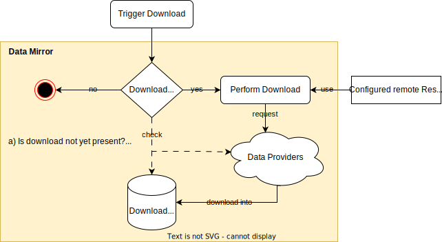

> [Documentation](../../../README.md) >
> [Vulnerability Management](../../README.md) >
> [Mirror](../README.md) >
> Downloaders

# Downloaders

Downloaders are responsible for retrieving vulnerability data from remote sources and storing it in a local directory.
Each downloader is tailored to the format and API of its respective data source, handling specifics like pagination, rate limiting, and incremental updates where the source supports them.

The downloaded data is not directly usable by the enrichment pipeline.
It must first be processed by the corresponding [Indexers](../indexers/README.md) to produce searchable Lucene indices.

- [All Downloaders](downloaders.md): list of all available downloaders with their configuration parameters, resource locations, and source code references
- [POM Configuration](downloaders-pom.md): complete Maven POM example for configuring all downloaders

## General Downloading Workflow

Each downloader operates independently and can be executed using the `data-mirror` goal from the
`com.metaeffekt.artifact.analysis:ae-mirror-plugin`.

While the downloaders have distinct implementations, they all follow a similar overall process.
Before actually running a download when triggered, they check if an update is needed.
The download step is skipped if no update is required.

A download is considered necessary if:

- The downloader has never been run before.
- The previous download attempt failed.
- The previous download attempt was incomplete.
- The data is older than a configured threshold.
- The remote source has been updated since the last download. (not available for all downloaders)

Each downloader stores then its data in a single designated directory, with a format that depends on the downloader.

The remote resource locations can be configured by using the ResourceLocations configuration.
Every downloader makes its remote URLs available via this configuration, allowing hosting the data on different servers,
like a local mirror or a caching proxy.
All available resource locations are listed in the [downloader details](downloaders.md).
