> [Documentation](../../../../README.md) >
> [Vulnerability Management](../../../README.md) >
> [Mirror](../../README.md) >
> [Index](../README.md) >
> Individual Index Diagrams

# Individual Index Diagrams

### NVD CVE API

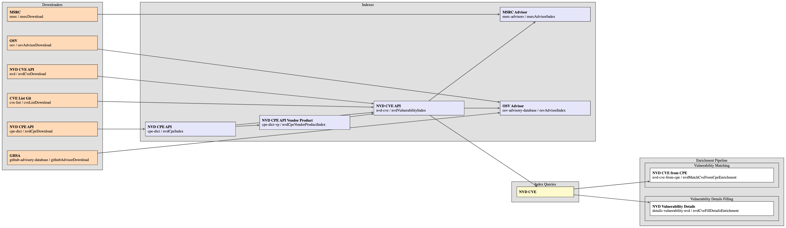

### NVD CPE API

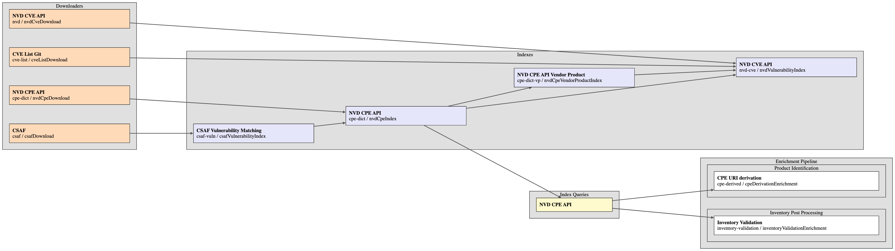

### NVD CPE API Vendor Product

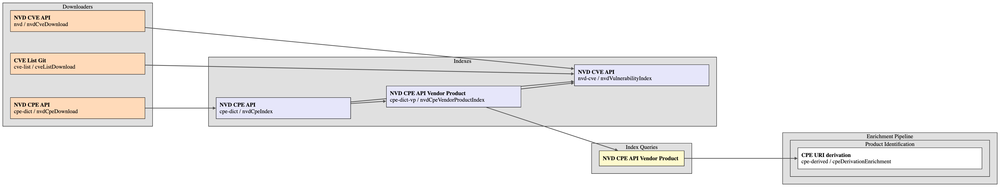

### MSRC Product

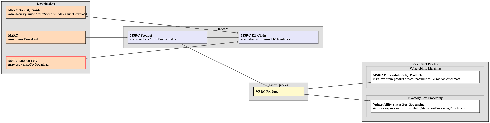

### MSRC Advisor

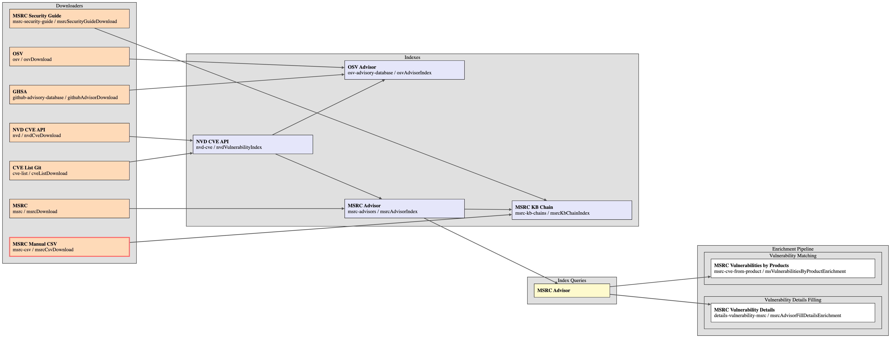

### MSRC KB Chain

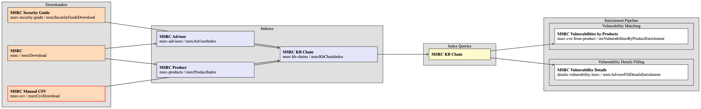

### OSV Advisor

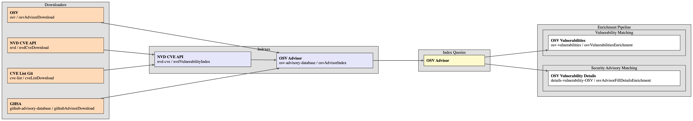

### CSAF Vulnerability Matching

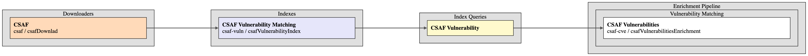

### CSAF Advisory

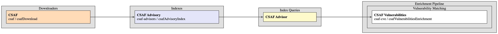

### CERT-SEI Advisor

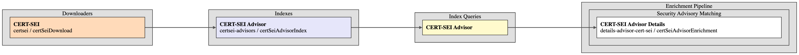

### CERT-FR Advisor

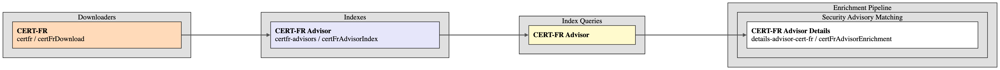

### CERT-EU Advisor

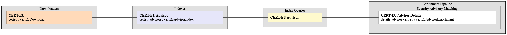

### KEV

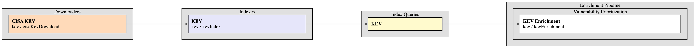

### EPSS

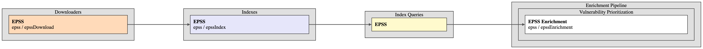

### EOL

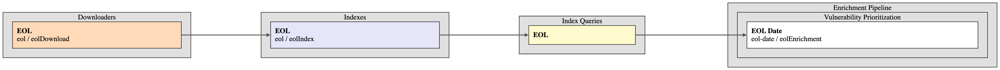

### CWE

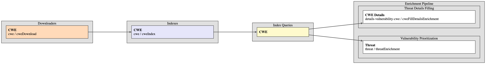

### CAPEC

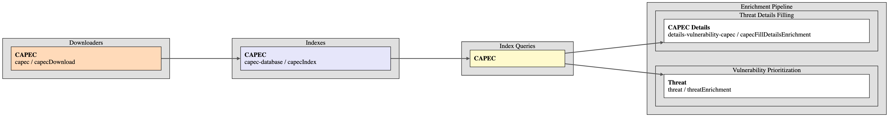

### Mitre Attack

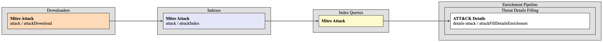

### Mitre Atlas

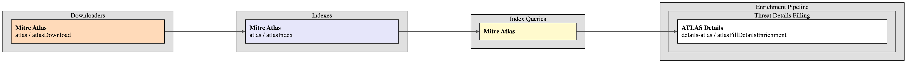

### NVD Vulnerability

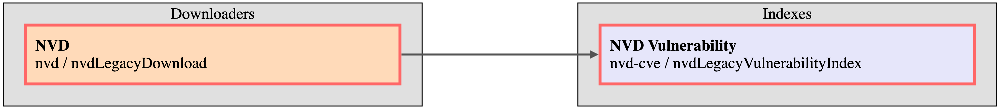

### CPE Dictionary

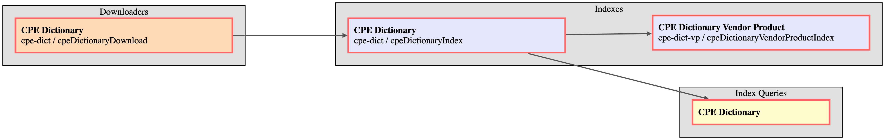

### CPE Dictionary Vendor Product

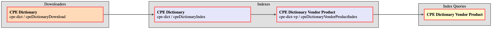

## Merge of all Indexes

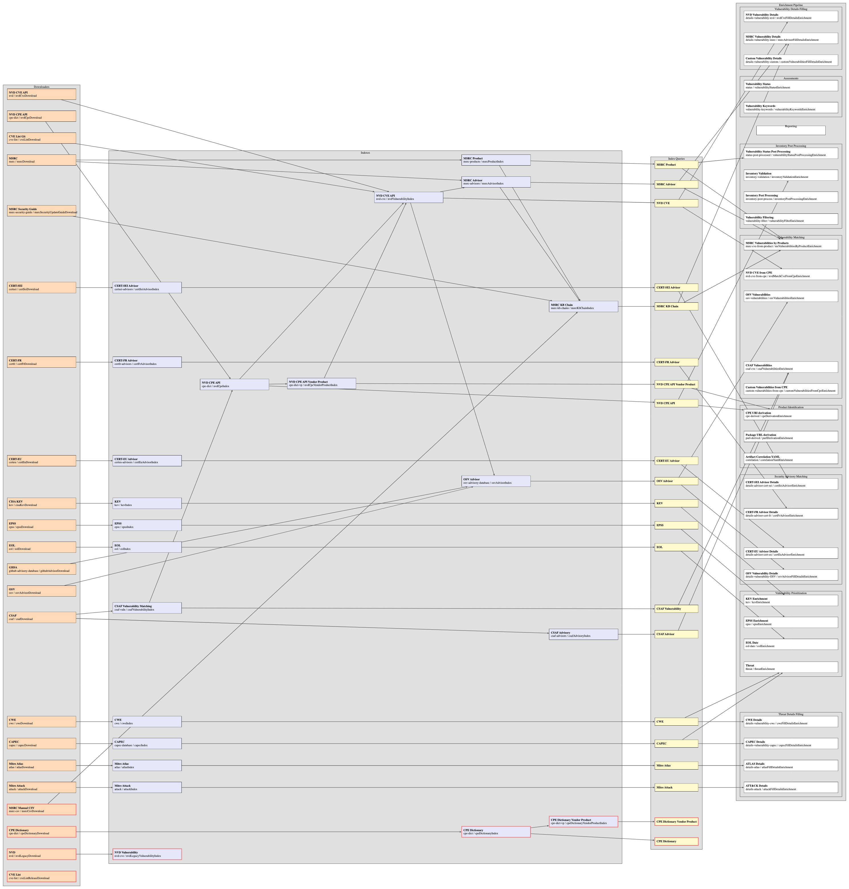
