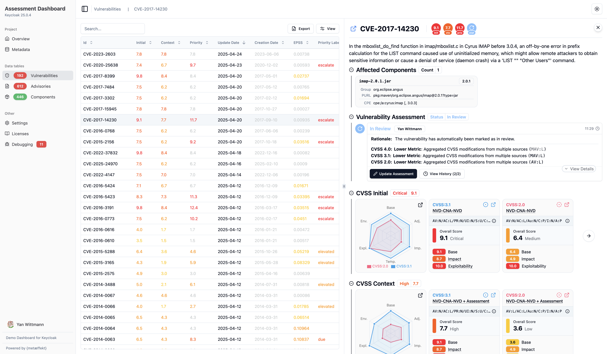
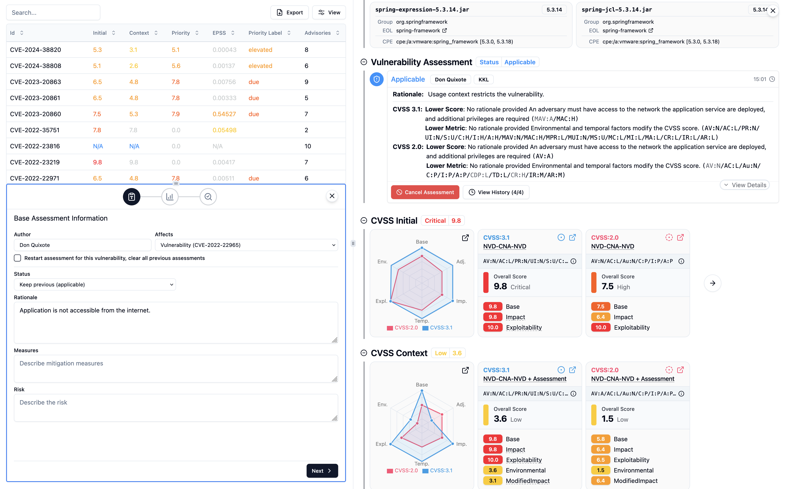

> [Documentation](../../README.md) >
> [Vulnerability Management](../vulnerability-management.md) >
> Assessment Dashboard

# Vulnerability Assessment Dashboard

> [Introduction](#introduction) -
> [Changes to 3.x](#changes-from-version-3) -
> [Generation](#generation) -
> [Assessment Management Service](#assessment-management-service)

> [!NOTE]
> This document refers to the "Dynamic Assessment Dashboard" or "Generation 4 Dashboard".
> For details on the previous implementation that uses the inventory enrichment system as generator framework, see
> [Inventory Enrichment Steps → Vulnerability Assessment Dashboard](inventory-enrichment-steps.md#vulnerability-assessment-dashboard).

## Introduction

The Vulnerability Assessment Dashboard is a single-page HTML document that can be generated from an Inventory that went
through the [Vulnerability Inventory Enrichment Steps](inventory-enrichment-steps.md) and has aggregated vulnerability
information.
It visualizes this information in a way that allows for both gaining a quick overview over the components used and their
current vulnerabilities and security advisories, but also to delve into the details of the situation.



## Changes from version 3

#### Vulnerability Assessment Format

With the rollout of the new Dashboard, the assessment format has been updated to version 4.0.
It now operates on an event-based system to more easily allow an API to be integrated into the dashboard.
All changes are recorded in the
[Vulnerability assessment file](../other-topics/assessment/vulnerability-assessment-file-gen-4.md)
chapter.
To support the 3.x assessment format, assessments in older formats are automatically converted to the new format.
The conversion is lossless and the resulting assessments should match up with older versions of the metaeffekt plugins.

#### Interactive / Dynamic Dashboard Data

A core concept behind the new dashboard was to have the full data model be transported into the HTML, and not have the
HTML be pre-rendered in the backend, such that the data can be adjusted at runtime to archive an integrative experience.

This allows for the interaction with a backend service that manages users and accepts vulnerability assessments to be
stored.

## Generation

You can use the `generate-vulnerability-dashboard` goal of the `ae-inventory-enrichment-plugin` to generate your
dashboard from an inventory that has been processed by the
[Inventory Enrichment Pipeline](inventory-enrichment-pipeline.md).

<!-- @formatter:off -->
```xml
<build>
    <plugins>
        <plugin>
            <groupId>com.metaeffekt.artifact.analysis</groupId>
            <artifactId>ae-inventory-enrichment-plugin</artifactId>
            <version>{metaeffekt.version}</version>
            <executions>
                <execution>
                    <goals>
                        <goal>generate-vulnerability-dashboard</goal>
                    </goals>
                    <configuration>
                        <inventoryInputFile>${input.inventory}</inventoryInputFile>
                        <outputFile>${output.dashboard}</outputFile>
                        <mirrorDirectory>${mirror.dir}</mirrorDirectory>

                        <timelines>
                            <active>true</active>
                            <maxThreads>16</maxThreads> <!-- default: 4 -->
                            <!-- <artifactSubgroupSize>100</artifactSubgroupSize> -->
                            <!-- <maximumTimeSpentPerTimeline>30000</maximumTimeSpentPerTimeline> --> <!-- default infinity -->
                            <!-- <vulnerabilityProviders>NVD, OSV</vulnerabilityProviders> --> <!-- default: all -->
                        </timelines>

                        <reportConfiguration>
                            <!-- see API configuration below -->
                        </reportConfiguration>
                    </configuration>
                </execution>
            </executions>
        </plugin>
    </plugins>
</build>
```
<!-- @formatter:on -->

## Assessment Management Service

> [!WARNING]
> The Asset Management Backend Service is not yet publicly available.
> Full documentation will be published with the release.

The Dashboard can connect to an external API to enable collaborative assessment workflows and user authentication.
This configuration allows users to log in, persist assessments, and retrieve updates in real time.

All communication is handled via HTTP and JSON.
Authentication is initially performed through username/password, which provides a user-token that the user can then use
to perform authenticated requests.
For this a HTTP header `authHeaderToken` is used, which is by default `X-Dashboard-User-Token`.



### Configuration

In your XML `reportConfiguration`, configure the API by specifying the individual endpoint URLs and other values:

<!-- @formatter:off -->
```xml
<reportConfiguration>
    <apiConfiguration>
        <apiType>A</apiType>
        <apiA>
            <baseUrl>http://localhost:8080/api/v2</baseUrl>
            <requestTimeout>5000</requestTimeout>

            <authHeaderUsername>X-Dashboard-User-Name</authHeaderUsername>
            <authHeaderToken>X-Dashboard-User-Token</authHeaderToken>

            <ping>ping</ping>
            <currentUser>current_user</currentUser>
            <login>login</login>
            <logout>logout</logout>
            <logoutMode>POST</logoutMode>

            <reserveAssessmentEventId>entity_id/assessment_event</reserveAssessmentEventId>
            <eventsSinceTimestampForDashboard>$[asset.current.Asset Id]/assessment_event/$[since_time]/$[asset.current.Version]</eventsSinceTimestampForDashboard>
            <putEventForDashboard>$[asset.current.Asset Id]/assessment_event/$[creation_time]/$[asset.current.Version]</putEventForDashboard>

            <urlDateParameterPattern>yyyy-MM-dd'T'HH_mm'Z'</urlDateParameterPattern>
        </apiA>
    </apiConfiguration>
</reportConfiguration>
```
<!-- @formatter:on -->

### Variable Placeholders

The following variables may be used in the `eventsSinceTimestampForDashboard` and `putEventForDashboard` endpoint paths:

- `asset.current.[ATTRIBUTE]`: Refers to a dynamic value from the currently selected asset.
- `info.[NAMESPACE].[KEY]`: Refers to a value set via inventory metadata (e.g., from `InventoryInfoSetterMojo`'s
  `set-inventory-info`).
- `event.uid`: UUID generated for the assessment event to be registered using the `putEventForDashboard` endpoint.
- `creation_time`: UTC timestamp for event creation, formatted as `urlDateParameterPattern`.
- `since_time`: UTC timestamp for querying events since a given time, formatted as `urlDateParameterPattern`.

Wrap them inside of `$[VARNAME]` to have them be evaluated at runtime.

### `ping` (`GET`)

Verifies the availability of the backend.

- default: `ping`
- response: a UNIX timestamp indicating the current server time as a number.

### `login` (`POST`)

Performs login via username and password. Returns a token that must be used in future authenticated requests.

- default: `login`
- request body:

  ```json
  {
    "username": "yan",
    "password": "admin"
  }
  ```
- response:

  ```json
  {
    "id": "yan",
    "token": "f71bb8a7-bef7-4b39-beb8-bc2c7fd14e62"
  }
  ```

### `logout` (`GET`)

Invalidates the token and logs out the current user.

- default: `logout`
- headers:
    - `authHeaderToken`: token to be invalidated
- response: `true` (boolean)

### `logoutMode`

Determines the behavior of the logout button available on the dashboard.

- default: `POST`
- values:
    - `POST`: makes a request to the `logout` endpoint with the user information in the request body.
    - `REDIRECT`: sets the `window.location.href` to the `logout` URL instead of calling it, redirecting the user to the
      target location. The current dashboard URL is passed as `redirect_uri` URL GET parameter.
    - `DISABLED`: Will disable the logout button and treat any logout attempt from any source as a success but do
      nothing otherwise.

Introduced in https://github.com/org-metaeffekt/metaeffekt-artifact-analysis/pull/320.

### `currentUser` (`GET`)

Returns the currently authenticated user.

- default: `current_user`
- headers:
    - `authHeaderToken`: the user token received after login
- response:
  ```json
  {
    "id": "yan",
    "name": "Yan Wittmann",
    "avatar": "https://..."
  }
  ```

Note that the avatar field is optional and the image linked will only be evaluated when the parameter is provided.

### `reserveAssessmentEventId` (`GET`)

Generates a unique ID for a new assessment event.

- response:
  ```json
  {
    "id": "f15e1ae8-5d55-4cc1-bb36-ef4283cbe8b7"
  }
  ```

This ID will be used by the frontend in a call to the `putEventForDashboard` endpoint.

### `eventsSinceTimestampForDashboard` (`GET`)

Retrieves assessment events for a given asset component/version path since the given time.

- example with variables: `$[asset.current.Asset Id]/assessment_event/$[since_time]/$[asset.current.Version]`
- headers:
    - `authHeaderToken`
- response:
  ```json
  [
    {
      "uid": "f15e1ae8-...",
      "type": "flag",
      "severity": "high",
      ...
    }
  ]
  ```

### `putEventForDashboard` (`POST`)

Persists a new assessment event.

- example with variables: `$[asset.current.Asset Id]/assessment_event/$[creation_time]/$[asset.current.Version]`
- headers:
    - `authHeaderToken`
- request body: arbitrary JSON structure representing the event
- response: HTTP 201 Created

### `urlDateParameterPattern`

Timestamp pattern used in all path variables representing dates:

```
yyyy-MM-dd'T'HH_mm'Z'
```

This format is UTC-based and uses underscores instead of colons (e.g., `2025-06-04T16_05Z`).
