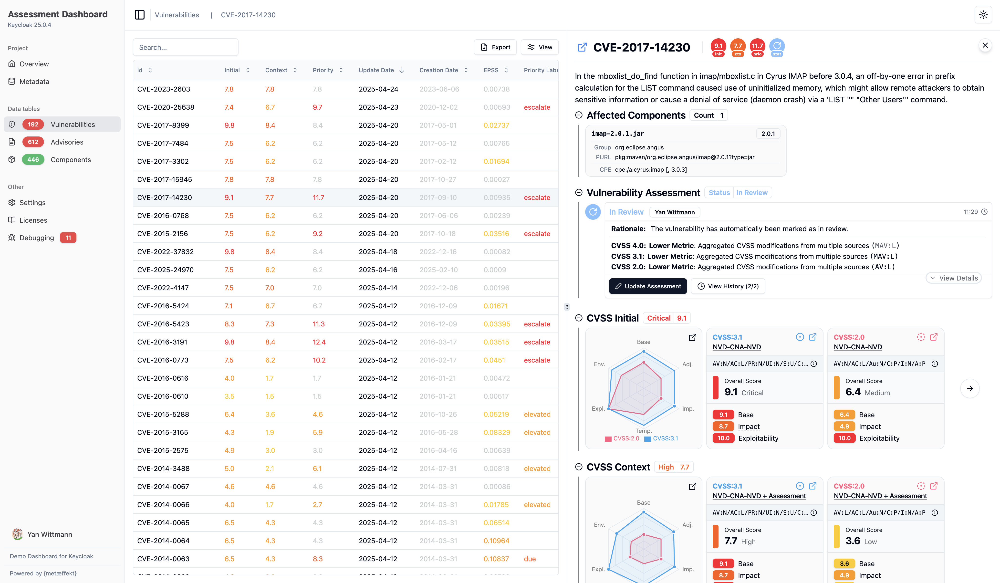

> [Documentation](../../README.md) >
> [Vulnerability Management](../vulnerability-management.md) >
> Assessment Dashboard

# Vulnerability Assessment Dashboard

> [!NOTE]
> This document refers to the "Dynamic Assessment Dashboard" or "Generation 4 Dashboard".
> For details on the previous implementation that uses the inventory enrichment system as generator framework, see [Inventory Enrichment Steps → Vulnerability Assessment Dashboard](inventory-enrichment-steps.md#vulnerability-assessment-dashboard).

## Introduction

The Vulnerability Assessment Dashboard is a single-page HTML document that can be generated from an Inventory that went through the [Vulnerability Inventory Enrichment Steps](inventory-enrichment-steps.md) and has aggregated vulnerability information.
It visualizes this information in a way that allows for both gaining a quick overview over the components used and their current vulnerabilities and security advisories, but also to delve into the details of the situation.

## Topics

- [Generation](assessment-dashboard/dashboard-creation.md): how to generate the dashboard from an enriched inventory using the `ae-inventory-enrichment-plugin` Maven plugin.
- [Assessment Management Service](assessment-dashboard/assessment-management-service.md): how to configure the backend API for collaborative assessment workflows, including all endpoint definitions and variable placeholders.
- Explanations of formats and concepts used in the dashboard.
  - [Vulnerability Assessment Format](../other-topics/assessment/vulnerability-assessment.md): the assessment file format used to write, persist, and exchange vulnerability assessments.
  - [Due Review](assessment-dashboard/concepts/due-review.md): explains the Due Review state and when vulnerabilities appear in this state, covering all four possible reasons and their configuration.
- [Changes from Version 3](assessment-dashboard/changes-from-version-3.md): covers the breaking changes and new features introduced with the Generation 4 Dashboard, including the updated assessment format and the shift to a fully dynamic data model.
