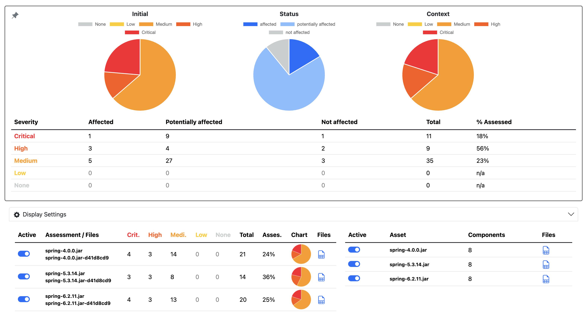
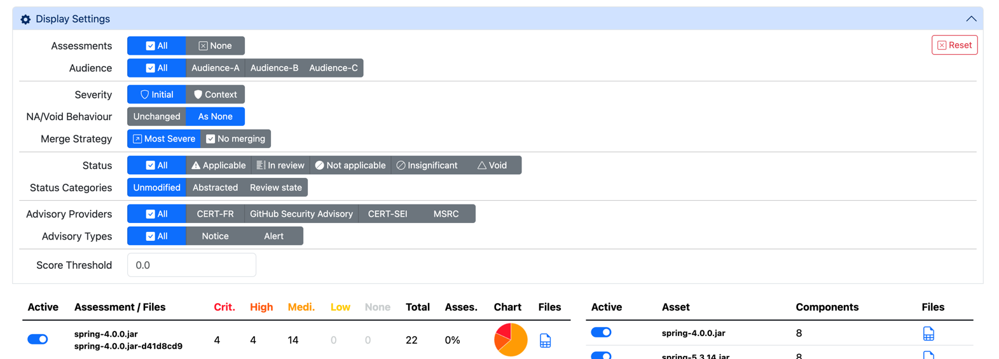

> [Documentation](../../README.md) >
> [Vulnerability Management](../vulnerability-management.md)
> Inventory Overview Report

# {metæffekt} Inventory Overview Report

> [Introduction](#introduction) -
> [Display Settings](#display-settings) -
> [Configuring Notifications](#configuring-notifications)

## Introduction

As part of the {metæffekt} tooling, the **Inventory Overview Report** enables the generation of a high-level view across multiple assets.
Compared to the detailed view provided by the [VAD](../../metaeffekt-vulnerability-assessment-dashboard/README.md), the **Inventory Overview Report** informs users on their vulnerability assessment situation across multiple assets and software inventories.
This allows not only the comparison of vulnerability assessments across multiple assets, but also of the same asset being assessed in multiple **Assessment Contexts**, also called Audiences. 

The vulnerabilities and their various aspects from the input vulnerabilities are displayed in pie charts and a table.
The table displays how many vulnerabilities possess a certain severity score, along its y-axis, and further separates them, according to their assessment status, along the x-axis.



## Display Settings



Since the vulnerabilities displayed are of a multivariate nature, filtering options provide the ability to specify the view or display only a selected set of vulnerability information.
The options are the following:

| Display Setting    | Description                                                                                                                                                                                                                                                                                                                                                                                                                                                              |
|:-------------------|:-------------------------------------------------------------------------------------------------------------------------------------------------------------------------------------------------------------------------------------------------------------------------------------------------------------------------------------------------------------------------------------------------------------------------------------------------------------------------|
| Audience           | Assets in the source inventories may specify a comma-separated-list of audiences in the `Audience` column. These assessment audiences enable the filtering of assets for a customized view, focusing on specific subsets.                                                                                                                                                                                                                                                |
| Severity           | The severity category determines whether to use the initial or contextualized CVSS scores to calculate the effective vulnerability severities.                                                                                                                                                                                                                                                                                                                           |
| NA/Void Behaviour  | These options apply only to the 'context' severities of the vulnerabilities, the 'initial' severities remain unchanged. Depending on the selected option, the severity category of the vulnerabilities may be interpreted differently. `As None` causes vulnerabilities with an assessment status of "not applicable" or "void" to be considered to have a severity of "None", regardless of their actual context severity score. `Unchanged` deactivates this behavior. |
| Merge Strategy     | Since the different assessment context inventories may contain the same vulnerability yet have designated different assessments for the vulnerability, this selector determines how these duplicate individual vulnerabilities should be treated. `Most Severe` chooses the assessment with the most severe assessment and discards the less sever . `No Merging` displays the vulnerability multiple times according to the different assessments.                      |
| Status Categories  | Beyond the default assessment states (inapplicable, in review, etc.), there exist other, generalized assessment views, which generalize the assessment status according to their applicability as well as review state. They are further illustrated in the [section below](#assessment-status-mappings)                                                                                                                                                                 |
| Status             | Filters the displayed vulnerabilities to only those, with the same selected assessment status. The values of this setting are controlled by the selected `Status Categories` option.                                                                                                                                                                                                                                                                                     |
| Score Threshold    | Filters all vulnerabilities out that have a severity below the configured threshold.                                                                                                                                                                                                                                                                                                                                                                                     |
| Advisory Providers | Filters all vulnerabilities which do not possess an advisory from the configured providers. Multiple selections are possible. The value of this setting is determined dynamically based on the providers found in all inventories.                                                                                                                                                                                                                                       |
| Advisory Types     | Similar to the `Advisory Providers` option, but instead filtering by provider, the type of the advisory is used instead.                                                                                                                                                                                                                                                                                                                                                 |

### Assessment Status Mappings

| Source         | Unmodified      | Abstracted           | Review State  |
|----------------|-----------------|----------------------|---------------|
| Applicable     | Applicable      | Affected             | Reviewed      |
| Not Applicable | Not Applicable  | Not affected         | Reviewed      |
| In Review      | In Review       | Potentially affected | In Review     |
| Insignificant  | Insignificant   | Potentially affected | Insignificant |
| Void           | Void            | Not affected         | Void          |

## Example Setup

An example pom.xml configuration for generating the **Inventory Overview Report** is provided below.

```
overview-report
├── pom.xml
└── overview
    ├── advisor
    │   ├── spring2.6.11.xls.result.xls
    │   ├── spring4.0.0.xls.result.xls
    ├── assessments
    │   ├── assessments-spring2.6.11.yaml
    │   ├── assessments-spring4.0.0.yaml
    ├── dashboards
    ├── input
    │   ├── spring2.6.11.xls
    │   ├── spring4.0.0.xls
    └── reports
```

```xml
<?xml version="1.0" encoding="UTF-8"?>
<project xmlns="http://maven.apache.org/POM/4.0.0"
         xmlns:xsi="http://www.w3.org/2001/XMLSchema-instance"
         xsi:schemaLocation="http://maven.apache.org/POM/4.0.0 http://maven.apache.org/xsd/maven-4.0.0.xsd">
    <modelVersion>4.0.0</modelVersion>

    <groupId>com.metaeffekt.artifact.analysis</groupId>
    <artifactId>ae-inventory-overview-html-report-example</artifactId>
    <version>HEAD-SNAPSHOT</version>
    <packaging>pom</packaging>

    <build>
        <plugins>
            <plugin>
                <groupId>com.metaeffekt.artifact.analysis</groupId>
                <artifactId>ae-inventory-overview-html-report</artifactId>
                <version>HEAD-SNAPSHOT</version>

                <executions>
                    <execution>
                        <id>create-inventory-overview-report</id>
                        <phase>process-resources</phase>
                        <goals>
                            <goal>create-report</goal>
                        </goals>

                        <configuration>
                            <baseDirectory>overview</baseDirectory>

                            <!-- these paths are relative to the <baseDirectory> -->
                            <inputInventoryPath>inventory</inputInventoryPath>
                            <advisorInventoryPath>advisor</advisorInventoryPath>
                            <dashboardsPath>dashboards</dashboardsPath>
                            <reportsPath>reports</reportsPath>

                            <outputFile>${project.build.directory}/inventory-overview-report.html</outputFile>

                            <inputInventoryUrlPattern>$[input.inventory.file.path.relative]</inputInventoryUrlPattern>
                            <advisorInventoryPathUrlPattern>$[assessment.inventory.file.path.relative]</advisorInventoryPathUrlPattern>
                            <dashboardsPathUrlPattern>$[assessment.vulnerabilityAssessmentDashboard.file.path.relative]</dashboardsPathUrlPattern>
                            <reportsPathUrlPattern>$[assessment.pdf.report.file.path.relative]</reportsPathUrlPattern>
                        </configuration>
                    </execution>
                </executions>
            </plugin>
        </plugins>
    </build>
</project>
```

```properties
assessment.inventory.asset.id . . . . . . . . . . . . . . . . . . . . . . .spring-4.0.0.jar
input.inventory.file.path.relative .  .  .  .  .  .  .  .  .  .  .  .  .  .inventory
assessment.inventory.file.path.relative .  .  .  .  .  .  .  .  .  .  .  . advisor
assessment.vulnerabilityAssessmentDashboard.file.path.relative .  .  .  . .dashboards
assessment.pdf.report.file.path.relative .  .  .  .  .  .  .  .  .  .  .  .reports
```

## Configuring Notifications

The data inside the **Inventory Overview Report** can be used to notify users of significant vulnerability sets.
In order to notify the relevant parties, the generation process of the **Inventory Overview Report** allows for the configuration of **Notifications** and **Notification Rules**, which are evaluated when the report is generated.
The result of this is a JSON file containing the activated notifications, which can later be consumed and parsed by other processes that manage sending the notifications to the recipients.

This chapter describes the YAML configuration and it's properties, the evaluation order and several examples.

The configuration of the notifications is highly customizable and split into the two different configuration elements:

- **[Notifications](#notification-configuration)** specify
  - the different notification targets,
  - a list of Audiences, filtering the input list of assets,
  - a set of properties to define the way the vulnerabilities on the selected assets should be evaluated,
  - as well as a list of **Notifications Rules** to determine the activation of the notification.
- **[Notifications Rules](#rules)** each may contain
  - a filter for the input vulnerabilities,
  - trigger conditions operating on the filtered list of vulnerabilities to determine whether the rule is active,
  - and a notification text template with variable placeholders, like `$[count] vulnerabilities found.`.
    A full list of variables is available below.

These rules and notifications are provided to the generation process of the **Inventory Overview Report** as two directories of YAML-files, one for the rules and one for the notifications.
Before the individual files and processes are explained, an example for a pom.xml will be provided below.

### Example Setup

This example setup for the notifications expands on the example setup provided in the introduction chapter.
It will introduce the parameters required to generate a notification JSON file from a set of YAML input files.

The following files and directories are added to the workspace:

```
overview-report
├── pom.xml
├── overview
│   └── ...
├── notifications
│   ├── audienceA.yaml
│   ├── audienceB.yaml
│   └── highCriticalCount.yaml
└── rules
    ├── audienceA.yaml
    ├── audienceB.yaml
    └── highCriticalCount
```

```xml
<?xml version="1.0" encoding="UTF-8"?>
<project xmlns="http://maven.apache.org/POM/4.0.0"
         xmlns:xsi="http://www.w3.org/2001/XMLSchema-instance"
         xsi:schemaLocation="http://maven.apache.org/POM/4.0.0 http://maven.apache.org/xsd/maven-4.0.0.xsd">
    <modelVersion>4.0.0</modelVersion>

    <groupId>com.metaeffekt.artifact.analysis</groupId>
    <artifactId>ae-inventory-overview-html-report-example</artifactId>
    <version>HEAD-SNAPSHOT</version>
    <packaging>pom</packaging>

    <build>
        <plugins>
            <plugin>
                <groupId>com.metaeffekt.artifact.analysis</groupId>
                <artifactId>ae-inventory-overview-html-report</artifactId>
                <version>HEAD-SNAPSHOT</version>

                <executions>
                    <execution>
                        <id>create-inventory-overview-report</id>
                        <phase>process-resources</phase>
                        <goals>
                            <goal>create-report</goal>
                        </goals>

                        <configuration>
                            <baseDirectory>overview</baseDirectory>

                            <!-- these paths are relative to the <baseDirectory> -->
                            <inputInventoryPath>inventory</inputInventoryPath>
                            <advisorInventoryPath>advisor</advisorInventoryPath>
                            <dashboardsPath>dashboards</dashboardsPath>
                            <reportsPath>reports</reportsPath>

                            <outputFile>${project.build.directory}/inventory-overview-report.html</outputFile>

                            <notificationOutputFile>${project.build.directory}/notifications.json</notificationOutputFile>
                            <notificationConfigFiles>
                                <file>notifications</file>
                            </notificationConfigFiles>
                            <notificationRuleFiles>
                                <file>rules</file>
                            </notificationRuleFiles>
                        </configuration>
                    </execution>
                </executions>
            </plugin>
        </plugins>
    </build>
</project>
```

### Notification Configuration

Notifications are configured in YAML files.
A simple example can be found below, the full documentation of all properties is provided below that.

```yaml
"My Notification":
  audience: Audience-A, Audience-B
  rules:
    - medium-severity-vulnerability
  emails:
    - mail@example.com
```

The top-level of the configuration file is a map, with the key being a unique notification Id (across files) and the value being another object containing the notification properties.
The properties of a notification consist of:

- `rules`: a list of [Rule-Ids](#rules) which must all evaluate to true to trigger the generation of the notification.
- Targets that are to be notified. Both of the properties below are simply copied to the resulting notification JSON without interpretation when the notification is active.
  - `emails`: a list of e-mails that are to be notified.
  - `groups`: describe more general descriptors to allow any interpretation by the receiving process.
- Properties that mirror the [Display Settings](#display-settings) from the user interface and change the way the vulnerabilities are collected across assets and how their scores are calculated.
  View this chapter for more details on how these are interpreted.
  - `audience`: a comma-seperated-list of audiences to use to filter the considered **Assessment Contexts** from which to get the vulnerabilities to consider.
  - `mergeMode` (`none`, `most-severe-status`): specifies the way the vulnerability lists obtained across the different assets should be merged before further processing.
  - `severityType` (`initial`, `context`): defines the source of the CVSS scores to be used to calculate the severity categories for each vulnerability.
  - `naVoid` (`unchanged`, `as-none`): only has an effect, if `naVoid` is set to `as-none` and `severityType` to `context`.
    This will consider vulnerabilities with the `Not Applicable` or `Void` status to have the severity category `none`.
  - `order`: is an integer value that is used to order the notifications in the output file (desc).
    The value will be provided in the output JSON for further processing.

A [json schema is available](https://metaeffekt.com/schema/artifact-analysis) for making the process of modifying the YAML files more easily using an IDE.

### Rules

Every rule specifies both a filter operation on a list of vulnerabilities and an applicability condition on these filtered vulnerabilities.
This filtered vulnerability list is the input to the logic that that determines whether the rule and therefore the containing notification is considered applicable.

The top-level of the configuration file is a map, with the key being a unique rule Id (across files, excluding automatically generated entries) and the value being another object containing the rule properties.
The properties of a rule consist of:

- Properties that defile a filter on the input vulnerability list, which will be evaluated by the applicability condition:
  - `severity` (`Low`, `Medium`, `High`, `Critical`; may deviate due to changes to the CSP): comma-seperated-list of CVSS severity ratings a vulnerability must have.
    Depending on the notification `severityType`, the initial or context scores are considered here.
    All lists are interpereted with a logical OR, meaning only one severity/status/... from the list must match to be a successful comparison.
  - `priority` (`escalate`, `due`, `elevated`): comma-seperated-list of priority score ratings (not yet implemented).
  - `assessmentStatusMapper` (`unmodified`, `abstracted`, `review state`): see [table above](#assessment-status-mappings) to access different status categories for the `assessmentStatus` property.
    The status mapper listed here will also be used to generate the template variables that reference an assessment status.
  - `assessmentStatus` (values found in [table above](#assessment-status-mappings) transformed to lowercase and whitespaces replaced with `-`): comma-seperated-list of a vulnerabilities assessment statuses.
- After the vulnerability list has been filtered, an applicability condition is applied:
  - `minCount`: number describing the minimum amount of vulnerabilities remaining in the filtered list.
- `notificationText`: a content body added to the resulting JSON, describing as to why the rule was triggered.
  It might contain variable placeholders that are filled before writing the JSON.

There are rules that are automatically generated from the configured Central Security Policy's severity ranges.
Per severity range, they filter for that range and an applicability condition using a `minCount` of 1.
Their names use the following template: `"$[severity]-severity-rule"` (i.e `"medium-severity-rule"`).
When configuring custom rules with the same names, the manually configured rules overwrite the automatically generated ones.

A [json schema is available](https://metaeffekt.com/schema/artifact-analysis) for making the process of modifying the YAML files more easily using an IDE.

#### `notificationText` Template Filling

Templating in `notificationText` is performed by enclosing the variable name within brackets and prefixing a dollar sign (i.e `There are $[count] vulnerabilities`).
The following options are statically generated:

- `ruleName`: resolves to the name of the respective rule
- `minCount`: resolves to the rules configured `minCount` value
- `severity`: resolves to the rules configured severity ranges
- `priority`: resolves to the rules configured priority ranges
- `count`: resolves to the sum of all matching vulnerabilities
- `sourceFile`: resolves to the specific path of the file containing the rule, if the rule was loaded from a file
- `notificationName`: resolves to the name of notification employing the rule 
- `groups`: resolves to the groups configured in the notification employing the rule
- `audiences`: resolves to the audiences configured in the notification employing the rule
- `assessmentStatus`: resolves to the rules configured assessment status
- `assessmentStatusMapper`: resolves to the rules configured assessment status mapper
- `assessmentStatusMapper.names.all`: resolves to a comma-separated-list of the rules configured assessment status mappers registered states
- `assessmentStatusMapper.names.assessed`: resolves to a comma-separated-list of the rules configured assessment status mappers registered states, filtered to those that contribute positively to the `% Assessed` calculation

Some information is calculated dynamically based on configuration parameters:

- `<count>.<severity>` (i.e `count.critical`, `count.high`): evaluates the total amount of vulnerabilities of the specified severity.
  This is equivalent to the `Total`-column in the **Inventory Overview Report** overview table.
- `<count>.<severity>.<status>` (i.e. `count.critical.in-review`, `count.high.in-review`): evaluates the total amount of vulnerabilities of a severity as well as an assessment state.
  The assessment status uses the ocnfigured `assessmentStatusMapper`.
  This is equivalent to a cell at the cross-section of one of the severity/status rows/columns in the **Inventory Overview Report** overview table.
- `<assessed>.<severity>` (i.e `assessed.critical`, `assessed.high`): evaluates the percentage of vulnerabilities, with the specific vulnerability, which have been assessed.
  This is equivalent to the `% Assessed`-column in the **Inventory Overview Report**.

#### Example Rules

```yaml
example-rule-001:
  severity: High, Critical
  minCount: 1
  notificationText: "You have $[count] vulnerabilities with a severity of $[severity]"
```

```yaml
example-rule-002:
  severity: High, Medium
  assessmentStatusMapper: review state
  assessmentStatus: in review, insignificant
  minCount: 1
  notificationText: "You have $[count] vulnerabilities = H/IR $[count.high.in-review] + H/I $[count.high.insignificant] + M/IR $[count.medium.in-review] + M/I $[count.medium.insignificant]. Checking for status: $[assessmentStatus] using mapper [$[assessmentStatusMapper]] with values: $[assessmentStatusMapper.names.all] of which are considered assessed: $[assessmentStatusMapper.names.assessed]. Severity check is: $[severity]"
```

### Evaluation of notifications

For each Notification Configuration, the following steps are evaluated to obtain the notification JSON element for the resulting JSON file.

1. Find each assessment context that contains one of the audiences listed in the notification's `audience` property.
   Each assessment context in this filtered list contains a list of vulnerabilities that are relevant to the notification.
2. Using the strategy in `mergeMode`, these multiple assessment context vulnerability lists are flattened into a single list of vulnerabilities.
   Depending on the strategy used, each vulnerability may appear multiple times with different assessments (`none`) or will be de-duplicated (`most-severe-status`).
3. Using the `severityType` and `naVoid` properties, these vulnerabilities are now evaluated for their effective (CVSS) severity category.
   For this, either the "initial" or "context" scores or the special case with the "context inapplicable" scores for `naVoid` = `as-none` and `severityType` = `context` are used.
4. With this vulnerability list and the severity counts prepared, the rules in the notification can be evaluated.
   Every rule is evaluated separately on this data and specifies a filter operation on the vulnerabilities and an applicability condition on the filtered vulnerabilities that determines whether the notification is applicable.
   1. Each rule specifies a filter for the vulnerability list.
      This filter consists of the `severity`, `priority` and `assessmentStatus` (uses the `assessmentStatusMapper`) properties.
      A vulnerability must have one of the values listed as effective value on itself to be valid.
   2. This filtered vulnerability list is then checked for the applicability of the rule.
      The `minCount` checks whether there have been at least a certain amount of vulnerabilities found, which is most likely set to `1` to check for the existence of any vulnerability of the selected filters.
   3. If the applicability condition is successful, the notification text template `notificationText` is filled with the evaluated values.
      This enables filtering dynamic values like `$[count]`, `$[count.critical.in-review]`, `$[ruleName]` and many more into the generated notification text.
5. The list of specified notifications is filtered to only those that have matched all rules.
6. The notifications are optionally ordered using the `order` property.
7. The resulting JSON is written into the output file.

### Generated JSON File

The resulting JSON file consists of a list of JSON objects.
Each object represents a notification configuration and contains it's `notificationId`, `emails`, `groups` and `order`.
Aside from these constant properties, each rule provides it's `notificationText` with all variables filled in a list of `reason`s.

Example:

```json
[
  {
    "emails": [
      "mail@example.com"
    ],
    "reason": [
      "Found 18 vulnerabilities in severity range [Medium]"
    ],
    "notificationId": "Config-01"
  },
  {
    "emails": [
      "contact@example.com"
    ],
    "reason": [
      "You have 12 vulnerabilities with a severity of [Critical]"
    ],
    "notificationId": "Config-02"
  }
]
```

This data can be further processed by other processes to send e-mail notifications.
