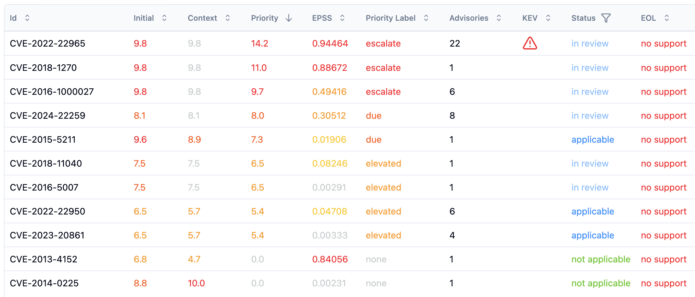
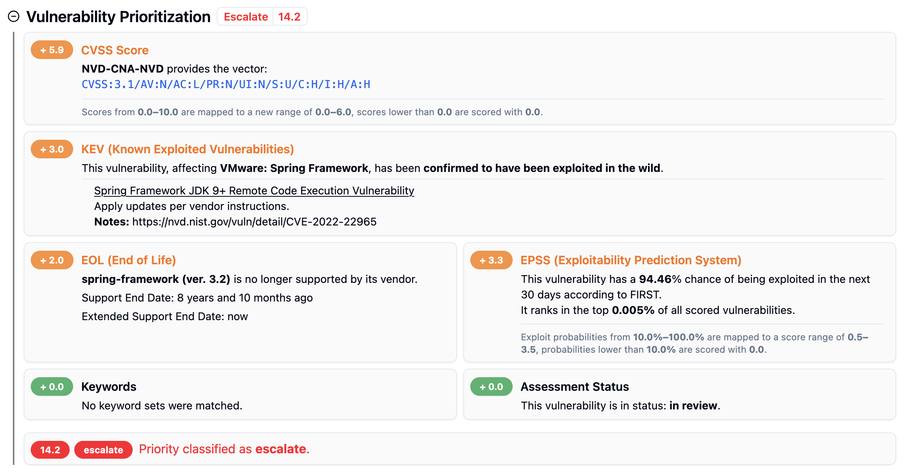
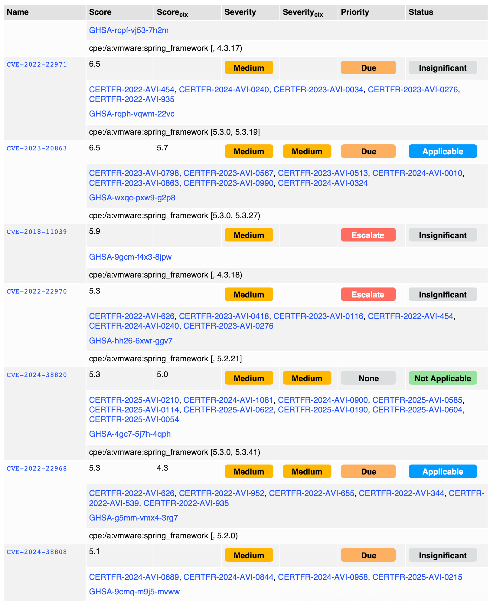
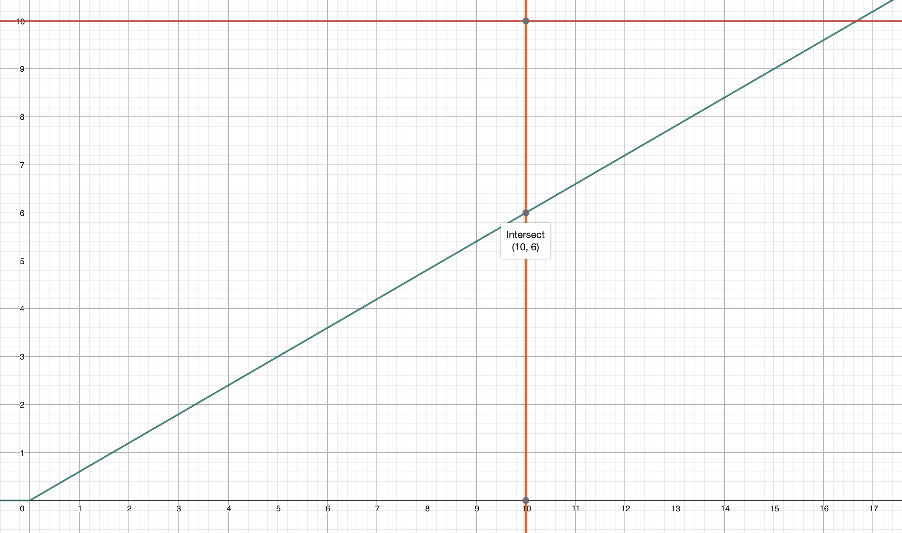
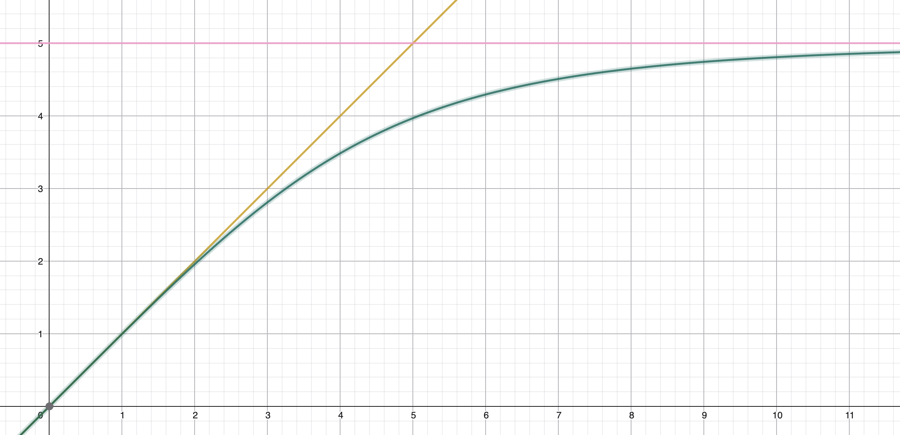
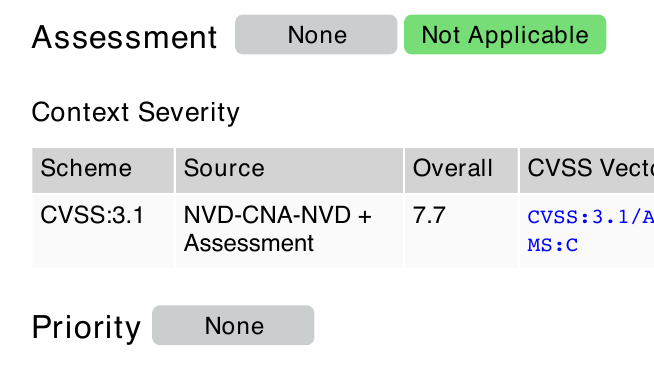
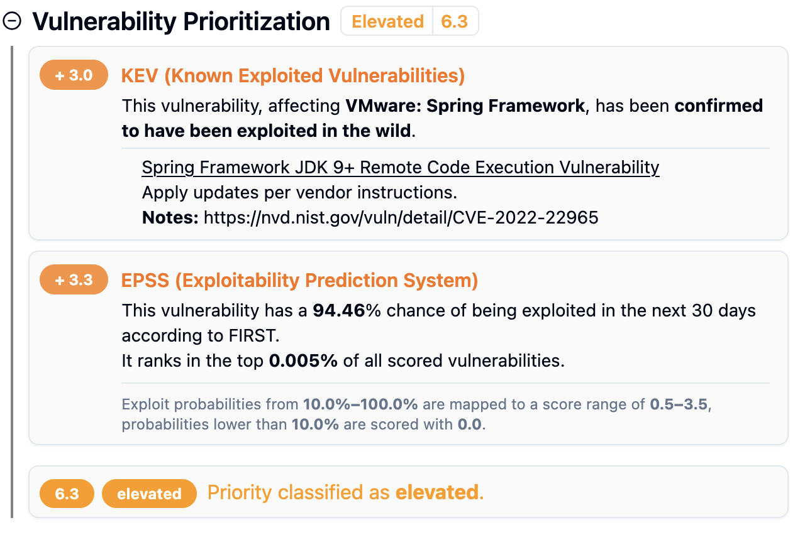
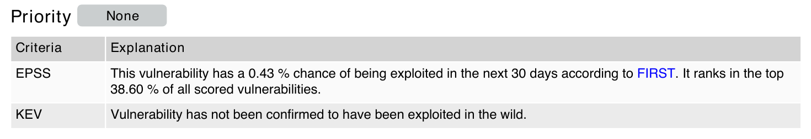

> [Documentation](../../README.md) >
> [Vulnerability Management](../vulnerability-management.md) >
> [CSP](../inventory-enrichment/central-security-policy.md) >
> Priority Score

# Priority Score

> [Introduction](#introduction) -
> [Configuration](#configuration) -
> [Calculation](#priority-score-calculation) -
> [Contributor Deactivation](#deactivation-of-score-contributors)

## Introduction

Next to the initial and context CVSS scores, the priority score is the third scoring metric that can be used to order a list of vulnerabilities.
The focus of this composite score is to enable locating vulnerabilities that are especially relevant right now by considering up-to-date external exploit information and relevant in a given context by considering additional product or asset context information.

The score is calculated by forming a sum of several contributors, each accounting for different factors.
These contributors are:

- CVSS Context or Initial score
- EPSS
- KEV
- EOL
- Keywords
- Assessment Status

## Configuration

The [Central Security Policy](../inventory-enrichment/central-security-policy.md) provides all relevant parameters to the calculation.

### Calculation Parameters (`priorityScoreConfiguration`)

The `priorityScoreConfiguration` parameter is a JSON object that specifies configuration values for each of the score providers.
THe individual properties are explained in the [Score Calculation](#priority-score-calculation) chapter below.

### Severity Ranges (`priorityScoreSeverityRanges`)

Since every score contributor knows their maximum numeric contribution, an upper bound can be calculated for the priority score.
By default, this maximum score is 20.

The `priorityScoreSeverityRanges` parameter is responsible for providing the ranges and labels that can be assigned to a vulnerability depending on its priority score.
The default ranges are:

- `none` (0 to 4.9)
- `elevated` (5 to 6.9)
- `due` (7 to 8.9)
- `escalate` (9 to 20)

The corresponding labels are rendered in the generated reports as priority indicators.

## Integration in Reports and other Features

### Assessment Dashboard

The "Metadata" tab provides the overview over the configuration in a table view, with the maximum contributions displayed alongside them.


The priority score and labels are displayed in the vulnerability table.



The priority score section on the vulnerability details shows both the score contributions and additional detail regarding the calculations as subtext.



### Vulnerability Report

The vulnerability report shows the priority score as a column in the vulnerability list.



Similarly to the dashboard, the details are displayed in the report as well.


### Overview Report / Notification Generator

The overview report and notification generation support querying the priority score of a vulnerability.
More details can be found on the [Inventory Overview Report](../inventory-overview-report/inventory-overview-report.md#notification-configuration) page.

## Priority Score Calculation

The priority score is calculated as the sum of several contributing metrics.
Each metric's impact is controlled by configurable functions.
All contributions are bound to maximum values, so the system can calculate the theoretical maximum possible priority score based on the current configuration.

### CVSS

The CVSS score is mapped from its original 0.0-10.0 range to a new range using a truncated linear function.

$S_{cvss} = f + \frac{p - min}{10.0 - min} \cdot (F - f)$

| Parameter | Description                                            | Default Value |
|:----------|:-------------------------------------------------------|:--------------|
| `p`       | The original CVSS score.                               |               |
| `min`     | The CVSS score must be above this value to contribute. | `0.0`         |
| `f`       | The floor of the new score range.                      | `0.0`         |
| `F`       | The ceiling of the new score range.                    | `6.0`         |



### EPSS (Exploit Prediction Scoring System)

The EPSS probability is mapped to a new score range using the same linear function as CVSS.

$S_{epss} = f + \frac{p - min}{1.0 - min} \cdot (F - f)$

| Parameter | Description                                                  | Default Value |
|:----------|:-------------------------------------------------------------|:--------------|
| `p`       | The original EPSS probability (0.0 to 1.0).                  |               |
| `min`     | The EPSS probability must be above this value to contribute. | `0.1`         |
| `f`       | The floor of the new score range.                            | `0.5`         |
| `F`       | The ceiling of the new score range.                          | `3.5`         |


### KEV (Known Exploited Vulnerabilities)

An additive score is applied for vulnerabilities confirmed to be exploited in the wild. The score is the sum of contributions for a known exploit and known ransomware usage.

| Parameter    | Description                            | Default Value |
|:-------------|:---------------------------------------|:--------------|
| `exploit`    | Added if an exploit is known.          | `3.0`         |
| `ransomware` | Added if used in ransomware campaigns. | `0.5`         |

$S_{KEV} = S_{exploit} + S_{ransomware}$

### Keywords

The sum of keyword scores is transformed using a non-linear curve to prevent disproportionately high scores. The function produces a curve that approaches the configured `max` value. If the result is ≤ 0.1, it is set to 0.0.

$S_{keywords} = \frac{max \cdot x}{(max^{knee} + x^{knee})^{\frac{1}{knee}}}$

| Parameter | Description                                            | Default Value |
|:----------|:-------------------------------------------------------|:--------------|
| `x`       | The raw sum of keyword scores.                         |               |
| `max`     | The maximum possible score from keyword contributions. | `5.0`         |
| `knee`    | Controls the sharpness of the function's curve.        | `3.0`         |



### EOL (End-of-Life)

The score is the highest applicable (worst-case) EOL score from all software components affected by the vulnerability.

$S_{EOL} = \max_{c \in C} (Score(state_c))$

Where:

- `C` is the set of affected components and `Score(state_c)` is defined by the tables below.

*No Extended Support*

| State               | Default Value |
|:--------------------|:--------------|
| Support Valid       | `0.0`         |
| Support Ending Soon | `1.5`         |
| Support Expired     | `2.0`         |

*With Extended Support*

| State                        | Default Value |
|:-----------------------------|:--------------|
| Support Valid                | `0.0`         |
| Support Ending Soon          | `0.5`         |
| Extended Support Valid       | `1.0`         |
| Extended Support Ending Soon | `1.5`         |
| Extended Support Expired     | `2.0`         |

### Vulnerability Status

The assessment status can modify the score in two ways:
- `add`: A configured value is added to the score based on the status.
- `set`: The entire priority score is overridden with a configured value.

The `set` configuration is by default used to set the score to `0.0` for a status of `void` or `not applicable`.

- If the vulnerability's `Status` is in the `set` configuration, $S_{StatusSet}$ gets the according value assigned.
- If the vulnerability's `Status` is in the `add` configuration, $S_{StatusAdd}$ gets the according value assigned.

### Final score calculation

If the assessment status overwrites the remaining metrics using a `set` configuration, the status score will be the priority score. Otherwise, the contributing metrics are summed up to form the priority score.

- If $S_{StatusSet}$ is set: $S_{priority} = S_{StatusSet}$
- Otherwise: $S_{priority} = S_{CVSS} + S_{Keywords} + S_{EPSS} + S_{KEV} + S_{EOL} + S_{StatusAdd}$

## Deactivation of score contributors

The security policy configuration can also disable individual priority score contributors.
By setting the `active` flag of a contributor to `false` in the `priorityScoreConfiguration`, it will no longer be evaluated.

```json
{
  "kev": {
    "active": false,
    "exploit": 3,
    "ransomware": 0.5
  } 
}
```

### Deactivation of all contributors




### Partial contributors

KEV and EPSS are `active = true`, remaining are `active = false`.




