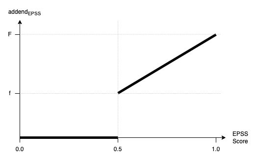

#### Priority Score System

The priority score calculation introduced in 0.117.0 replaces the old system with a multi-faceted approach that accounts 
for a broader range of factors. The system enables - in addition to contextual CVSS scoring - an external 
demand-driven and extensible ordering of vulnerabilities:

1. **Base Score**

The base score is now determined by the first available value from either the "Context CVSS" or "Initial CVSS" vector.
This CVSS data is used as the foundation for the priority score that all others are added to.

2. **Keyword Score**

Keyword scores, derived from relevant manually defined keyword sets, are added to the base score. This is unchanged to
the previous priority score behavior.

3. **EPSS Score**

The EPSS score ('p') is transformed into a linear additive factor. If 'p' is below a defined minimum threshold ('min'),
it contributes 0 to the score. Otherwise, the score is calculated using the following linear interpolation formula:

    addendEPSS(p) = 0 | 0 <= p <= min 
                             = f + ((p - min) / (1.0 - min)) * (F - f) | for min < p <= 1.0

This describes a truncated linear function, meaning it allows for fully ignoring the lower ranges and returning a custom
linear scaled value for the higher ones.

4. **KEV Score**

A predefined score is added if a known exploit exists, with an additional increment if ransomware is associated with the
vulnerability.

5. **EOL Score**

The EOL score is based on the software's lifecycle states that are affected by the relevant vulnerability, with distinct
scores for scenarios with and without extended support.

The new calculation method adds additional context to a previously not-so-useful score, allowing for a more accurate
vulnerability prioritization. The formulas implemented allow full customization of the scores added to the overall
priority score.

#### Priority Labels

The new priority system introduces a new CVSS Severity Range, the `priorityScoreSeverityRanges`, responsible for
creating labels for the scores to display in the reports. By default, it has three ranges:

- escalate (9.0 - ∞)
- due (7.0 - 8.9)
- elevated (-∞ - 6.9)

The corresponding labels are rendered in the resulting reports as priority indicators in case the priority score is
greater than the context score. Otherwise, the label 'Default' is rendered as priority indicator.
