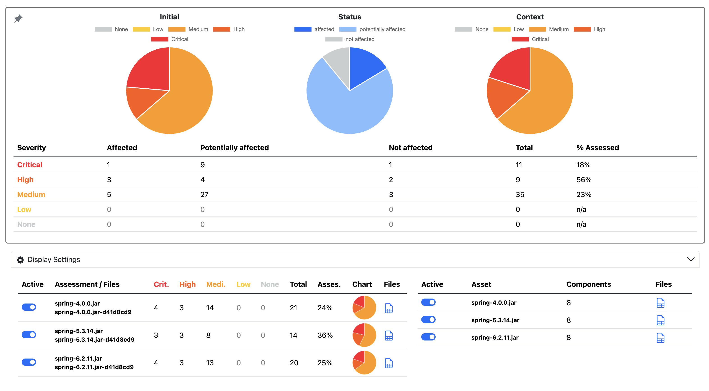
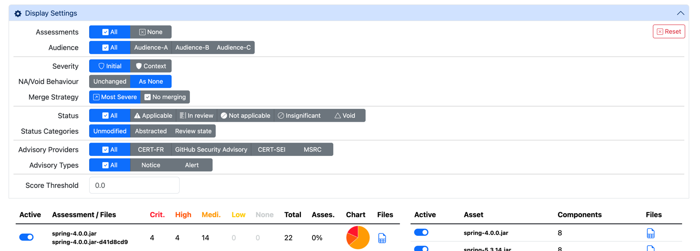

> [Documentation](../../../README.md) >
> [Vulnerability Management](../../README.md) >
> [Reports](../README.md) >
> Inventory Overview Report

# {metæffekt} Inventory Overview Report

> [Introduction](#introduction) -
> [Display Settings](#display-settings) -
> [Example Setup](#example-setup)

## Introduction

As part of the {metæffekt} tooling, the **Inventory Overview Report** enables the generation of a high-level view across multiple assets.
Compared to the detailed view provided by the [VAD](../vulnerability-assessment-dashboard/README.md), the **Inventory Overview Report** informs users on their vulnerability assessment situation across multiple assets and software inventories.
This allows not only the comparison of vulnerability assessments across multiple assets, but also of the same asset being assessed in multiple **Assessment Contexts**, also called Audiences. 

The vulnerabilities and their various aspects from the input vulnerabilities are displayed in pie charts and a table.
The table displays how many vulnerabilities possess a certain severity score, along its y-axis, and further separates them, according to their assessment status, along the x-axis.



## Display Settings



Since the vulnerabilities displayed are of a multivariate nature, filtering options provide the ability to specify the view or display only a selected set of vulnerability information.
The options are the following:

| Display Setting    | Description                                                                                                                                                                                                                                                                                                                                                                                                                                                              |
|:-------------------|:-------------------------------------------------------------------------------------------------------------------------------------------------------------------------------------------------------------------------------------------------------------------------------------------------------------------------------------------------------------------------------------------------------------------------------------------------------------------------|
| Audience           | Assets in the source inventories may specify a comma-separated-list of audiences in the `Audience` column. These assessment audiences enable the filtering of assets for a customized view, focusing on specific subsets.                                                                                                                                                                                                                                                |
| Severity           | The severity category determines whether to use the initial or contextualized CVSS scores to calculate the effective vulnerability severities.                                                                                                                                                                                                                                                                                                                           |
| NA/Void Behaviour  | These options apply only to the 'context' severities of the vulnerabilities, the 'initial' severities remain unchanged. Depending on the selected option, the severity category of the vulnerabilities may be interpreted differently. `As None` causes vulnerabilities with an assessment status of "not applicable" or "void" to be considered to have a severity of "None", regardless of their actual context severity score. `Unchanged` deactivates this behavior. |
| Merge Strategy     | Since the different assessment context inventories may contain the same vulnerability yet have designated different assessments for the vulnerability, this selector determines how these duplicate individual vulnerabilities should be treated. `Most Severe` chooses the assessment with the most severe assessment and discards the less sever . `No Merging` displays the vulnerability multiple times according to the different assessments.                      |
| Status Categories  | Beyond the default assessment states (inapplicable, in review, etc.), there exist other, generalized assessment views, which generalize the assessment status according to their applicability as well as review state. They are further illustrated in the [section below](#assessment-status-mappings)                                                                                                                                                                 |
| Status             | Filters the displayed vulnerabilities to only those, with the same selected assessment status. The values of this setting are controlled by the selected `Status Categories` option.                                                                                                                                                                                                                                                                                     |
| Score Threshold    | Filters all vulnerabilities out that have a severity below the configured threshold.                                                                                                                                                                                                                                                                                                                                                                                     |
| Advisory Providers | Filters all vulnerabilities which do not possess an advisory from the configured providers. Multiple selections are possible. The value of this setting is determined dynamically based on the providers found in all inventories.                                                                                                                                                                                                                                       |
| Advisory Types     | Similar to the `Advisory Providers` option, but instead filtering by provider, the type of the advisory is used instead.                                                                                                                                                                                                                                                                                                                                                 |

### Assessment Status Mappings

| Source         | Unmodified      | Abstracted           | Review State  |
|----------------|-----------------|----------------------|---------------|
| Applicable     | Applicable      | Affected             | Reviewed      |
| Not Applicable | Not Applicable  | Not affected         | Reviewed      |
| In Review      | In Review       | Potentially affected | In Review     |
| Insignificant  | Insignificant   | Potentially affected | Insignificant |
| Void           | Void            | Not affected         | Void          |

## Example Setup

An example pom.xml configuration for generating the **Inventory Overview Report** is provided below.

```
overview-report
├── pom.xml
└── overview
    ├── advisor
    │   ├── spring2.6.11.xls.result.xls
    │   ├── spring4.0.0.xls.result.xls
    ├── assessments
    │   ├── assessments-spring2.6.11.yaml
    │   ├── assessments-spring4.0.0.yaml
    ├── dashboards
    ├── input
    │   ├── spring2.6.11.xls
    │   ├── spring4.0.0.xls
    └── reports
```

```xml
<?xml version="1.0" encoding="UTF-8"?>
<project xmlns="http://maven.apache.org/POM/4.0.0"
         xmlns:xsi="http://www.w3.org/2001/XMLSchema-instance"
         xsi:schemaLocation="http://maven.apache.org/POM/4.0.0 http://maven.apache.org/xsd/maven-4.0.0.xsd">
    <modelVersion>4.0.0</modelVersion>

    <groupId>com.metaeffekt.artifact.analysis</groupId>
    <artifactId>ae-inventory-overview-html-report-example</artifactId>
    <version>HEAD-SNAPSHOT</version>
    <packaging>pom</packaging>

    <build>
        <plugins>
            <plugin>
                <groupId>com.metaeffekt.artifact.analysis</groupId>
                <artifactId>ae-inventory-overview-html-report</artifactId>
                <version>HEAD-SNAPSHOT</version>

                <executions>
                    <execution>
                        <id>create-inventory-overview-report</id>
                        <phase>process-resources</phase>
                        <goals>
                            <goal>create-report</goal>
                        </goals>

                        <configuration>
                            <baseDirectory>overview</baseDirectory>

                            <!-- these paths are relative to the <baseDirectory> -->
                            <inputInventoryPath>inventory</inputInventoryPath>
                            <advisorInventoryPath>advisor</advisorInventoryPath>
                            <dashboardsPath>dashboards</dashboardsPath>
                            <reportsPath>reports</reportsPath>

                            <outputFile>${project.build.directory}/inventory-overview-report.html</outputFile>

                            <inputInventoryUrlPattern>$[input.inventory.file.path.relative]</inputInventoryUrlPattern>
                            <advisorInventoryPathUrlPattern>$[assessment.inventory.file.path.relative]</advisorInventoryPathUrlPattern>
                            <dashboardsPathUrlPattern>$[assessment.vulnerabilityAssessmentDashboard.file.path.relative]</dashboardsPathUrlPattern>
                            <reportsPathUrlPattern>$[assessment.pdf.report.file.path.relative]</reportsPathUrlPattern>
                        </configuration>
                    </execution>
                </executions>
            </plugin>
        </plugins>
    </build>
</project>
```

```properties
assessment.inventory.asset.id . . . . . . . . . . . . . . . . . . . . . . .spring-4.0.0.jar
input.inventory.file.path.relative .  .  .  .  .  .  .  .  .  .  .  .  .  .inventory
assessment.inventory.file.path.relative .  .  .  .  .  .  .  .  .  .  .  . advisor
assessment.vulnerabilityAssessmentDashboard.file.path.relative .  .  .  . .dashboards
assessment.pdf.report.file.path.relative .  .  .  .  .  .  .  .  .  .  .  .reports
```

## Notifications

The Inventory Overview Report supports a notification system that evaluates configurable rules against the vulnerability data and produces a JSON file with triggered notifications.
This can be used to alert relevant parties when vulnerability counts exceed thresholds or match specific criteria.

For the full notification configuration reference, including YAML schemas, rule definitions, template variables, and evaluation logic, see [Notifications](notifications.md).
