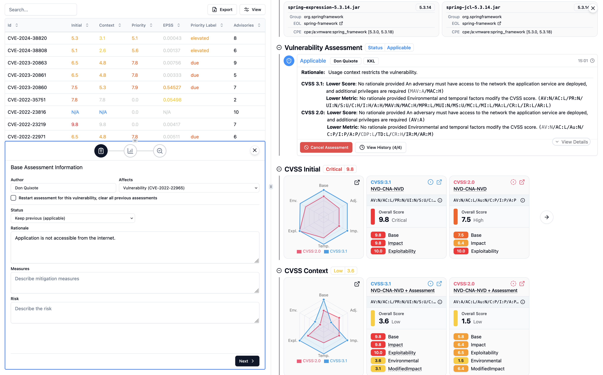

> [Documentation](../../../README.md) >
> [Vulnerability Management](../../README.md) >
> [Reports](../README.md) >
> [Assessment Dashboard](assessment-dashboard.md) >
> Assessment Management Service

# Assessment Management Service

> [Configuration](#configuration) -
> [Variable Placeholders](#variable-placeholders) -
> [Endpoints](#endpoints)

> [!WARNING]
> The Assessment Management Backend Service is not yet publicly available.
> Full documentation will be published with the release.

The Dashboard can connect to an external API to enable collaborative assessment workflows and user authentication.
This configuration allows users to log in, persist assessments, and retrieve updates in real time.

All communication is handled via HTTP and JSON.
Authentication is initially performed through username and password, which provides a user token that the user can then use to perform authenticated requests.
For this a HTTP header `authHeaderToken` is used, which is by default `X-Dashboard-User-Token`.



## Configuration

In your XML `reportConfiguration`, configure the API by specifying the individual endpoint URLs and other values:

<!-- @formatter:off -->
```xml
<reportConfiguration>
    <apiConfiguration>
        <apiType>A</apiType>
        <apiA>
            <baseUrl>http://localhost:8080/api/v2</baseUrl>
            <requestTimeout>5000</requestTimeout>

            <authHeaderUsername>X-Dashboard-User-Name</authHeaderUsername>
            <authHeaderToken>X-Dashboard-User-Token</authHeaderToken>

            <ping>ping</ping>
            <currentUser>current_user</currentUser>
            <login>login</login>
            <logout>logout</logout>
            <logoutMode>POST</logoutMode>

            <reserveAssessmentEventId>entity_id/assessment_event</reserveAssessmentEventId>
            <eventsSinceTimestampForDashboard>$[asset.current.Asset Id]/assessment_event/$[since_time]/$[asset.current.Version]</eventsSinceTimestampForDashboard>
            <putEventForDashboard>$[asset.current.Asset Id]/assessment_event/$[creation_time]/$[asset.current.Version]</putEventForDashboard>

            <urlDateParameterPattern>yyyy-MM-dd'T'HH_mm'Z'</urlDateParameterPattern>
        </apiA>
    </apiConfiguration>
</reportConfiguration>
```
<!-- @formatter:on -->

## Variable Placeholders

The following variables may be used in the `eventsSinceTimestampForDashboard` and `putEventForDashboard` endpoint paths.
Wrap them inside of `$[VARNAME]` to have them be evaluated at runtime.

- `asset.current.[ATTRIBUTE]`: refers to a dynamic value from the currently selected asset.
- `info.[NAMESPACE].[KEY]`: refers to a value set via inventory metadata (e.g., from `InventoryInfoSetterMojo`'s `set-inventory-info`).
- `event.uid`: UUID generated for the assessment event to be registered using the `putEventForDashboard` endpoint.
- `creation_time`: UTC timestamp for event creation, formatted as `urlDateParameterPattern`.
- `since_time`: UTC timestamp for querying events since a given time, formatted as `urlDateParameterPattern`.

## Endpoints

### `ping` (`GET`)

Verifies the availability of the backend.

- default: `ping`
- response: a UNIX timestamp indicating the current server time as a number.

### `login` (`POST`)

Performs login via username and password.
Returns a token that must be used in future authenticated requests.

- default: `login`
- request body:

  ```json
  {
    "username": "yan",
    "password": "admin"
  }
  ```
- response:

  ```json
  {
    "id": "yan",
    "token": "f71bb8a7-bef7-4b39-beb8-bc2c7fd14e62"
  }
  ```

### `logout` (`GET`)

Invalidates the token and logs out the current user.

- default: `logout`
- headers:
    - `authHeaderToken`: token to be invalidated
- response: `true` (boolean)

### `logoutMode`

Determines the behavior of the logout button available on the dashboard.

- default: `POST`
- values:
    - `POST`: makes a request to the `logout` endpoint with the user information in the request body.
    - `REDIRECT`: sets the `window.location.href` to the `logout` URL instead of calling it, redirecting the user to the target location; the current dashboard URL is passed as a `redirect_uri` URL GET parameter.
    - `DISABLED`: disables the logout button and treats any logout attempt as a success without performing any action.

Introduced in https://github.com/org-metaeffekt/metaeffekt-artifact-analysis/pull/320.

### `currentUser` (`GET`)

Returns the currently authenticated user.

- default: `current_user`
- headers:
    - `authHeaderToken`: the user token received after login
- response:
  ```json
  {
    "id": "yan",
    "name": "Yan Wittmann",
    "avatar": "https://..."
  }
  ```

The avatar field is optional and the image linked will only be evaluated when the parameter is provided.

### `reserveAssessmentEventId` (`GET`)

Generates a unique ID for a new assessment event.

- response:
  ```json
  {
    "id": "f15e1ae8-5d55-4cc1-bb36-ef4283cbe8b7"
  }
  ```

This ID will be used by the frontend in a call to the `putEventForDashboard` endpoint.

### `eventsSinceTimestampForDashboard` (`GET`)

Retrieves assessment events for a given asset component and version path since the given time.

- example with variables: `$[asset.current.Asset Id]/assessment_event/$[since_time]/$[asset.current.Version]`
- headers:
    - `authHeaderToken`
- response:
  ```json
  [
    {
      "uid": "f15e1ae8-...",
      "type": "flag",
      "severity": "high",
      ...
    }
  ]
  ```

### `putEventForDashboard` (`POST`)

Persists a new assessment event.

- example with variables: `$[asset.current.Asset Id]/assessment_event/$[creation_time]/$[asset.current.Version]`
- headers:
    - `authHeaderToken`
- request body: arbitrary JSON structure representing the event
- response: HTTP 201 Created

### `urlDateParameterPattern`

Timestamp pattern used in all path variables representing dates:

```
yyyy-MM-dd'T'HH_mm'Z'
```

This format is UTC-based and uses underscores instead of colons (e.g., `2025-06-04T16_05Z`).
