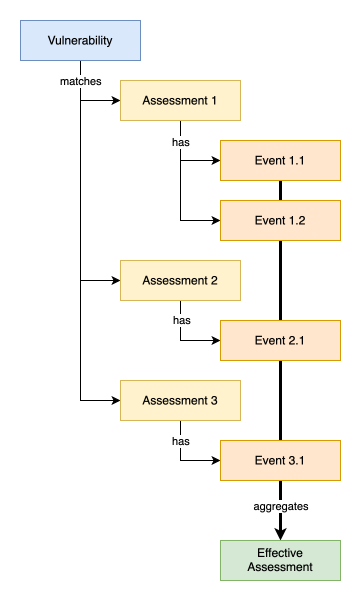

> [Documentation](../../../../README.md) >
> [Vulnerability Management](../../../README.md) >
> [Technical Specifications](../../README.md) >
> Assessment

# Vulnerability Assessment Format

The Vulnerability Assessment Format defines how vulnerability assessments are written, persisted, and exchanged.
Assessments are YAML or JSON documents that assign statuses, CVSS modifications, and other metadata to vulnerabilities, and are evaluated by the dashboard and enrichment pipeline.

The format has evolved through multiple schema versions, each extending the capabilities of the previous one.
The latest version (2.3) is the recommended format for all new assessments.

- [Version 2.3 (Latest)](vulnerability-assessment-file-gen-4-2.3.md): assessment identity and ownership restructuring, PURL matching, artifact-based narrowing changes
- [Version 2.2](vulnerability-assessment-file-gen-4-2.2.md): full format specification, schema definition, and effective assessment evaluation logic
- [Version 2.1](vulnerability-assessment-file-gen-4-2.1.md): rationale-centric CVSS modification format and JSON structure changes
- [Version 2.0](vulnerability-assessment-file-gen-4-2.0.md): introduction of the Generation 4 event-based assessment model
- [Version 1.0 (Legacy)](vulnerability-assessment-file-gen-3.md): the Generation 3 assessment format

A tool to upgrade your assessments to the latest version is provided as the [Format Upgrade Tool](vulnerability-assessment-upgrade-plugin.md).

For details on how assessments are applied, merged, and overwritten at different evaluation levels, see [Assessment Application](vulnerability-assessment-application.md).

For the principles and matching behavior specific to false positive assessments, see [False Positive Assessments](vulnerability-assessment-false-positive.md).

## Format Specification

The vulnerability assessment format YAML and JSON formats allow for the configuration of assessments that will be applied on vulnerabilities to determine their status and add various metadata to the vulnerabilities.

Equivalent examples for both the YAML and JSON formats are provided in the table below.

<table>
<thead>
  <tr>
    <th>YAML</th>
    <th>JSON (reduced)</th>
  </tr>
</thead>
<tbody>
  <tr>
<td valign="top">

```yaml
schema-version: "2.3"

assessments:
- affects:
  vulnerabilities:
    - CVE-2021-4104
  events:
    - date: 2022-01-31
      status: applicable
      rationale: Application configuration allows exploitation.
      cvss:
        - rationale: "Component is only accessible from a trusted internal network."
          modifications:
            - version: "4.0"
              type: "lower metric"
              metrics: "MAV:N"
```

</td>
<td>

```json
{
  "schemaVersion": "2.3",
  "uid": "5e9c3a2d-6b1f-4e2a-9c77-1a2b3c4d5e6f",
  "scope": "VULNERABILITY",
  "affects": {
    "affectedVulnerabilities": [ "CVE-2021-4104" ]
  },
  "events": [ {
      "schemaVersion": "2.3",
      "assessmentUid": "5e9c3a2d-6b1f-4e2a-9c77-1a2b3c4d5e6f",
      "scope": "VULNERABILITY",
      "status": "applicable",
      "rationale": "Application configuration allows exploitation.",
      "date": 1643587200000,
      "priority": 0,
      "cvss": [ {
          "rationale": "Component is only accessible from a trusted internal network.",
          "modifications": [ {
              "version": "4.0", "type": "lower metric", "metrics": "MAV:N"
          } ]
      } ],
      "reviewedAdvisories": []
  } ],
  "ignoreWhenVoid": false
}
```

</td>
  </tr>
</tbody>
</table>

## Terminology

**Assessments** are provided by **Assessment YAML/JSON files** or the **[Asset Management Backend](https://github.com/org-metaeffekt/metaeffekt-asset-management)** via the **Dashboard API** in the Dashboard frontend.
Every **Assessment** provides a set of general information on the assessment, such as what **Vulnerabilities, CPEs, PURLs, etc., the assessment should affect**, the **Scope** and **Creation Context** of the assessment and a list of **Assessment Events**.
**Assessment Events** are what specify what the effect on a vulnerability should be.
They contain a **Status, Rationales, Measures, CVSS Vectors**, and more.
Events are aggregated into an **Effective Assessment** across multiple assessments and evaluated additively in the order they were created.



### Schema Format Definition

Expand the collapsables below to learn more about the formats.

<details>

<summary><h4>YAML</h4></summary>

The full JSON schema definition of the YAML format is available at https://metaeffekt.com/schema/artifact-analysis.

On the topmost level of the YAML document, the following keys are required:

- `schema-version` (required): Specifies the schema version, must be "2.3" for the latest version.
- `assessments` (required): An array of one or more assessment entries.

#### Assessments (`assessments`)

Each assessment defines the following properties:

- `uid` (optional): A stable identifier for the assessment. If not set explicitly, it is derived deterministically from the `uid`s of its own events, in list order, so the same events in the same order always produce the same assessment `uid`. An assessment with no events at all gets a random, non-reproducible `uid` instead. An event without its own `uid` is likewise derived deterministically, from its own content, see [Assessment Identity and Ownership](vulnerability-assessment-file-gen-4-2.3.md#assessment-identity-and-ownership).
- `scope`:
    - `vulnerability`: Applies to vulnerabilities specified in the `affects` section.
    - `inventory` ("baseline"): Applies to all vulnerabilities in the inventory (bypasses `affects`).
      `inventory`-scope assessments order below `vulnerability`-scope assessments by default.
- `affects` (mandatory on `vulnerability` scope): Specifies what vulnerabilities to apply the assessment on.
    - `matchOperator` (optional, default: `OR`): Determines how the different matching criteria are combined.
        - `OR`: The assessment applies if *any* of the defined criteria sets match (legacy behavior).
        - `AND`: The assessment applies only if *all* defined non-empty criteria sets yield a match. If a criteria set contains multiple criteria, only one of them has to match for the set to become a match.
    - `vulnerabilities`: Array of vulnerability IDs (e.g. `CVE-2021-44228`) to apply the assessment on.
    - `cpe`: Array of CPE 2.2/2.3 strings (e.g. `cpe:/a:apache:log4j`).
    - `purl`: Array of package URLs (e.g. `pkg:maven/com.acme/widget`). Participates in matching exactly the way `cpe` does.
    - `cwe`: Array of CWE IDs (e.g. `CWE-502`).
    - `artifacts`: Array of artifact correlation matchers. Allows restricting assessments to specific artifacts (e.g. by name or version).
      Whenever an artifact matcher is present, it is evaluated first, and every other identifier criterion in the same assessment (`cpe`, `purl`) only ever considers artifacts already selected by that matcher.
      If an assessment matches only a subset of the artifacts affected by a vulnerability, this is recorded as a partial match on the vulnerability, not on the event: the event itself is kept in history but does not take effect on its own.
      See [False Positive Assessments](vulnerability-assessment-false-positive.md#restricting-a-match-to-the-reviewed-artifact) for the full mechanics.
      Independent of any vulnerability, the assessment is also referenced directly on every artifact this matcher matches, so it stays visible from that artifact even when it currently matches no vulnerability, see [FP Assessment visibility without a matching vulnerability](vulnerability-assessment-false-positive.md#fp-assessment-visibility-without-a-matching-vulnerability).
    - `criteria`: Array of predefined, hardcoded assessment behaviors. Replaces the legacy `condition` DSL.
        - `name`: The name of the criterion (as of writing, only `msrc fix present` exists).
        - `parameters`: Optional key-value pairs for configuration (currently unused).
    - `labels`: If specified, the labels listed must match in addition to another `affects` criteria.
        - `includes`: At least one of the labels listed is required to match for the assessment to apply.
        - `excludes`: Labels that disqualify the assessment if present.
- `events` (mandatory): See sub-chapter below.
- `ignoreWhenVoid` (optional, default: `false`): Controls how to handle assessments for vulnerabilities that are not found in the inventory.
    - `false` (default): If an assessment targets a vulnerability not present in the inventory, a new placeholder entry for that vulnerability is created and its status is set to `VOID`.
    - `true`: The assessment is completely ignored if the target vulnerability is not found in the inventory.
- `validation`: See [the validation chapter in this document](vulnerability-assessment-file-gen-3.md#validation) or [this example](vulnerability-assessment-file-gen-3.md#ex-5-inventory-validation).

#### Assessment Events (`events`)

An array of incremental assessment events.
Events are evaluated in order based on their intrinsic comparison order, with later events overriding earlier ones.

Each event must include (required):

- `date`: ISO 8601-alike date (either `2025-01-01`, `2025-01-01 10:00` or `2025-01-01 10:00:00`).

Assessment properties:

- `status`: One of `applicable`, `in review`, `not applicable`, `insignificant`, or `void`.
- `author`/`authorId`
- `rationale`: Explanation for the status and assessment.
- `risk`
- `measures`
- `score`: setting this property will fully overwrite the priority score displayed in the Vulnerability Assessment
  Dashboard.
- `priority`: Integer to override sorting (higher values take precedence), default: `0`.
- `false positive` (optional, default: not set): Marks the event as declaring a false positive rather than a regular status judgement.
- `advisory reviewed`:
    - List of objects with `id` (e.g. `CERTFR-2021-ALE-022`) and `rationale`.
- `cvss`: An array of CVSS modification blocks, supporting versions 2.0, 3.0, 3.1, and 4.0. This "rationale-centric" format groups modifications under a common rationale.
    - `rationale`: An explanation for the set of modifications being applied.
    - `modifications`: An array of modification objects, each with the following properties:
        - `version` (required): The CVSS version string (`2.0`, `3.0`, `3.1`, `4.0`).
        - `type` (required): The type of modification to perform. Valid types include:
            - `reset`: Resets one or more metrics to their original values.
            - `overwrite`: Sets a specific metric to a new value.
            - `lower score` / `upper score`: Applies metrics only if the resulting score is lower/higher than the previous one.
            - `lower metric` / `upper metric`: Applies metrics only if the metric is ranked lower/higher than the one already set.
        - `metrics` (required): The CVSS vector string defining the change (e.g. `MAV:N`). For `reset`, this can be `all` or a slash-separated list of metrics (e.g. `AV/AC`).

Flags to determine whether the assessment event should be considered at all:

- `active`: Whether to include the event in the assessment evaluation.
- `discard prior events`: Fully resets all previous events.
- `reset to baseline`: Fully resets all previous events that are not an inventory-scope (baseline) assessment.
- `discard on subsequent events`: If there are later events, this event and all prior ones are discarded. If this is the latest event, it remains active.

</details>

<details>

<summary><h4>JSON</h4></summary>

The JSON formats of the vulnerability assessment schema are not intended to be written by a human being and merely serve as exchange format between processes and the API, and changes to the format may be more drastical between versions.
The JSON format mirrors the internal data structure of the Java and TypeScript implementations of the assessment systems.

The most important changes compared to the YAML format are:

- Both the assessments and assessment events contain their `schemaVersion` and `scope` as properties to allow them being parsed independently from each other.
- Every event gets assigned a UUID that should remain stable for this event, and carries an `assessmentUid` reference back to the assessment it belongs to.
- A `creationContext` is defined on the assessment that may store additional information on where the assessment was created in.

A full example of the structure can be found in [version 2.3](vulnerability-assessment-file-gen-4-2.3.md).

</details>
