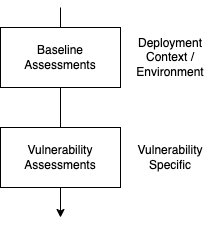
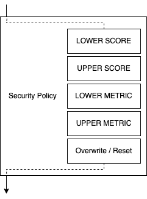

> [Documentation](../../../../README.md) >
> [Vulnerability Management](../../../README.md) >
> [Technical Specifications](../../README.md) >
> [Assessment](README.md) >
> Assessment Application

# Application of Vulnerability Assessments

The Vulnerability Assessment Dashboard supports various levels and forms of assessments.
These are primarily applied to compute an effective context CVSS vector and a resulting score.

The following sections describe how assessments are applied, merged, and overwritten.

## Definitions

### Baseline Assessments

Baseline assessments apply to all vulnerabilities in a given assessment context.
They are often based on additional information from deployment scenarios or environments.

### Vulnerability Assessments

Vulnerability assessments apply to vulnerabilities and their given characteristics and details.

Vulnerability assessments may apply based on different criteria:

- Condition: a generic condition that can be used to express certain prerequisites for the vulnerability to apply
- CPE: the vulnerability matches a specific CPE
- CWE: the vulnerability matches a specific CWE
- CVE: a vulnerability with the given CVE

## Assessment-Type-Level Application

The current implementation has several levels of evaluation.

Assessment-Type-Level Application Order:

1. Apply baseline assessments
2. Apply vulnerability assessments

All baseline assessments are evaluated first.
The result of this evaluation is then used as input for applying vulnerability assessments.

Baseline and vulnerability assessments do not interfere with each other, independent of when the assessments were created.

## Assessment-Level Application

In both assessment levels, assessments are processed according to the following scheme:

Within an assessment, different evaluation steps are applied based on different MergeMethods as specified in the security policy (`contextCvssSelector` section).

The default security policy applies the following order:

- LOWER SCORE modifications, applied only if the resulting score is lower than the score of the input vector
- UPPER SCORE modifications, applied only if the resulting score is higher than the score of the input vector
- LOWER METRIC modifications, applied only in case the metric is lower than the original metric
- UPPER METRIC modifications, applied only in case the metric is higher than the original metric
- ALL other modifications, including overwrite and reset

Within a MergeMethod, the assessments are applied ordered by creation time.
The matching criteria for a vulnerability is irrelevant.
