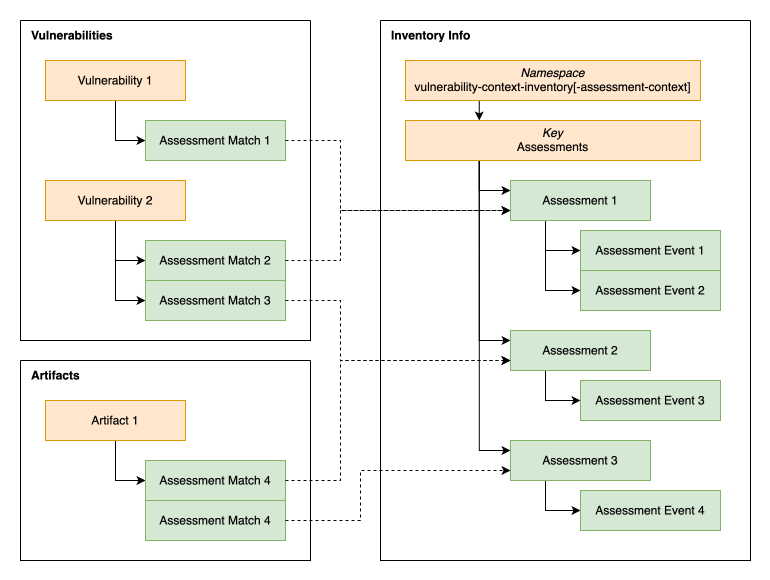
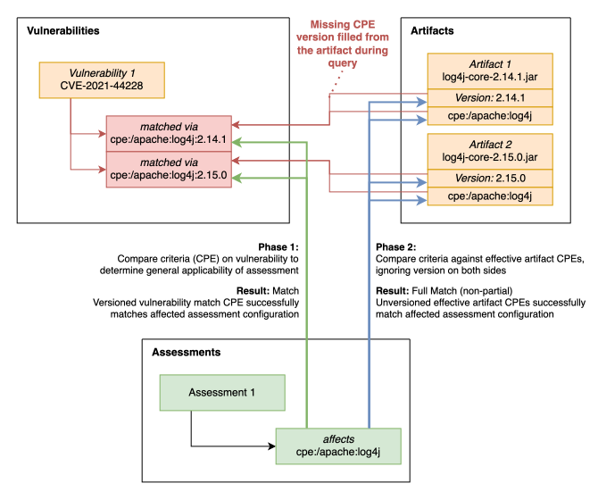
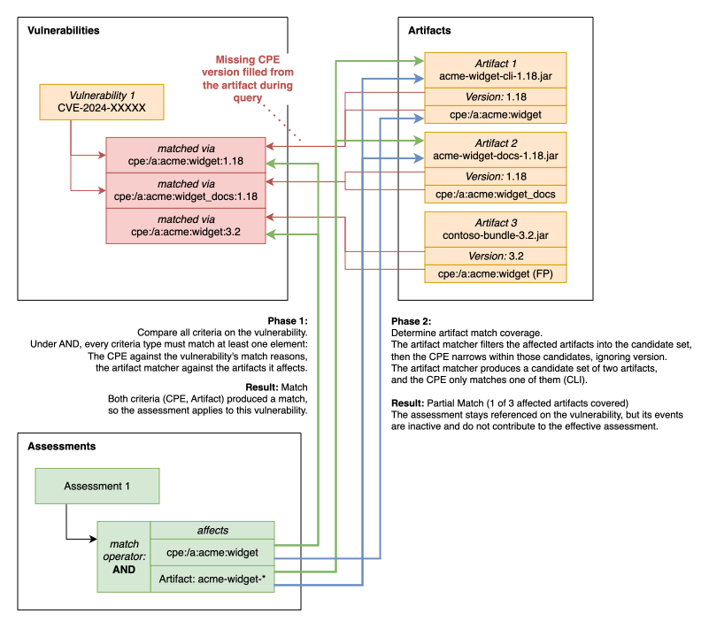
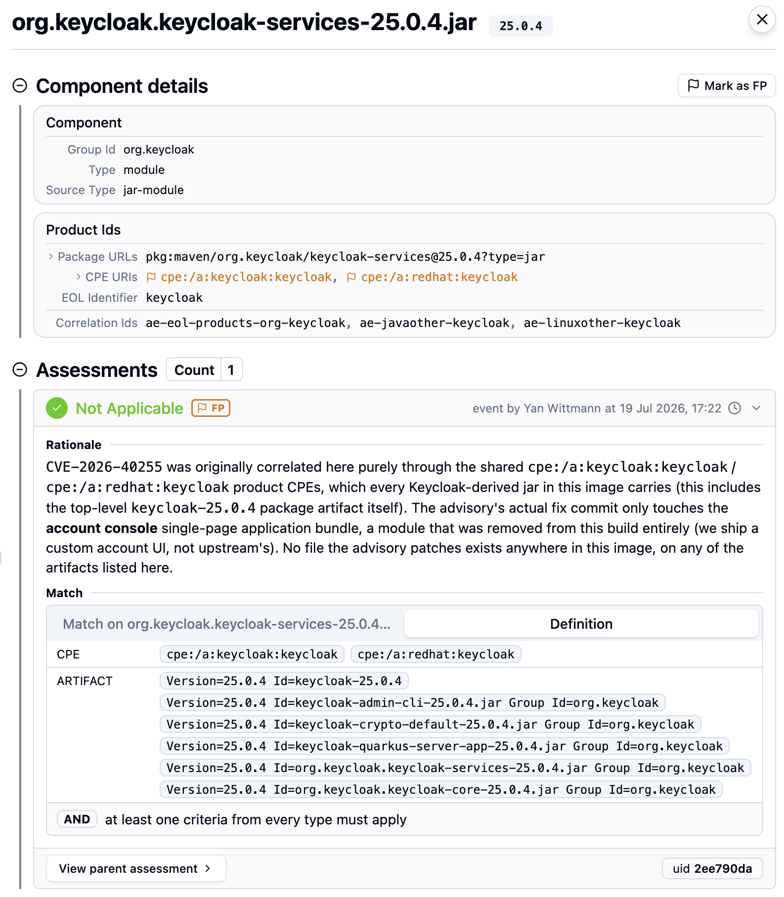
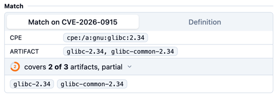
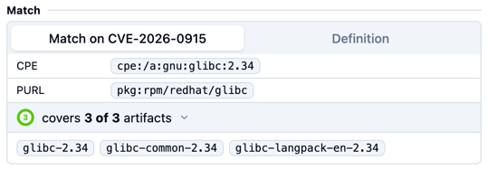

> [Documentation](../../../../README.md) >
> [Vulnerability Management](../../../README.md) >
> [Technical Specifications](../../README.md) >
> [Assessment](README.md) >
> Matching

# Assessment Matching

> [Storage and References](#assessment-storage-and-references) -
> [Target: Artifacts](#match-target-artifacts) -
> [Target: Vulnerabilities](#match-target-vulnerabilities) -
> [Partial Matches](#partial-matches)

Matching is the step that decides which vulnerabilities and which artifacts an assessment applies to, and how much of each of them it actually covers.
It runs whenever an inventory is enriched, it reads the `affects` section of every assessment available in the current assessment context, and it writes its findings as references onto the vulnerabilities and artifacts it matched.

Matching does not decide what an assessment means.
It only decides where an assessment lands and with what coverage.
Turning the events of all matched assessments into one status, rationale and CVSS vector for a vulnerability is a separate step, described in [Effective Assessment](vulnerability-assessment-effective-assessment.md).

For every vulnerability it considers, matching answers two questions.
The first question decides whether anything is recorded at all, the second decides whether what was recorded takes effect, which is the subject of [Partial Matches](#partial-matches).

- Whether the assessment applies to that vulnerability at all (which the criteria in `affects` and the match operator decide), described in [Matching a Vulnerability](#matching-a-vulnerability).
- Which of that vulnerability's artifacts the assessment actually covers, described in [Artifact Narrowing](#artifact-narrowing).

Artifact matching is significantly simpler, and can be found in the [Match Target: Artifacts](#match-target-artifacts) chapter.

Before any other topic can be described, it is worth knowing where an assessment is stored and what matching actually writes, since neither is where one would intuitively expect it.

## Assessment Storage and References

An assessment is stored once per inventory, together with all of its own events.
This chapter covers where the content lives, what those pointers record, and the two storage forms that exist so that older and standalone data keep working.

### The central store

Assessments live on the inventory info sheet, under the namespace `vulnerability-context-inventory`, in the key `Assessments`, as a JSON array with one entry per assessment.
A named assessment context stores its assessments under the same namespace suffixed with the context name, for example `vulnerability-context-inventory-assessment-001`.



### What a reference records

Vulnerabilities and artifacts carry an `Assessment Matches` column with a JSON array of match records, where each record points at one assessment and describes how that assessment matched this particular target.

A record holds the following.

- `assessmentUid`, the identifier of the assessment this reference points at, resolved against the central store.
- `matchReasons`, one entry per criterion that produced a match, each with a `type` and a `value`. The types are `VULNERABILITY`, `CPE`, `PURL`, `CWE`, `ARTIFACT`, `CONDITION` and `INVENTORY_SCOPE`. A value is a display string, and where a criterion matched several things the values are deduplicated and joined with a comma.
- `artifactApplicability`, how much of the vulnerability the match covers, present only when [artifact narrowing](#artifact-narrowing) actually decided something.
- `partialMatch`, whether that coverage is incomplete, derived from `artifactApplicability` as described in [Partial Matches](#partial-matches).

The simplest possible reference is one produced by naming the vulnerability directly, which covers the whole vulnerability and therefore records no coverage at all:

```json
{
  "assessmentUid": "5e9c3a2d-6b1f-4e2a-9c77-1a2b3c4d5e6f",
  "partialMatch": false,
  "matchReasons": [ { "type": "VULNERABILITY", "value": "CVE-2024-0001" } ]
}
```

Because the reference and the content live in different places, if a record names a uid that the info sheet does not contain, the reference cannot be resolved, a warning is logged, and the assessment is skipped, so none of its events appear anywhere.
This is the shape to look for when an assessment that clearly should have matched is nowhere to be seen.

### Standalone and legacy storage

To maintain backwards compatibility and to support storing assessments without a managing inventory, two further storage forms are recognized.

- A vulnerability that is handled on its own, outside a managing inventory, has no central store available, so it writes the assessments it references into an `Inline Assessments` column on its own row in order to stay self-contained.
  As soon as such a vulnerability enters an inventory, those assessments are migrated into the central store and the column is cleared, so the column should not normally be present in a regular inventory.
- The pre-2.3 `Assessment Events` column, which used to hold the events of a vulnerability directly, is still read so that older inventories can be opened, but it is never written again.
  Reading and writing an inventory of that age therefore moves its data into the current shape on its own.
  More information on that can be found in [Assessment Gen 2.3 Upgrading Existing Documents](vulnerability-assessment-file-gen-4-2.3.md#upgrading-existing-documents).

## Matching overview diagrams

Before diving into the details of the matching algorithm, here are a few diagrams that present possible matchings of assessments against vulnerabilities and artifacts.
These will be referenced throughout the different chapters in this file, so you do not need to understand them fully just yet.

The scenarios below are constructed to make one mechanism visible at a time, and none of them is taken from real inventory data.
Where a diagram uses a name that exists in the real world, it does so only because a familiar name is easier to read than an invented one, and nothing shown should be understood as a statement about the affectedness of that product.

### Apache Log4j CPE on Vulnerability and Artifact

A CPE product identifier criterion evaluated against both sides, with the versioned CPEs recorded on the vulnerability and the effective CPEs of each artifact.



### Partial Match through Artifact Narrowing

An assessment that carries both an artifact matcher and a product identifier under `AND`, applied to a vulnerability that affects three artifacts, of which it ends up covering one.



Each of the three artifacts leaves the covered set at a different point, which is what the two narrowing steps do.
`acme-widget-cli-1.18.jar` is selected by the matcher and carries the identifier, so it is covered.
`acme-widget-docs-1.18.jar` is selected by the matcher as well, but its own identifier names a different product, so it is dropped when the identifier narrows within the candidates.
`contoso-bundle-3.2.jar` does carry the identifier and is still not covered, because the matcher never admitted it, and nothing can reintroduce an artifact the matcher excluded.

Covering one of the three artifacts the vulnerability affects is what makes this match partial: the assessment stays referenced on the vulnerability and its events remain visible in the history, but none of them take effect.
How the covered set is built is described in [Artifact Narrowing](#artifact-narrowing), and what the resulting verdict causes in [Partial Matches](#partial-matches).

## Match Target: Artifacts

An artifact is the simpler target and is thus covered first.
It exists so that an assessment stays traceable from the artifact it was written about, mainly for [FP Assessments](vulnerability-assessment-false-positive.md).

Only assessments with an artifact matcher (correlation algorithm) are considered for artifacts, and only that one criterion is evaluated for the match to be successful.
The match operator and every other criterion, including `vulnerabilities`, `cpe` and `purl`, are ignored.
A reference is created on every artifact the matcher selects, whether the assessment currently matches any vulnerability at all.

A reference produced this way is always recorded as a full match, carries a single match reason naming the artifact, never carries coverage information since there is no set of artifacts for it to be a subset of:

```json
{
  "assessmentUid": "311731c1-c749-340d-af6a-e8a08d909360",
  "partialMatch": false,
  "matchReasons": [ { "type": "ARTIFACT", "value": "acme-widget-cli-1.18.jar" } ]
}
```

### How artifact references are used

Artifact-side references are only minimally evaluated at the moment.
An artifact has no effective assessment, and an artifact does not have a status.
The dashboard resolves those assessments, displays their events and additionally derives false positive state per product identifier of the artifact.
Why an artifact carries these references at all, and why they are kept even while the assessment matches no vulnerability, is described in [FP Assessment visibility without a matching vulnerability](vulnerability-assessment-false-positive.md#fp-assessment-visibility-without-a-matching-vulnerability).



## Match Target: Vulnerabilities

First, all criteria in `affects` are evaluated with the match operator, then artifact narrowing applies (partial matching), and the resulting references are stored on the vulnerability to be fed into the vulnerability's effective assessment.

### Matching a Vulnerability

This chapter covers the first of the two phases: whether an assessment applies to a vulnerability at all.
Each criterion is compared against a different piece of data on the vulnerability, and the match operator then decides how the individual results combine into one answer.
An assessment that fails here produces no reference at all, and nothing further is recorded about it.

This section here describes what they are compared against, the syntax of the fields below is documented in the [format specification](README.md#assessments-assessments).

| Criterion         | Compared against                                                                                                                                                     | Narrows artifacts              |
|-------------------|----------------------------------------------------------------------------------------------------------------------------------------------------------------------|--------------------------------|
| `vulnerabilities` | the id of the vulnerability, compared for equality                                                                                                                   | no                             |
| `cwe`             | the CWE ids the vulnerability references                                                                                                                             | no                             |
| `cpe`             | a product the vulnerability was reported against, see [Product Identifiers](#product-identifiers)                                                                    | yes                            |
| `purl`            | a product the vulnerability was reported against, see [Product Identifiers](#product-identifiers)                                                                    | yes                            |
| `artifacts`       | the artifacts the vulnerability is recorded as affecting, through a correlation matcher                                                                              | yes, and it filters the others |
| `criteria`        | a predefined check on the vulnerability's own data, currently only `msrc fix present`, which asks whether the vulnerability carries an `MS Fixing Knowledge Base ID` | no                             |

It is important to realize that in this first phase, only properties from the vulnerabilities are compared.
All information is derived from fields that are present on the vulnerability itself, without any evaluation of artifacts or other referenced entries.

Three of these criteria do double duty.
`artifacts`, `cpe` and `purl` decide whether the assessment applies, like every other criterion, and they additionally determine which artifacts it covers, which is what the second phase, [Artifact Narrowing](#artifact-narrowing), is about.
The `artifacts` matcher goes one step further and restricts which artifacts the other two are allowed to consider at all.

`labels` do not appear in this list, as it is not a criterion but a gate.
It is evaluated before even touching any of the vulnerabilities, and when it is rejected, no other criterion is even consulted.

#### Combining criteria

A criterion counts as active when it is present and not empty.
Within a single criterion the listed entries are always combined with `OR`, so one of several listed CPEs matching is enough for that criterion to produce a match reason.

Between criteria, the `matchOperator` decides.
With `OR`, the default, at least one active criterion has to produce a match reason.
With `AND`, every active criterion has to produce one, and there has to be at least one active criterion to begin with.
A match that ends up with no reasons at all is discarded rather than recorded.

The operator does not only affect this first phase.
Under `OR`, a criterion that matched on the vulnerability itself can suppress the artifact narrowing that follows entirely.
[When coverage is recorded at all](#when-coverage-is-recorded-at-all) describes that once narrowing has been introduced.

#### Baseline assessments

An assessment with the `inventory` scope (baseline assessment), bypasses the criterion-based `affects`-matching above entirely.
It applies to every vulnerability in the inventory, and its reference carries a single match reason of type `INVENTORY_SCOPE` with no value.
It never applies to artifacts, does not narrow vulnerabilities using the matched artifacts and can thus never be partial.
Baseline assessments also never produce artifact-side references, since they carry no meaningful artifact matcher.

### Product Identifiers

`cpe` and `purl` are different from the other criteria in what they target in their comparison operations.
`vulnerabilities`, `cwe` and `criteria` ask something about the vulnerability, and `artifacts` asks something about artifacts, but a product identifier names a product, and a product is something that both a vulnerability and an artifact can be about.

Matching therefore evaluates such a criterion against both, once while deciding whether the assessment applies at all, and once while deciding which artifacts it covers.
The two sides record their identity differently, which is what the rest of this chapter is about.

#### What each side records

An artifact records what it is.
Its identity is its effective product identifiers, computed from several of its attributes rather than read from a single one, see [Effective Artifact CPEs](../../algorithms-calculations/parsing-effective-cpe.md#effective-cpe) and [Effective Artifact PURLs](../purl.md#effective-purls).
They normally carry no version, since an artifact's version lives in its own `Version` attribute rather than inside the identifier.

A vulnerability records what it was reported against.
Its identity is the identifiers on its match reasons, the "vulnerable products" ("match reasons") of the vulnerability, meaning the ones that actually produced a hit when the artifacts of this inventory were queried against the vulnerability data.
Those queries fill the artifact's version in first, so what ends up recorded on the vulnerability is a versioned identifier.
A vulnerability therefore carries a versioned subset of the identifiers of the artifacts behind it, and for CPEs the `Product URIs` attribute holds that same data.

An example for both sides and the two comparisons between them can be found in [Apache Log4j CPE on Vulnerability and Artifact](#apache-log4j-cpe-on-vulnerability-and-artifact) above.

Because the two sides record versions differently, version is deliberately left out when a criterion is compared against an artifact.
An artifact is covered when the product itself agrees, whatever version either side happens to carry.

A version written into a `cpe` or `purl` is therefore only felt in the first phase, where it can restrict which vulnerabilities the criterion matches at all, and it never restricts which artifacts are covered.
Scoping an assessment to a particular version of an artifact is done through the artifact matcher, which is what [Version handling](vulnerability-assessment-false-positive.md#version-handling) builds on.

### Artifact Narrowing

After the first phase, now that only assessments remain that are known to have matched the vulnerability, this chapter covers the second phase:
which of a vulnerability's artifacts an assessment actually covers and whether the assessment is fully applicable to the vulnerability, or only partially.

A vulnerability in an inventory usually affects more than one artifact, and an assessment written about one of them should not quietly speak for the others.
Matching therefore records not only that an assessment applies to a vulnerability, but which of that vulnerability's artifacts it covers.

The covered set is built in two steps.
First the artifact matcher decides which artifacts may be considered at all by building a candidate set, which the other artifact-based criteria are evaluated on.
Then the identifier criteria select among those candidates, and what remains is the covered set.
The verdict this coverage produces, whether the assessment applies to the vulnerability fully or only partially, is the subject of the [Partial Matches chapter](#partial-matches).

#### The artifact matcher filters the candidates

When `affects` carries an `artifacts` matcher, it is evaluated against the artifacts the vulnerability affects, and the subset of artifacts it selects become the candidate set for the following checks.
Without a matcher, the candidate set is simply every artifact the vulnerability affects.

The matcher uses the standard artifact correlation syntax, so it can match on ordinary artifact attributes, on wildcards and on regular expressions, and additionally on the computed `Artifact Id` ([Matching the artifact by name, version-agnostic](vulnerability-assessment-false-positive.md#matching-the-artifact-by-name-version-agnostic)).
See the [Correlation Schema documentation](https://metaeffekt.com/schema/artifact-analysis) for the syntax.

Before schema 2.3, the matcher and the identifier criteria each contributed artifacts independently, so an identifier could widen the set back out past what the matcher had selected.
Since 2.3 the matcher filters instead, and nothing can reintroduce an artifact it excluded.
More on this can be found in [False Positive Restricting a match to the reviewed Artifact](vulnerability-assessment-false-positive.md#restricting-a-match-to-the-reviewed-artifact).

#### Identifiers narrow within the candidates

Within the candidate set, each `cpe` and `purl` criterion of the assessment is now asked of the artifacts themselves, against the identity described in [Product Identifiers](#product-identifiers).
Every candidate artifact whose own identifiers agree is added to the covered set, and every candidate that does not agree is left out of it.

When an assessment carries an artifact matcher but no `cpe` and no `purl`, there is nothing to narrow with, and the candidate set becomes the covered set directly.
An assessment that carries neither has matched on vulnerability-level criteria alone, and no coverage is recorded for it at all, see [When coverage is recorded at all](#when-coverage-is-recorded-at-all).

#### The coverage that results

What both steps produce is recorded on the reference as `artifactApplicability`.
It holds `matchedArtifacts`, the names of the artifacts the assessment covers (`Id`, `Component`, `Group Id`, or `unnamed` as fallback), and `affectedArtifactCount`, how many artifacts the vulnerability affects in total, meant for a human reader only.

An example produced by a CPE criterion together with an artifact matcher, covering one of the three artifacts the vulnerability affects, drawn out in [Partial Match through Artifact Narrowing](#partial-match-through-artifact-narrowing):

```json
{
  "assessmentUid": "311731c1-c749-340d-af6a-e8a08d909360",
  "partialMatch": true,
  "matchReasons": [
    { "type": "ARTIFACT", "value": "acme-widget-cli-1.18.jar" },
    { "type": "CPE", "value": "cpe:/a:acme:widget" }
  ],
  "artifactApplicability": {
    "matchedArtifacts": [ "acme-widget-cli-1.18.jar" ],
    "affectedArtifactCount": 3
  }
}
```

## Partial Matches

A partially matched assessment expresses that it is not fully matched on the vulnerability.
Therefore, the matches are added onto the vulnerability for traceability, but deactivated such that they do not contribute to the effective assessment.

The artifact coverage from the previous chapters is what decides whether a match is partial.
A match is partial exactly when the assessment contained artifact-based criteria in its matcher, and it covers fewer artifacts than the vulnerability affects, as drawn out in [Partial Match through Artifact Narrowing](#partial-match-through-artifact-narrowing).

Since a match without coverage is never partial, the first thing to establish is when coverage is recorded at all.

### When coverage is recorded at all

Coverage is only recorded when artifact narrowing actually decided something.
There are three cases in which it is not.

A baseline assessment applies to the whole inventory and never narrows, so the question does not arise.

Under `OR`, when a vulnerability-level criterion produced a match reason, the assessment has claimed the entire vulnerability by naming it, or its CWE, or a predefined criterion.
Whatever an artifact-based criterion in the same assessment happened to select is then irrelevant, because the assessment already applies on its own terms.
Only a criterion that actually matched has this effect, so an assessment listing nothing but artifact-based criteria narrows normally under `OR` as well, and a vulnerability-level criterion that did not match suppresses nothing.
This is why an assessment that is meant to speak about specific artifacts has to use `AND`: under `OR` the vulnerability id alone already satisfies the match, and the matcher standing next to it never gets to restrict anything.

When nothing was narrowed and no artifact matcher is present, the identifier simply had no per-artifact attribution to work with, which is not the same as having selected nothing.
An assessment that does carry an artifact matcher is treated differently here, because with a matcher present, selecting zero artifacts is a real and meaningful outcome, and it is recorded as a coverage of zero.

### What a partial match causes

An assessment that only speaks about some of the artifacts behind a vulnerability must not mark the whole vulnerability as assessed, and at the same time the work that was done has to remain visible rather than disappear.

The partially matched assessment will stay referenced on the vulnerability, and all of its events remain visible in the assessment history together with the reasons and the coverage that produced them.
However, none of those events take effect as they are all set to be inactive and an effective assessment ignores it.
This also means they cannot discard anything: an event that would otherwise modify the history through `discard prior events` or `reset to baseline` does not do so while its match is partial.

The dashboard shows the coverage on the match of an assessment, as the number of artifacts covered out of the number affected, together with the list of covered artifacts, and it marks the affected events as partial.
The assessment editor shows the same split while an assessment is being written, listing the vulnerabilities it would match fully and those it would match only partially.

<table><tr>
<td></td>
<td></td>
</tr></table>

## Example Assessment intents

| What you want to say                                            | How to write it                                                                           | Artifact coverage that results                                            |
|-----------------------------------------------------------------|-------------------------------------------------------------------------------------------|---------------------------------------------------------------------------|
| This vulnerability does not apply to us at all                  | name the vulnerability id, optionally with `cwe` or `criteria`, under `OR`                | none recorded, so the match is always full                                |
| This vulnerability does not apply to these particular artifacts | `AND` with an artifact matcher, plus the identifier when the statement is about a product | the artifacts the criteria agree on, partial whenever that is a subset    |
| This product is unaffected wherever it appears                  | the `cpe` or `purl` on its own                                                            | the artifacts carrying that identifier, partial whenever that is a subset |

### When the shape does not match the intent

Naming only an identifier while meaning the whole vulnerability is the most common mismatch.
The coverage then follows whichever artifacts happen to carry that identifier, and where those are a subset the match becomes partial and the events quietly stop taking effect, even though the assessment names no artifact and was never meant to be artifact-scoped.
Naming the vulnerability id alongside the identifier under `OR` states the wider intent and keeps the match full.

Using `OR` while meaning specific artifacts discards the narrowing entirely, since a vulnerability-level criterion standing beside the matcher already satisfies the match on its own.

A wildcard in an artifact matcher selects more than its name suggests, as `acme-widget-*` also selects `acme-widget-utils`, which is a separately versioned component.
The coverage reports that wider selection honestly rather than correcting it.
Matching on the derived `Artifact Id` avoids this, since it compares a name rather than a prefix of a string that happens to contain a version.

A matcher that selects nothing is a mismatch that the two operators report differently.
Under `AND` the assessment does not apply at all, under `OR` it applies with a coverage of zero and is therefore partial.

For an extended, worked application of all of this, see [False Positive Assessments](vulnerability-assessment-false-positive.md), which uses artifact narrowing and partial matches to restrict a statement to exactly the artifact that was reviewed.
