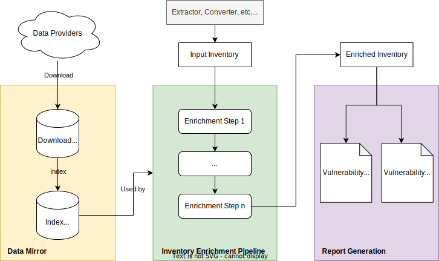

> [Documentation](../../README.md) >
> Vulnerability Management

# {metæffekt} Vulnerability Management

## Introduction

The {metæffekt} Vulnerability Management toolset is designed to facilitate the continuous monitoring of publicly known
vulnerabilities in software products.
It is particularly relevant within the context of software supply chain management,
where it ensures that the components of a software product are continuously assessed against the latest known
vulnerabilities and security advisories.

The toolchain operates by analyzing an inventory of software components,
which can either be extracted via a {metæffekt} extractor or derived from an SBOM (Software Bill of Materials) format
like SPDX or CycloneDX.
Once this inventory is established, the process of vulnerability enrichment is applied,
matching software components against known security vulnerabilities from multiple sources.
Finally, the enriched inventory is used to generate a Vulnerability Assessment Dashboard (HTML) and
Vulnerability Report (PDF).

### Phases

On a high level, the Vulnerability Monitoring consists of the following phases:

- [Vulnerability Data Mirror](data-mirror/vulnerability-data-mirror.md) (prerequisite for other phases)
- Inventory Enrichment Pipeline
- Vulnerability Assessment Dashboard generation (HTML)
- Vulnerability Report generation (PDF)

### Considered Vulnerabilities

The {metæffekt} toolset focuses on known vulnerabilities,
specifically those tracked by sources like the National Vulnerability Database (NVD),
Additional vulnerability metadata may be correlated from sources like the Microsoft Security Response Center (MSRC),
GitHub Security Advisories (GHSA), and other vulnerability sources.
Each source provides general details such as descriptions, affected products, severity scores (CVSS),
and references for accessing further details.

### Security Advisories

Security advisories provide extended details for matched vulnerabilities,
including their affected components, severity levels, and remediation measures.
These advisories can be activated individually and are pulled from trusted sources to be matched against the software
components and vulnerabilities present in the inventory.
The advisories are provided from governments and organizations such as CERT-EU, CERT-FR, CERT-SEI,
various vendors like Red Hat, Microsoft, or open-source communities.

The graphic below illustrates and example for the transition from software components to vulnerabilities and finally
security advisories.

## Product Identification

A challenge for the vulnerability matching is that every vulnerability and security advisory provider uses different
formats and methods of identifying products and versions in their knowledge database.
A couple of examples for actual product identification methods are:

- The [National Vulnerability Database (NVD)](https://nvd.nist.gov/vuln)
  uses the [Common Platform Enumeration (CPE)](https://cpe.mitre.org/specification) to identify products,
- [Microsoft Security Response Center (MSRC)](https://www.microsoft.com/en-us/msrc)
  uses a numeric registry with a number for each product and version,
- [GitHub Security Advisories (GHSA)](https://github.com/advisories)
  and others use [Package URLs (PURLs)](https://github.com/package-url/purl-spec),
- [End Of Life](https://endoflife.date) uses unique string identifiers for each product,
- and so on.

This diversity of product identifiers is not represented in the initial software component inventory.
Therefore, the first step in the vulnerability matching process is to attempt to automatically derive product
identifiers from the component metadata, including artifact names, versions, and vendor information.

The following two steps are always performed to enable and improve the matching accuracy:

**CPE Derivation**:
To find the correct product identifiers for the NVD CVE data, CPE URIs are derived from the component metadata.
This step is based on the principle of allowing more false positives than false negatives,
since it is more important to identify all potential vulnerabilities which can be filtered out in later steps
either manually or automatically than to potentially miss critical vulnerabilities.

**Artifact Correlation**:
However, there is no way of reliably and correctly performing an automated step like this for several reasons,
such as spelling mistakes in the product data on either side, differing naming conventions, multiple products
with the same name, and so on.
To improve the quality of the previous step and to enable matching via Microsoft, EOL and other data sources,
a custom data format is used (Correlation Files) to manually map the component metadata to the product identifiers.
More details on the schema [can be found here](https://metaeffekt.com/schema/artifact-analysis).
