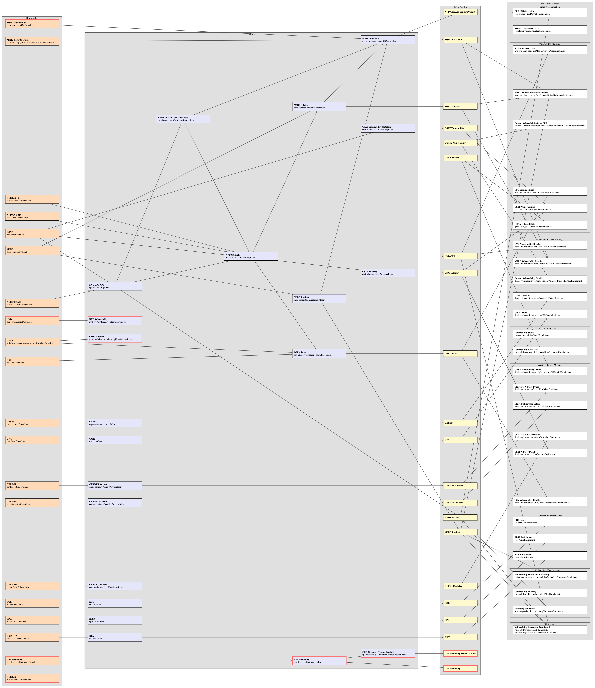

> [Documentation](../README.md) >
> Vulnerability Management

# {metæffekt} Vulnerability Management

> [Introduction](#introduction) -
> [Phases](#phases) -
> [Relevant topics](#relevant-topics) -
> [Process overview](#process-overview) -
> [Data definition](#data-definition)

## Introduction

The {metæffekt} Vulnerability Management toolset allows for the continuous monitoring of publicly known
vulnerabilities in software products.
It is particularly relevant within the context of software supply chain management,
where it ensures that the components of a software product are continuously assessed against the latest known
vulnerabilities and security advisories.

The toolchain operates by analyzing an inventory of software components,
which can either be extracted via a {metæffekt} extractor or derived from an SBOM (Software Bill of Materials) format
like SPDX or CycloneDX.
Once this inventory is established, the process of vulnerability enrichment is applied,
matching software components against known security vulnerabilities from multiple sources.
Finally, the enriched inventory is used to generate a Vulnerability Assessment Dashboard (HTML) and
Vulnerability Report (PDF).

## Phases

On a high level, the Vulnerability Monitoring consists of the following phases:

- [Vulnerability Data Mirror](data-mirror/vulnerability-data-mirror.md) (prerequisite for other phases)
- [Inventory Enrichment Pipeline](inventory-enrichment/inventory-enrichment-pipeline.md)
- [Vulnerability Assessment Dashboard generation (HTML)](../metaeffekt-vulnerability-assessment-dashboard/README.md)
- Vulnerability Report generation (PDF)

Learn more about the individual phases and how to run them in the above and below-linked sections.
The illustration at the end of this chapter provides an overview of the entire process.

## Relevant topics

Aside from the chapters above, other topics related to vulnerability management are covered in the following sections:

- **Vulnerability Enrichment Data Formats**
    - Vulnerability Assessment
      - [Gen 3.x](other-topics/assessment/vulnerability-assessment-file-gen-3.md)
      - [Gen 4.x](other-topics/assessment/vulnerability-assessment-file-gen-4.md)
    - [Vulnerability Assessment Differ tool](other-topics/vulnerability-status-differ.md)
    - [Vulnerability Keywords](other-topics/vulnerability-keywords.md)
    - [Vulnerability Filter format](other-topics/vulnerability-filter-format.md)
    - [Correlation Transformer](other-topics/correlation-transformer.md)
- **Algorithms and Calculations**
    - [CVSS 4.0 Calculation](other-topics/security/cvss-4.0-calculation.md)
    - [Effective CPE URIs calculation](other-topics/parsing-effective-cpe.md)
    - [Version Comparator](other-topics/version-comparator.md)
    - [Inventory Merger (flatten vulnerabilities)](other-topics/inventory-merger.md)
- **Data / Mirror**
    - [Data Providers and Content Identifiers](inventory-enrichment/content-identifiers.md)
    - [Overview Diagrams for Mirror / Enrichment](diagrams/individual-index-diagrams.md)
    - **[Downloaders](data-mirror/download.md)**
    - **[Indexers](data-mirror/index.md)**
        - [Live Index Structure](data-mirror/index-examples.md)
    - **Data Source Research Documents**
        - [Understanding the Microsoft Security Response Center (MSRC)](data-mirror/msrc/understanding-data.md)
        - [Finding MS Product Ids](data-mirror/msrc/finding-microsoft-product-ids.md)
        - [Understanding the EOL Data](data-mirror/eol/understanding-data.md)
        - [Microsoft Product Patches](data-mirror/msrc/msrc-product-kbs.md)
        - [Specific EOL Cycles, MS Windows Versions](data-mirror/eol/eol-data-specific-cycles.md)
    - **CVSS Sources**
        - [Updating the CVSS Entities](other-topics/security/updating-cvss-entities.md)
- **Inventory Enrichment**
    - [All Inventory Enrichment steps with their configuration parameters](inventory-enrichment/inventory-enrichment-steps.md)
- **Reports**
    - [Vulnerability Assessment Dashboard Detail Levels](other-topics/vad-detail-levels.md)

### Changelog

- [Artifact Analysis 0.110.0 - 0.117.0](changelog/0.110.0-0.117.0.md)

## Process overview

An overview of all available downloaders, indexers, and enrichers is visualized in the following diagram.
An interactive version of this diagram can be [found here](large-overview-diagram.html).
Individually rendered diagrams for all indices can be found in the
[Individual Diagrams](diagrams/individual-index-diagrams.md) file.

<!-- to update this diagram, open the html file in a browser and press 's' to save the svg or 'p' for png -->
<!--  -->

## Data definition

### Considered Vulnerabilities

The {metæffekt} toolset focuses on known vulnerabilities,
specifically those tracked by sources like the National Vulnerability Database (NVD).
Additional vulnerability metadata may be correlated from sources like the Microsoft Security Response Center (MSRC),
GitHub Security Advisories (GHSA), and other vulnerability sources.
Each source provides general details such as descriptions, affected products, severity scores (CVSS),
and references for accessing further details, but may also contribute unique information like specific remediation
measures or temporal/environmental CVSS metrics.

### Security Advisories

Security advisories provide extended details for matched vulnerabilities,
including their affected components, severity levels, and remediation measures.
These advisories can be activated individually and are pulled from trusted sources to be matched against the software
components and vulnerabilities present in the inventory.
The advisories are provided from governments and organizations such as CERT-EU, CERT-FR, CERT-SEI,
various vendors like Red Hat, Microsoft, or open-source communities.

The graphic below illustrates and example for the transition from software components to vulnerabilities and finally
security advisories.

